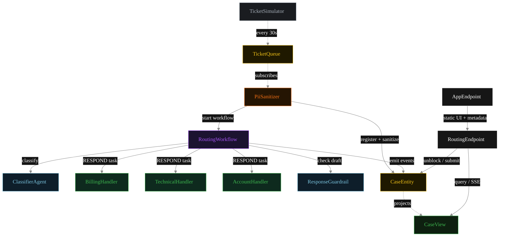
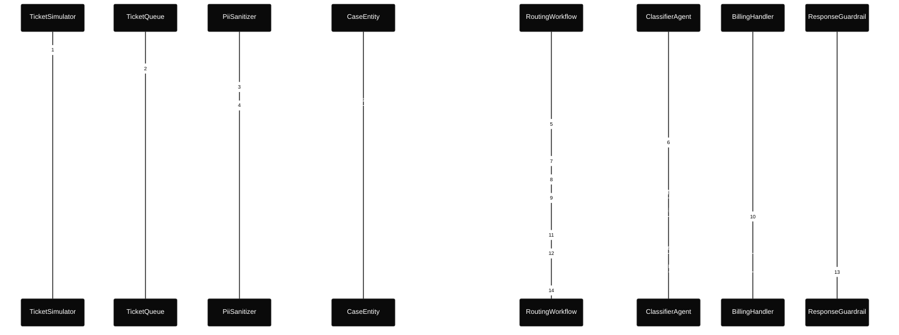
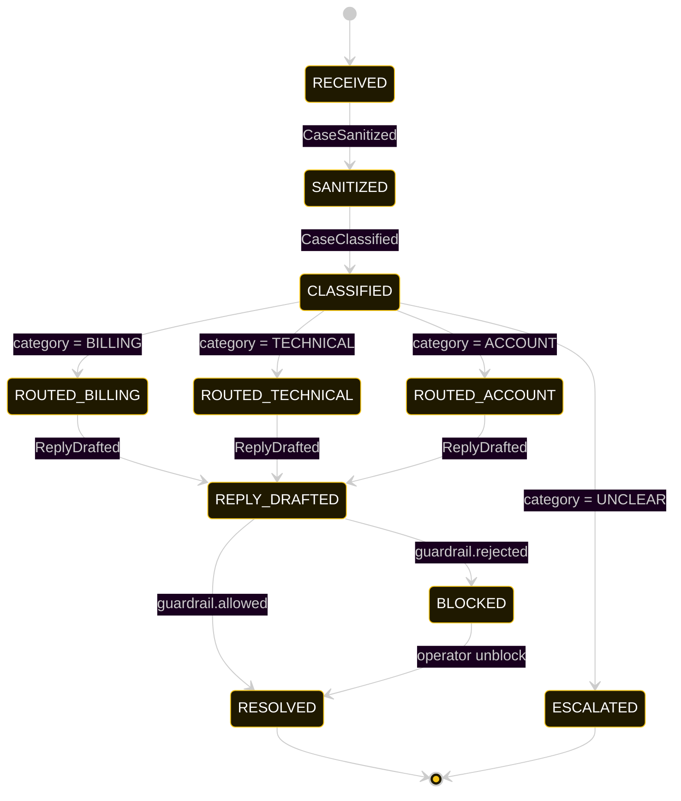
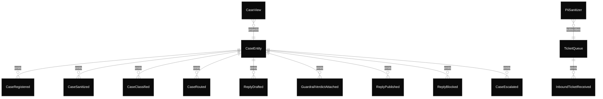

# PLAN — routing-classifier

Architectural sketch consumed by `/akka:plan` and rendered on the generated system's Architecture tab.

---

## Component graph

Solid arrows = synchronous component calls. Dashed arrows = event subscriptions and scheduler ticks.

## Interaction sequence — J1 (billing happy path)

## State machine — `CaseEntity`

## Entity model

## Component table — Java file targets

| Component | Path (generated) |
|---|---|
| `TicketSimulator` | `application/TicketSimulator.java` |
| `TicketQueue` | `application/TicketQueue.java` |
| `PiiSanitizer` | `application/PiiSanitizer.java` |
| `ClassifierAgent` | `application/ClassifierAgent.java` |
| `BillingHandler` | `application/BillingHandler.java` |
| `TechnicalHandler` | `application/TechnicalHandler.java` |
| `AccountHandler` | `application/AccountHandler.java` |
| `ResponseGuardrail` | `application/ResponseGuardrail.java` |
| `RoutingWorkflow` | `application/RoutingWorkflow.java` |
| `CaseEntity` | `application/CaseEntity.java` (state in `domain/Case.java`, events in `domain/CaseEvent.java`) |
| `CaseView` | `application/CaseView.java` |
| `RoutingEndpoint` | `api/RoutingEndpoint.java` |
| `AppEndpoint` | `api/AppEndpoint.java` |
| Task definitions | `application/RoutingTasks.java` |
| Mock provider (option a) | `application/MockModelProvider.java` |
| Bootstrap | `Bootstrap.java` |

## Concurrency notes

- **Per-step timeout.** `classifyStep` 20 s, `guardrailStep` 20 s, `billingStep` / `technicalStep` / `accountStep` / `publishStep` 60 s each. On timeout, default recovery is `maxRetries(2).failoverTo(error)` which transitions the case to `ESCALATED` with the failure reason captured.
- **Idempotency.** Every per-case primitive is keyed by `caseId`: `CaseEntity` id is `caseId`; `RoutingWorkflow` id is `caseId`; agent sessions for `ClassifierAgent` and `ResponseGuardrail` use `caseId`. Duplicate sanitize events fold into a single workflow start (workflow start is idempotent per id).
- **No saga compensation.** The handoff is a single-direction transfer of ownership; once the handler returns its `HandlerReply`, the workflow either publishes or blocks based on the guardrail verdict. A blocked draft sits in `BLOCKED` until an operator unblocks via `POST /api/cases/{id}/unblock`.
- **No HITL on the happy path.** The system only waits for a human when the guardrail blocks; everything else flows through to `RESOLVED` autonomously.
- **Three-way branch.** Unlike a two-specialist pattern, the `ACCOUNT` category adds a third branch. Each branch is structurally identical — the workflow uses the same step template with a different `AutonomousAgent` target. Adding a fourth category is therefore a mechanical extension.
- **Simulator throughput.** `TicketSimulator` drips one ticket every 30 s; the system can comfortably process each case end-to-end inside that window with mock or real LLMs.
