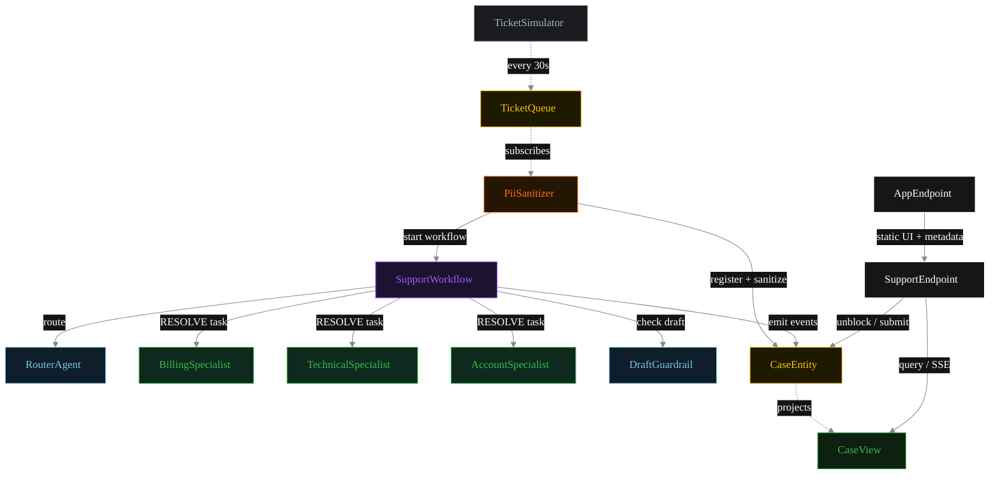
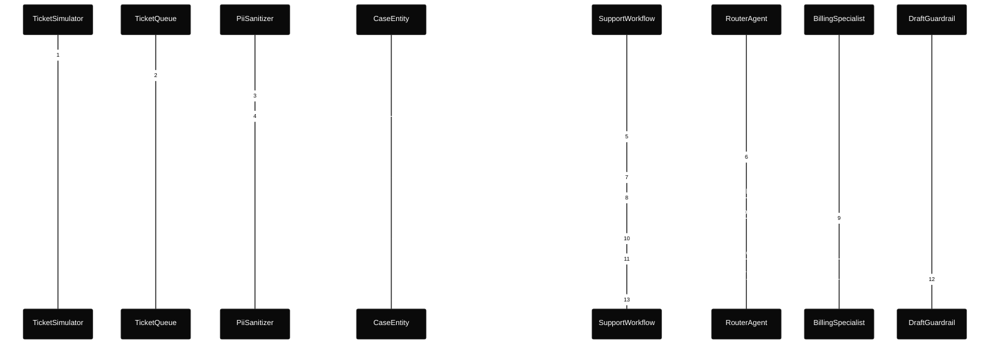
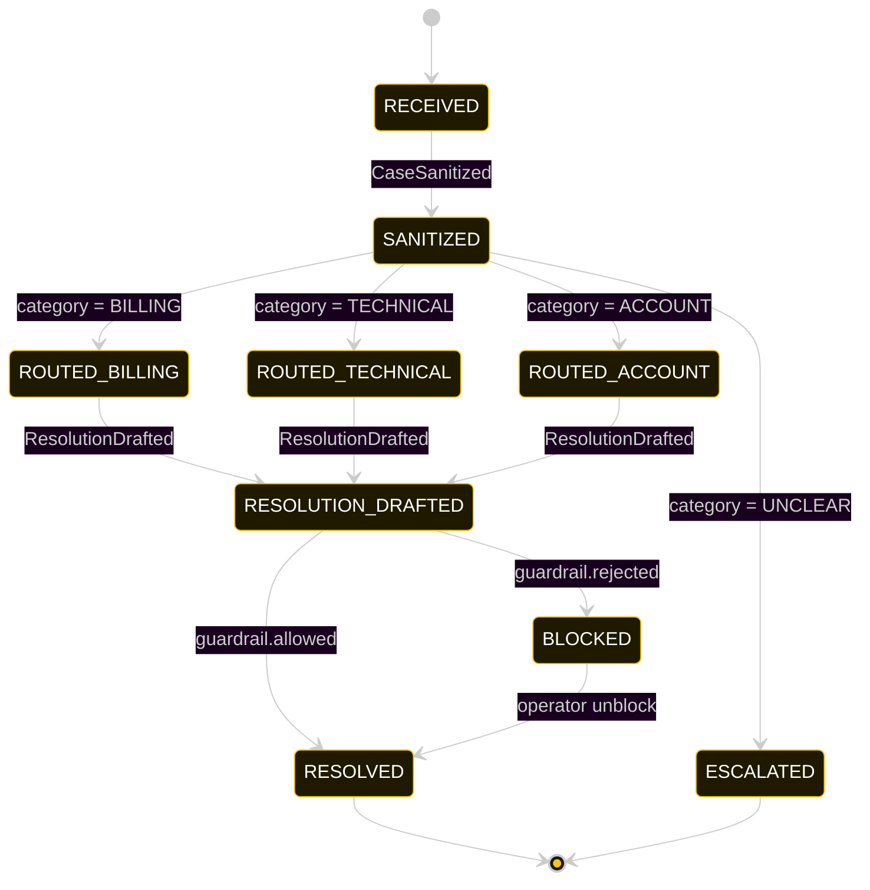
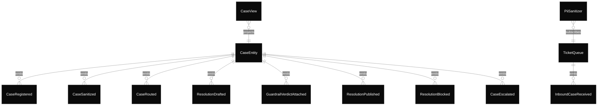

# PLAN — support-multi-agent

Architectural sketch consumed by `/akka:plan` and rendered on the generated system's Architecture tab.

---

## Component graph

Solid arrows = synchronous component calls. Dashed arrows = event subscriptions and scheduler ticks.

## Interaction sequence — J1 (billing happy path)

## State machine — `CaseEntity`

## Entity model

## Component table — Java file targets

| Component | Path (generated) |
|---|---|
| `TicketSimulator` | `application/TicketSimulator.java` |
| `TicketQueue` | `application/TicketQueue.java` |
| `PiiSanitizer` | `application/PiiSanitizer.java` |
| `RouterAgent` | `application/RouterAgent.java` |
| `BillingSpecialist` | `application/BillingSpecialist.java` |
| `TechnicalSpecialist` | `application/TechnicalSpecialist.java` |
| `AccountSpecialist` | `application/AccountSpecialist.java` |
| `DraftGuardrail` | `application/DraftGuardrail.java` |
| `SupportWorkflow` | `application/SupportWorkflow.java` |
| `CaseEntity` | `application/CaseEntity.java` (state in `domain/Case.java`, events in `domain/CaseEvent.java`) |
| `CaseView` | `application/CaseView.java` |
| `SupportEndpoint` | `api/SupportEndpoint.java` |
| `AppEndpoint` | `api/AppEndpoint.java` |
| Task definitions | `application/SupportTasks.java` |
| Mock provider (option a) | `application/MockModelProvider.java` |
| Bootstrap | `Bootstrap.java` |

## Concurrency notes

- **Per-step timeout.** `routeStep` 20 s, `guardrailStep` 20 s, `billingStep` / `technicalStep` / `accountStep` / `publishStep` 60 s each. On timeout, default recovery is `maxRetries(2).failoverTo(error)` which transitions the case to `ESCALATED` with the failure reason captured.
- **Idempotency.** Every per-case primitive is keyed by `caseId`: `CaseEntity` id is `caseId`; `SupportWorkflow` id is `caseId`; agent sessions for `RouterAgent` and `DraftGuardrail` use `caseId`. Duplicate sanitize events fold into a single workflow start (workflow start is idempotent per id).
- **Three-way branch.** The routing step dispatches to one of three specialists (or the escalate path). Only the matched specialist is invoked; the other two see no traffic for that case.
- **No saga compensation.** The handoff is a single-direction transfer of ownership; once the specialist returns its `Resolution`, the workflow either publishes or blocks based on the guardrail verdict. There is no rollback path — a blocked draft sits in `BLOCKED` until an operator unblocks via `POST /api/cases/{id}/unblock`.
- **No HITL on the happy path.** The system only waits for a human when the guardrail blocks; everything else flows through to `RESOLVED` autonomously.
- **Simulator throughput.** `TicketSimulator` drips one case every 30 s; the system can comfortably process each case end-to-end inside that window with mock or real LLMs.
