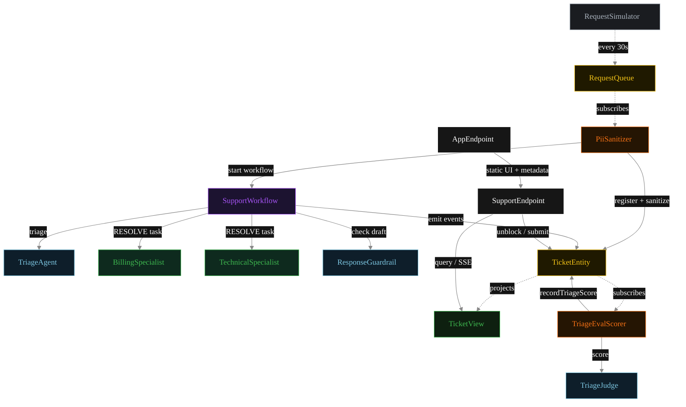
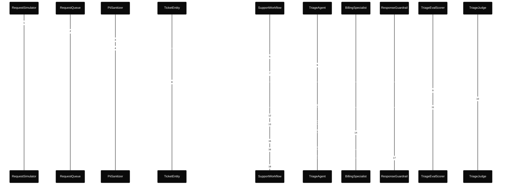
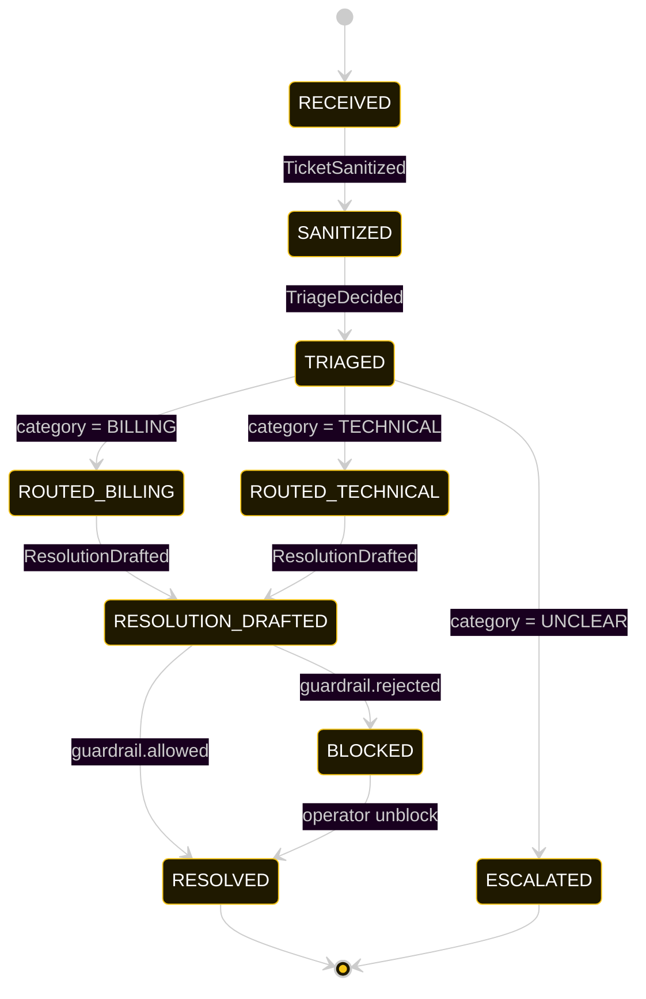
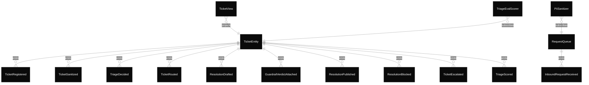

# PLAN — support

Architectural sketch consumed by `/akka:plan` and rendered on the generated system's Architecture tab.

---

## Component graph

Solid arrows = synchronous component calls. Dashed arrows = event subscriptions and scheduler ticks.

## Interaction sequence — J1 (billing happy path)

The eval-event sequence (steps 7–10) runs concurrently with the workflow's continuation — `TriageEvalScorer` is a Consumer reading the entity's event stream, independent of `SupportWorkflow`. Both writes target the same `TicketEntity`; the entity's commands are idempotent on `ticketId`.

## State machine — `TicketEntity`

The `TriageScored` event does not change `status`; it attaches the eval result. The state machine therefore treats it as a no-op transition (omitted from the diagram for clarity).

## Entity model

## Component table — Java file targets

| Component | Path (generated) |
|---|---|
| `RequestSimulator` | `application/RequestSimulator.java` |
| `RequestQueue` | `application/RequestQueue.java` |
| `PiiSanitizer` | `application/PiiSanitizer.java` |
| `TriageAgent` | `application/TriageAgent.java` |
| `BillingSpecialist` | `application/BillingSpecialist.java` |
| `TechnicalSpecialist` | `application/TechnicalSpecialist.java` |
| `TriageJudge` | `application/TriageJudge.java` |
| `ResponseGuardrail` | `application/ResponseGuardrail.java` |
| `SupportWorkflow` | `application/SupportWorkflow.java` |
| `TicketEntity` | `application/TicketEntity.java` (state in `domain/Ticket.java`, events in `domain/TicketEvent.java`) |
| `TicketView` | `application/TicketView.java` |
| `TriageEvalScorer` | `application/TriageEvalScorer.java` |
| `SupportEndpoint` | `api/SupportEndpoint.java` |
| `AppEndpoint` | `api/AppEndpoint.java` |
| Task definitions | `application/SupportTasks.java` |
| Mock provider (option a) | `application/MockModelProvider.java` |
| Bootstrap | `Bootstrap.java` |

## Concurrency notes

- **Per-step timeout.** `triageStep` 20 s, `guardrailStep` 20 s, `billingStep` / `technicalStep` / `publishStep` 60 s each. On timeout, default recovery is `maxRetries(2).failoverTo(error)` which transitions the ticket to `ESCALATED` with the failure reason captured.
- **Idempotency.** Every per-ticket primitive is keyed by `ticketId`: `TicketEntity` id is `ticketId`; `SupportWorkflow` id is `ticketId`; agent sessions for `TriageAgent`, `TriageJudge`, and `ResponseGuardrail` use `ticketId`. Duplicate sanitize events fold into a single workflow start (workflow start is idempotent per id).
- **Race between eval and workflow.** `TriageEvalScorer` (Consumer) and `SupportWorkflow` both append events to the same `TicketEntity`. Order is not guaranteed but does not matter: `TriageScored` only mutates `triageScore`, never `status`. The view materialises both events independently.
- **No saga compensation.** The handoff is a single-direction transfer of ownership; once the specialist returns its `Resolution`, the workflow either publishes or blocks based on the guardrail verdict. There is no rollback path — a blocked draft sits in `BLOCKED` until an operator unblocks via `POST /api/tickets/{id}/unblock`.
- **No HITL on the happy path.** This is the distinction from `human-in-loop-gate`. The system only waits for a human when the guardrail blocks; everything else flows through to `RESOLVED` autonomously.
- **Simulator throughput.** `RequestSimulator` drips one request every 30 s; the system can comfortably process each ticket end-to-end inside that window with mock or real LLMs.
