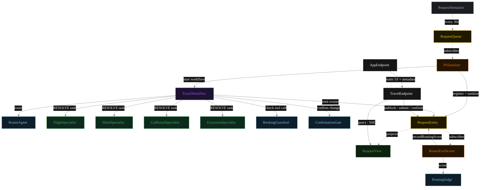
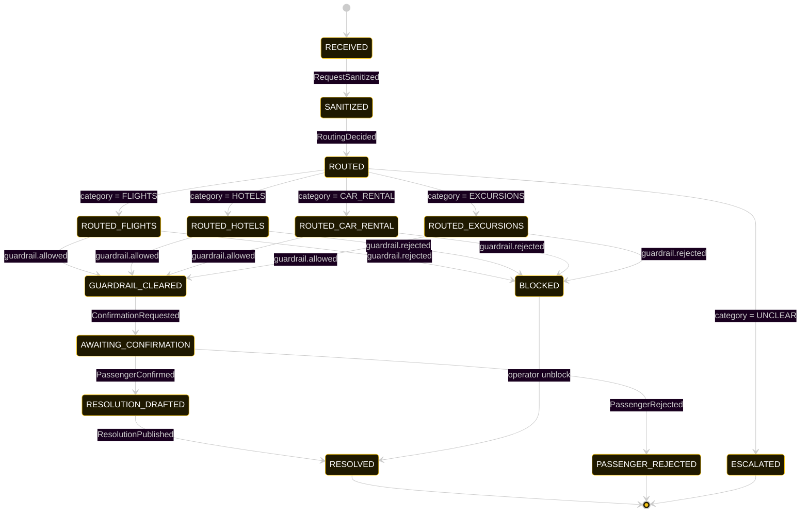
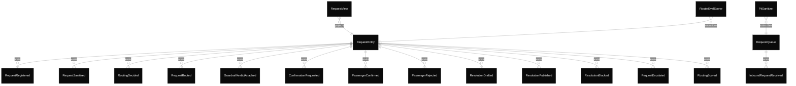

# PLAN — travel-support-router

Architectural sketch consumed by `/akka:plan` and rendered on the generated system's Architecture tab.

---

## Component graph



Solid arrows = synchronous component calls. Dashed arrows = event subscriptions and scheduler ticks.

## Interaction sequence — J1 (flight rebooking happy path)

```mermaid
%%{init: {'theme':'base','themeVariables':{
  'primaryColor':'#0A0A0A','primaryTextColor':'#ffffff','primaryBorderColor':'#222',
  'lineColor':'#888','secondaryColor':'#141414','tertiaryColor':'#1C1C1C',
  'nodeTextColor':'#ffffff','stateLabelColor':'#ffffff','transitionLabelColor':'#cccccc',
  'actorTextColor':'#ffffff','noteTextColor':'#ffffff','sequenceNumberColor':'#000'
}}}%%
sequenceDiagram
  autonumber
  participant Sim as RequestSimulator
  participant Q as RequestQueue
  participant S as PiiSanitizer
  participant E as RequestEntity
  participant W as TravelWorkflow
  participant R as RouterAgent
  participant F as FlightSpecialist
  participant G as BookingGuardrail
  participant C as ConfirmationGate
  participant Sc as RouterEvalScorer
  participant J as RoutingJudge

  Sim->>Q: receive(IncomingRequest)
  Q->>S: InboundRequestReceived
  S->>E: registerIncoming + attachSanitized
  S->>W: start(requestId, sanitized)
  W->>R: route(sanitized)
  R-->>W: RoutingDecision{FLIGHTS}
  W->>E: recordRouting(decision) [emits RoutingDecided]
  E->>Sc: RoutingDecided event
  Sc->>J: score(sanitized, decision)
  J-->>Sc: RoutingScore
  Sc->>E: recordRoutingScore [emits RoutingScored]
  W->>E: recordRoutedCategory(FLIGHTS) [emits RequestRouted]
  W->>F: runSingleTask(RESOLVE, prompt)
  F-->>W: Resolution (proposed change)
  W->>G: check(sanitized, proposedAction)
  G-->>W: GuardrailVerdict{allowed=true}
  W->>E: recordGuardrailVerdict [emits GuardrailVerdictAttached]
  W->>C: summarize(sanitized, resolution)
  C-->>W: ConfirmationRequest{summary, deadline}
  W->>E: recordConfirmationRequest [emits ConfirmationRequested] — PAUSED
  Note over W: workflow pauses; passenger receives confirmation prompt
  W->>E: recordConfirmationOutcome(CONFIRM) [emits PassengerConfirmed]
  W->>E: recordDraft(resolution) [emits ResolutionDrafted]
  W->>E: publish(resolution) [emits ResolutionPublished, status RESOLVED]
```

The eval-event sequence (steps 7–10) runs concurrently with the workflow's continuation — `RouterEvalScorer` is a Consumer reading the entity's event stream, independent of `TravelWorkflow`. Both writes target the same `RequestEntity`; the entity's commands are idempotent on `requestId`.

## State machine — `RequestEntity`



The `RoutingScored` event does not change `status`; it attaches the eval result. The state machine treats it as a no-op transition and omits it from the diagram.

## Entity model



## Component table — Java file targets

| Component | Path (generated) |
|---|---|
| `RequestSimulator` | `application/RequestSimulator.java` |
| `RequestQueue` | `application/RequestQueue.java` |
| `PiiSanitizer` | `application/PiiSanitizer.java` |
| `RouterAgent` | `application/RouterAgent.java` |
| `FlightSpecialist` | `application/FlightSpecialist.java` |
| `HotelSpecialist` | `application/HotelSpecialist.java` |
| `CarRentalSpecialist` | `application/CarRentalSpecialist.java` |
| `ExcursionSpecialist` | `application/ExcursionSpecialist.java` |
| `RoutingJudge` | `application/RoutingJudge.java` |
| `BookingGuardrail` | `application/BookingGuardrail.java` |
| `ConfirmationGate` | `application/ConfirmationGate.java` |
| `TravelWorkflow` | `application/TravelWorkflow.java` |
| `RequestEntity` | `application/RequestEntity.java` (state in `domain/TravelRequest.java`, events in `domain/RequestEvent.java`) |
| `RequestView` | `application/RequestView.java` |
| `RouterEvalScorer` | `application/RouterEvalScorer.java` |
| `TravelEndpoint` | `api/TravelEndpoint.java` |
| `AppEndpoint` | `api/AppEndpoint.java` |
| Task definitions | `application/TravelTasks.java` |
| Mock provider (option a) | `application/MockModelProvider.java` |
| Bootstrap | `Bootstrap.java` |

## Concurrency notes

- **Per-step timeout.** `routeStep` 20 s, `guardrailStep` 20 s, `specialistStep` / `confirmStep` / `publishStep` 60 s each. On timeout, default recovery is `maxRetries(2).failoverTo(error)` which transitions the request to `ESCALATED` with the failure reason captured.
- **Idempotency.** Every per-request primitive is keyed by `requestId`: `RequestEntity` id is `requestId`; `TravelWorkflow` id is `requestId`; agent sessions for `RouterAgent`, `RoutingJudge`, `BookingGuardrail`, and `ConfirmationGate` use `requestId`. Duplicate sanitize events fold into a single workflow start.
- **Race between eval and workflow.** `RouterEvalScorer` (Consumer) and `TravelWorkflow` both append events to the same `RequestEntity`. Order is not guaranteed but does not matter: `RoutingScored` only mutates `routingScore`, never `status`.
- **HITL pause duration.** The `confirmStep` has a 60-second timeout, but for demo purposes the mock responder auto-confirms after a few seconds so that the simulator's 30-second cycle can complete end-to-end. In a deployed setting the timeout would be configured to the passenger's SLA.
- **No saga compensation.** The guardrail block is a terminal transition; blocked requests sit in `BLOCKED` until an operator unblocks via `POST /api/requests/{id}/unblock`. A `PASSENGER_REJECTED` is also terminal — the passenger's explicit refusal is the audit record.
- **Simulator throughput.** `RequestSimulator` drips one request every 30 s; the system can comfortably process each request end-to-end inside that window with mock or real LLMs.
