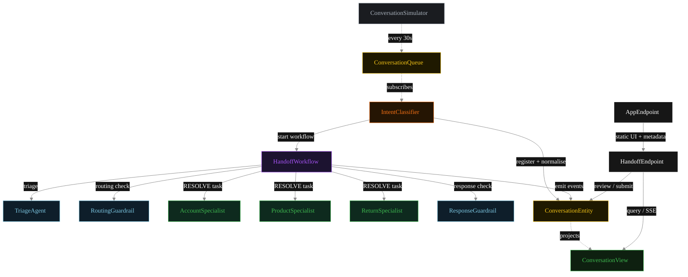
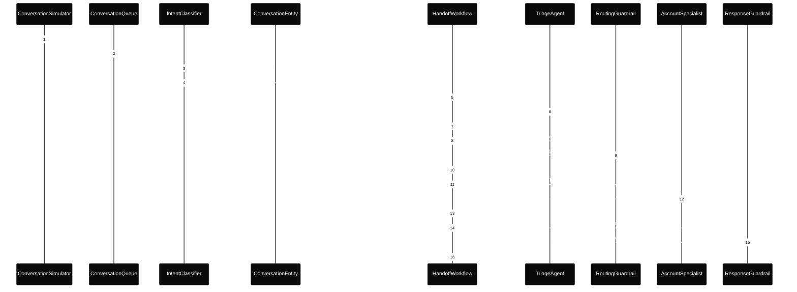
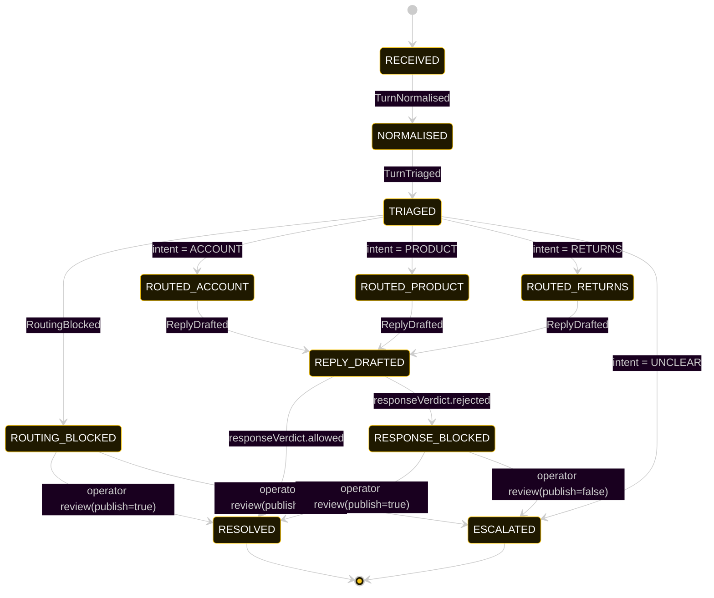
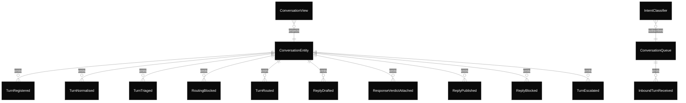

# PLAN — triage-handoff-routing

Architectural sketch consumed by `/akka:plan` and rendered on the generated system's Architecture tab.

---

## Component graph

Solid arrows = synchronous component calls. Dashed arrows = event subscriptions and scheduler ticks.

## Interaction sequence — J1 (account happy path)

The routing guardrail step (steps 7–9) runs synchronously inside the workflow before any specialist is called. A blocked routing decision short-circuits the workflow directly to `ROUTING_BLOCKED` — the specialist path is never entered.

## State machine — `ConversationEntity`

`ResponseVerdictAttached` events do not change `status` when the verdict is `allowed=true` and the workflow proceeds to `publishStep`. The transition to `RESOLVED` comes from `ReplyPublished`.

## Entity model

## Component table — Java file targets

| Component | Path (generated) |
|---|---|
| `ConversationSimulator` | `application/ConversationSimulator.java` |
| `ConversationQueue` | `application/ConversationQueue.java` |
| `IntentClassifier` | `application/IntentClassifier.java` |
| `TriageAgent` | `application/TriageAgent.java` |
| `RoutingGuardrail` | `application/RoutingGuardrail.java` |
| `AccountSpecialist` | `application/AccountSpecialist.java` |
| `ProductSpecialist` | `application/ProductSpecialist.java` |
| `ReturnSpecialist` | `application/ReturnSpecialist.java` |
| `ResponseGuardrail` | `application/ResponseGuardrail.java` |
| `HandoffWorkflow` | `application/HandoffWorkflow.java` |
| `ConversationEntity` | `application/ConversationEntity.java` (state in `domain/Conversation.java`, events in `domain/ConversationEvent.java`) |
| `ConversationView` | `application/ConversationView.java` |
| `HandoffEndpoint` | `api/HandoffEndpoint.java` |
| `AppEndpoint` | `api/AppEndpoint.java` |
| Task definitions | `application/HandoffTasks.java` |
| Mock provider (option a) | `application/MockModelProvider.java` |
| Bootstrap | `Bootstrap.java` |

## Concurrency notes

- **Per-step timeout.** `triageStep` 20 s, `routingCheckStep` 20 s, `responseCheckStep` 20 s, `accountStep` / `productStep` / `returnStep` / `publishStep` 60 s each. On timeout, default recovery is `maxRetries(2).failoverTo(error)` which transitions the turn to `ESCALATED` with the failure reason captured.
- **Idempotency.** Every per-turn primitive is keyed by `turnId`: `ConversationEntity` id is `turnId`; `HandoffWorkflow` id is `turnId`; agent sessions for `TriageAgent`, `RoutingGuardrail`, and `ResponseGuardrail` use `turnId`. Duplicate normalise events fold into a single workflow start (workflow start is idempotent per id).
- **Two guardrail boundaries.** The routing guardrail fires synchronously inside the workflow before the specialist is ever invoked. The response guardrail fires synchronously after the specialist returns but before `ReplyPublished`. Both are blocking — the specialist is not a cost until the routing guardrail clears; the reply is not published until the response guardrail clears.
- **No saga compensation.** The handoff is a single-direction transfer of ownership; once the specialist returns its `Reply`, the workflow either publishes or blocks based on the response guardrail verdict. Blocked turns sit in `ROUTING_BLOCKED` or `RESPONSE_BLOCKED` until an operator reviews via `POST /api/turns/{id}/review`.
- **No HITL on the happy path.** The system only waits for a human when either guardrail blocks; everything else flows through to `RESOLVED` autonomously.
- **Simulator throughput.** `ConversationSimulator` drips one turn every 30 s; the system can comfortably process each turn end-to-end inside that window with mock or real LLMs.
