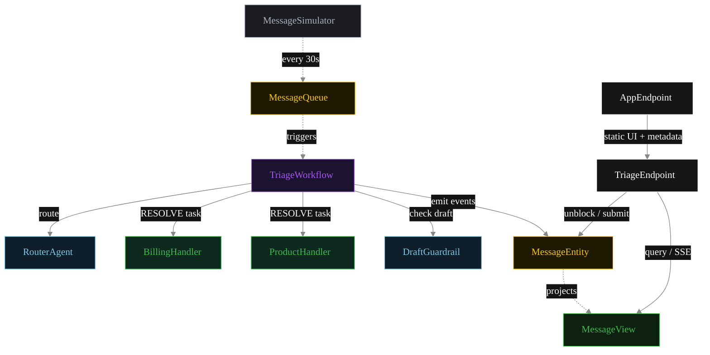
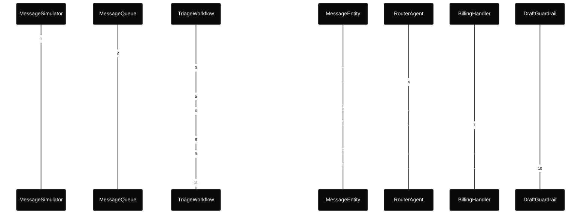
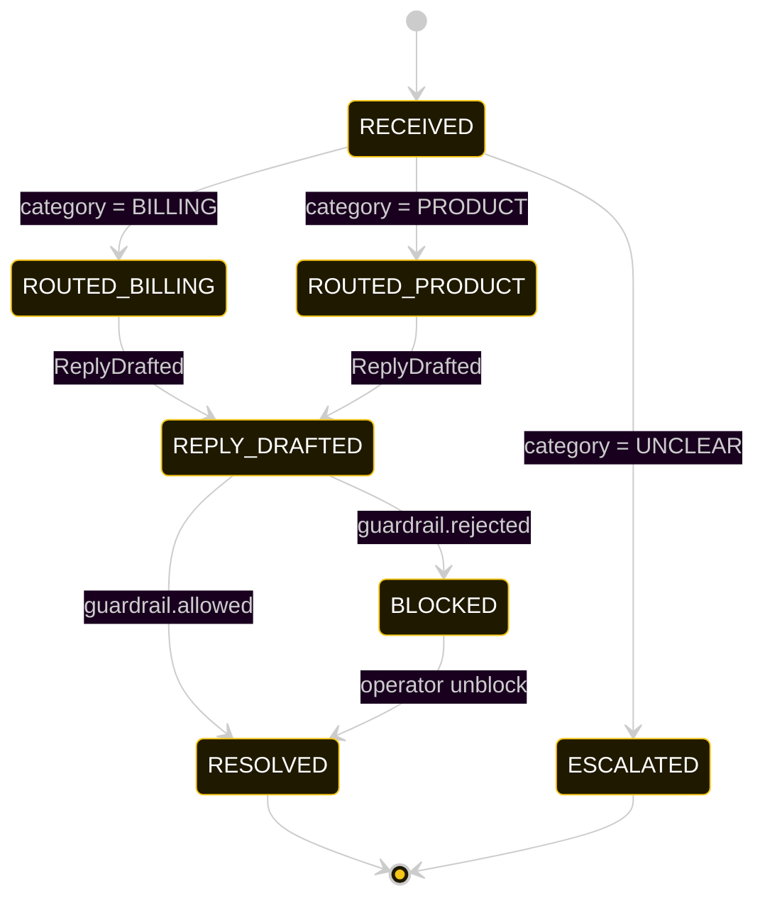
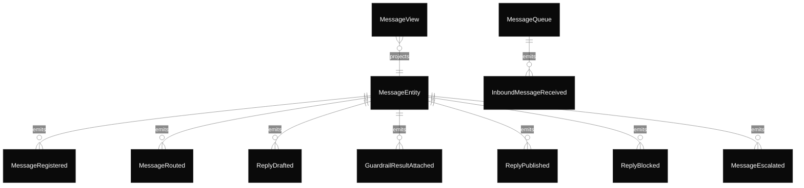

# PLAN — triage-router-ui

Architectural sketch consumed by `/akka:plan` and rendered on the generated system's Architecture tab.

---

## Component graph

Solid arrows = synchronous component calls. Dashed arrows = event subscriptions and scheduler ticks.

## Interaction sequence — J1 (billing happy path)

## State machine — `MessageEntity`

## Entity model

## Component table — Java file targets

| Component | Path (generated) |
|---|---|
| `MessageSimulator` | `application/MessageSimulator.java` |
| `MessageQueue` | `application/MessageQueue.java` |
| `RouterAgent` | `application/RouterAgent.java` |
| `BillingHandler` | `application/BillingHandler.java` |
| `ProductHandler` | `application/ProductHandler.java` |
| `DraftGuardrail` | `application/DraftGuardrail.java` |
| `TriageWorkflow` | `application/TriageWorkflow.java` |
| `MessageEntity` | `application/MessageEntity.java` (state in `domain/Message.java`, events in `domain/MessageEvent.java`) |
| `MessageView` | `application/MessageView.java` |
| `TriageEndpoint` | `api/TriageEndpoint.java` |
| `AppEndpoint` | `api/AppEndpoint.java` |
| Task definitions | `application/TriageTasks.java` |
| Mock provider (option a) | `application/MockModelProvider.java` |
| Bootstrap | `Bootstrap.java` |

## Concurrency notes

- **Per-step timeout.** `routeStep` 20 s, `guardrailStep` 20 s, `billingStep` / `productStep` / `publishStep` 60 s each. On timeout, default recovery is `maxRetries(2).failoverTo(error)` which transitions the message to `ESCALATED` with the failure reason captured.
- **Idempotency.** Every per-message primitive is keyed by `messageId`: `MessageEntity` id is `messageId`; `TriageWorkflow` id is `messageId`; agent sessions for `RouterAgent` and `DraftGuardrail` use `messageId`. A duplicate simulator tick for the same `messageId` folds into a no-op on the workflow (workflow start is idempotent per id).
- **No saga compensation.** The handoff is a single-direction transfer of ownership; once the handler returns its `HandlerReply`, the workflow either publishes or blocks based on the guardrail verdict. There is no rollback path — a blocked draft sits in `BLOCKED` until an operator unblocks via `POST /api/messages/{id}/unblock`.
- **No HITL on the happy path.** The system only waits for a human when the guardrail blocks; everything else flows through to `RESOLVED` autonomously. Blocked messages wait indefinitely for the operator.
- **Simulator throughput.** `MessageSimulator` drips one message every 30 s; the service can process each message end-to-end inside that window with mock or real LLMs.
