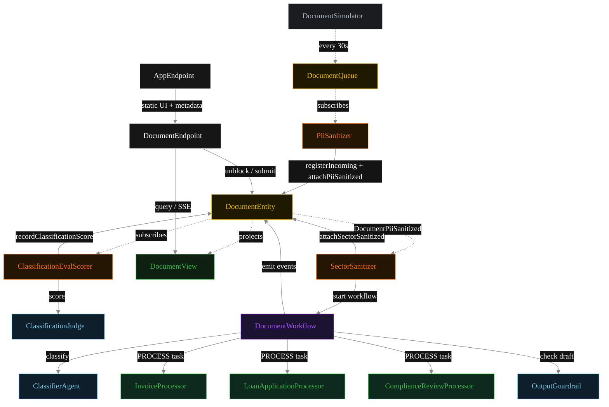
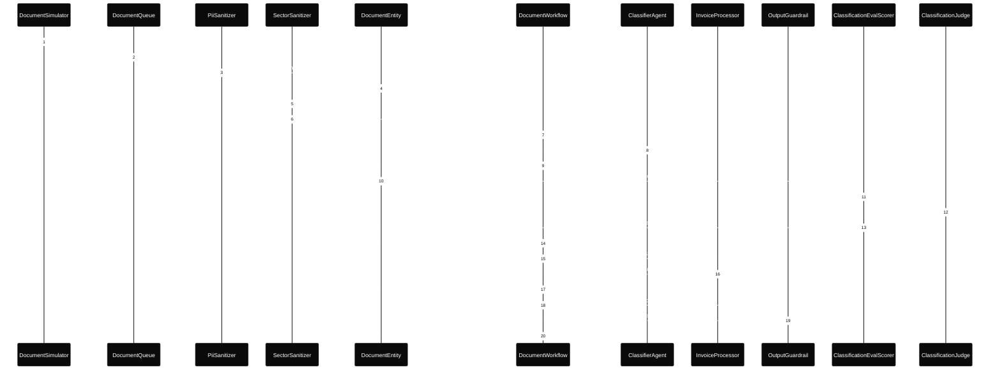
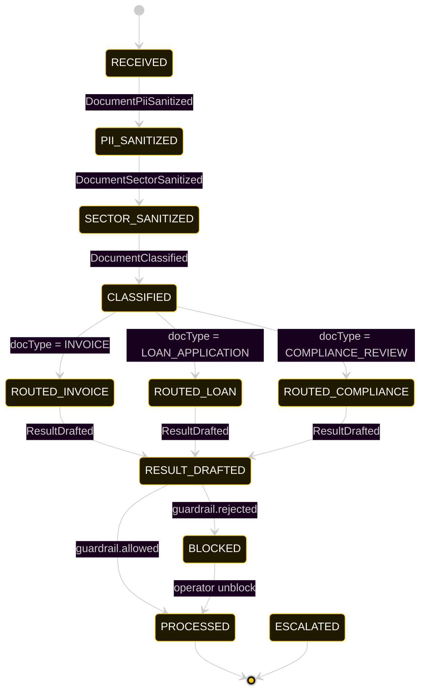
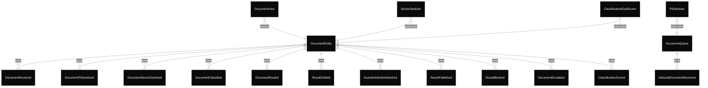

# PLAN — finance-document-triage

Architectural sketch consumed by `/akka:plan` and rendered on the generated system's Architecture tab.

---

## Component graph

Solid arrows = synchronous component calls. Dashed arrows = event subscriptions and scheduler ticks.

## Interaction sequence — J1 (invoice happy path)

The eval-event sequence (steps 9–12) runs concurrently with the workflow's continuation — `ClassificationEvalScorer` is a Consumer reading the entity's event stream, independent of `DocumentWorkflow`. Both writes target the same `DocumentEntity`; the entity's commands are idempotent on `documentId`.

## State machine — `DocumentEntity`

The `ClassificationScored` event does not change `status`; it attaches the eval result. The state machine omits it for clarity.

## Entity model

## Component table — Java file targets

| Component | Path (generated) |
|---|---|
| `DocumentSimulator` | `application/DocumentSimulator.java` |
| `DocumentQueue` | `application/DocumentQueue.java` |
| `PiiSanitizer` | `application/PiiSanitizer.java` |
| `SectorSanitizer` | `application/SectorSanitizer.java` |
| `ClassifierAgent` | `application/ClassifierAgent.java` |
| `InvoiceProcessor` | `application/InvoiceProcessor.java` |
| `LoanApplicationProcessor` | `application/LoanApplicationProcessor.java` |
| `ComplianceReviewProcessor` | `application/ComplianceReviewProcessor.java` |
| `ClassificationJudge` | `application/ClassificationJudge.java` |
| `OutputGuardrail` | `application/OutputGuardrail.java` |
| `DocumentWorkflow` | `application/DocumentWorkflow.java` |
| `DocumentEntity` | `application/DocumentEntity.java` (state in `domain/Document.java`, events in `domain/DocumentEvent.java`) |
| `DocumentView` | `application/DocumentView.java` |
| `ClassificationEvalScorer` | `application/ClassificationEvalScorer.java` |
| `DocumentEndpoint` | `api/DocumentEndpoint.java` |
| `AppEndpoint` | `api/AppEndpoint.java` |
| Task definitions | `application/FinanceTasks.java` |
| Mock provider (option a) | `application/MockModelProvider.java` |
| Bootstrap | `Bootstrap.java` |

## Concurrency notes

- **Per-step timeout.** `classifyStep` 20 s, `guardrailStep` 20 s, `invoiceStep` / `loanStep` / `complianceStep` / `publishStep` 60 s each. On timeout, default recovery is `maxRetries(2).failoverTo(error)` which transitions the document to `ESCALATED` with the failure reason captured.
- **Two-Consumer sanitization chain.** `PiiSanitizer` runs first (subscribed to `DocumentQueue`). `SectorSanitizer` runs second (subscribed to `DocumentEntity` on `DocumentPiiSanitized`). Only `SectorSanitizer` starts the `DocumentWorkflow`. This guarantees both redaction passes complete before any LLM call.
- **Idempotency.** Every per-document primitive is keyed by `documentId`: `DocumentEntity` id is `documentId`; `DocumentWorkflow` id is `documentId`; agent sessions for `ClassifierAgent`, `ClassificationJudge`, and `OutputGuardrail` use `documentId`. Duplicate sanitize events fold into a single workflow start (workflow start is idempotent per id).
- **Race between eval and workflow.** `ClassificationEvalScorer` (Consumer) and `DocumentWorkflow` both append events to the same `DocumentEntity`. Order is not guaranteed but does not matter: `ClassificationScored` only mutates `classificationScore`, never `status`. The view materialises both events independently.
- **No saga compensation.** Once the processor returns its `ProcessingResult`, the workflow either publishes or blocks based on the guardrail verdict. There is no rollback — a blocked result sits in `BLOCKED` until an operator unblocks via `POST /api/documents/{id}/unblock`.
- **Simulator throughput.** `DocumentSimulator` drips one document every 30 s; the system can comfortably process each document end-to-end inside that window with mock or real LLMs.
