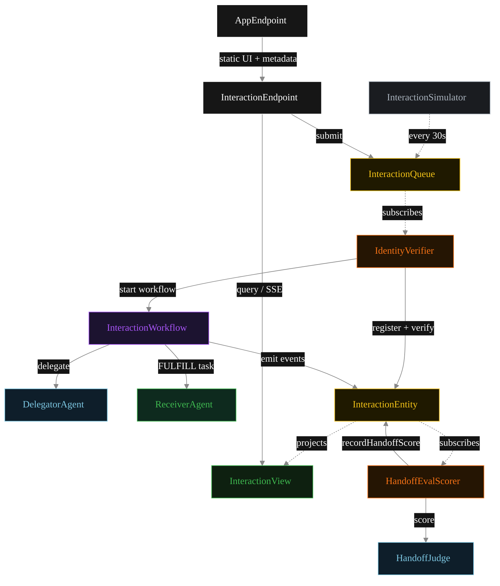
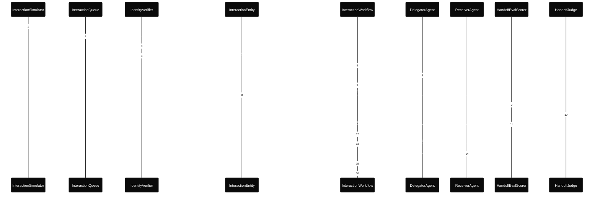
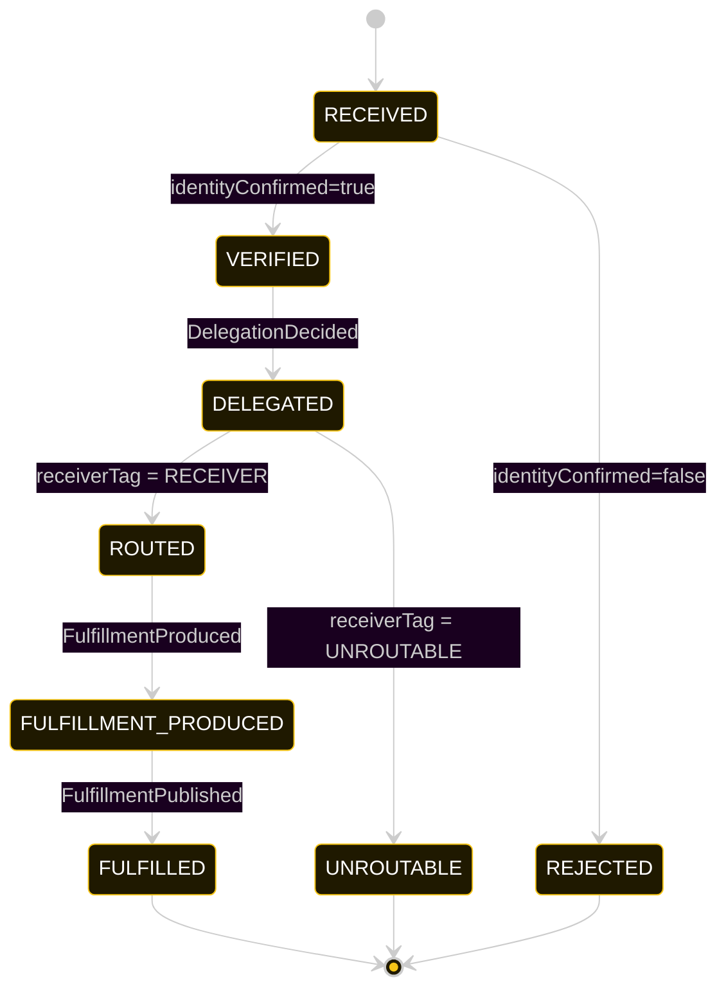
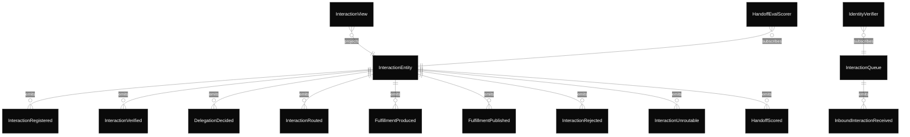

# PLAN — a2a-interactions

Architectural sketch consumed by `/akka:plan` and rendered on the generated system's Architecture tab.

---

## Component graph

Solid arrows = synchronous component calls. Dashed arrows = event subscriptions and scheduler ticks.

## Interaction sequence — J1 (routable happy path)

The eval-event sequence (steps 7–10) runs concurrently with the workflow's continuation — `HandoffEvalScorer` is a Consumer reading the entity's event stream, independent of `InteractionWorkflow`. Both writes target the same `InteractionEntity`; the entity's commands are idempotent on `interactionId`.

## State machine — `InteractionEntity`

The `HandoffScored` event does not change `status`; it attaches the eval result. The state machine therefore treats it as a no-op transition (omitted from the diagram for clarity).

## Entity model

## Component table — Java file targets

| Component | Path (generated) |
|---|---|
| `InteractionSimulator` | `application/InteractionSimulator.java` |
| `InteractionQueue` | `application/InteractionQueue.java` |
| `IdentityVerifier` | `application/IdentityVerifier.java` |
| `DelegatorAgent` | `application/DelegatorAgent.java` |
| `ReceiverAgent` | `application/ReceiverAgent.java` |
| `HandoffJudge` | `application/HandoffJudge.java` |
| `InteractionWorkflow` | `application/InteractionWorkflow.java` |
| `InteractionEntity` | `application/InteractionEntity.java` (state in `domain/Interaction.java`, events in `domain/InteractionEvent.java`) |
| `InteractionView` | `application/InteractionView.java` |
| `HandoffEvalScorer` | `application/HandoffEvalScorer.java` |
| `InteractionEndpoint` | `api/InteractionEndpoint.java` |
| `AppEndpoint` | `api/AppEndpoint.java` |
| Task definitions | `application/InteractionTasks.java` |
| Mock provider (option a) | `application/MockModelProvider.java` |
| Bootstrap | `Bootstrap.java` |

## Concurrency notes

- **Per-step timeout.** `delegateStep` 20 s, `receiverStep` / `publishStep` 60 s each. On timeout, default recovery is `maxRetries(2).failoverTo(error)` which transitions the interaction to `UNROUTABLE` with the failure reason captured.
- **Idempotency.** Every per-interaction primitive is keyed by `interactionId`: `InteractionEntity` id is `interactionId`; `InteractionWorkflow` id is `interactionId`; agent sessions for `DelegatorAgent` and `HandoffJudge` use `interactionId`. Duplicate verification events fold into a single workflow start (workflow start is idempotent per id).
- **Race between eval and workflow.** `HandoffEvalScorer` (Consumer) and `InteractionWorkflow` both append events to the same `InteractionEntity`. Order is not guaranteed but does not matter: `HandoffScored` only mutates `handoffScore`, never `status`. The view materialises both events independently.
- **No saga compensation.** The handoff is a single-direction transfer of ownership; once the receiver returns its `Fulfillment`, the workflow publishes. There is no rollback path — a failed receiver step terminates in `UNROUTABLE` via default recovery.
- **Identity check is pre-LLM.** `IdentityVerifier` (Consumer) acts before any workflow or agent is called. A rejected interaction never enters the workflow and no LLM ever processes its payload. This is the principal distinction from a guardrail inside the workflow.
- **Simulator throughput.** `InteractionSimulator` drips one interaction every 30 s; the system can process each end-to-end inside that window with mock or real LLMs.
