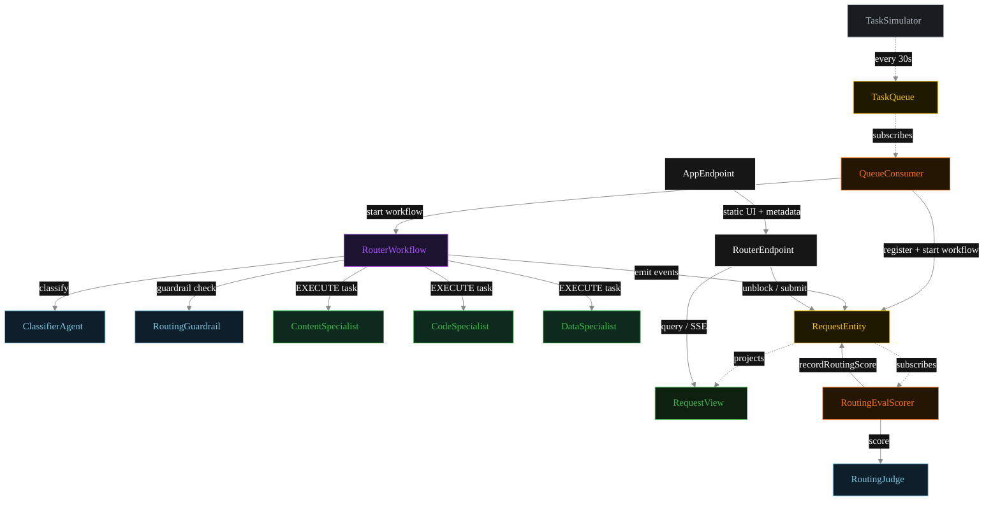
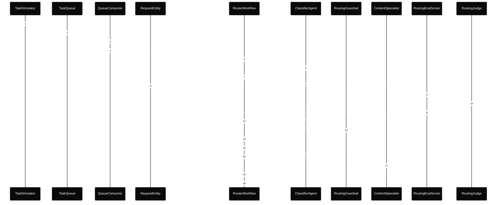
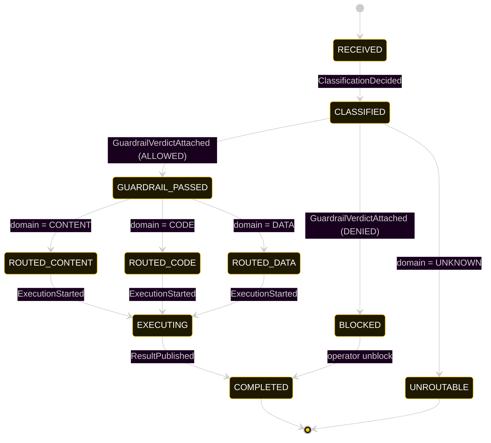
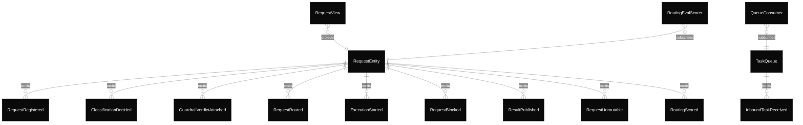

# PLAN — akka-router-pattern

Architectural sketch consumed by `/akka:plan` and rendered on the generated system's Architecture tab.

---

## Component graph

Solid arrows = synchronous component calls. Dashed arrows = event subscriptions and scheduler ticks.

## Interaction sequence — J1 (content happy path)

The eval-event sequence (steps 7–10) runs concurrently with the workflow's continuation — `RoutingEvalScorer` is a Consumer reading the entity's event stream, independent of `RouterWorkflow`. Both writes target the same `RequestEntity`; the entity's commands are idempotent on `requestId`.

## State machine — `RequestEntity`

The `RoutingScored` event does not change `status`; it attaches the eval result. The state machine therefore treats it as a no-op transition (omitted from the diagram for clarity).

## Entity model

## Component table — Java file targets

| Component | Path (generated) |
|---|---|
| `TaskSimulator` | `application/TaskSimulator.java` |
| `TaskQueue` | `application/TaskQueue.java` |
| `QueueConsumer` | `application/QueueConsumer.java` |
| `ClassifierAgent` | `application/ClassifierAgent.java` |
| `RoutingGuardrail` | `application/RoutingGuardrail.java` |
| `ContentSpecialist` | `application/ContentSpecialist.java` |
| `CodeSpecialist` | `application/CodeSpecialist.java` |
| `DataSpecialist` | `application/DataSpecialist.java` |
| `RoutingJudge` | `application/RoutingJudge.java` |
| `RouterWorkflow` | `application/RouterWorkflow.java` |
| `RequestEntity` | `application/RequestEntity.java` (state in `domain/Request.java`, events in `domain/RequestEvent.java`) |
| `RequestView` | `application/RequestView.java` |
| `RoutingEvalScorer` | `application/RoutingEvalScorer.java` |
| `RouterEndpoint` | `api/RouterEndpoint.java` |
| `AppEndpoint` | `api/AppEndpoint.java` |
| Task definitions | `application/RouterTasks.java` |
| Mock provider (option a) | `application/MockModelProvider.java` |
| Bootstrap | `Bootstrap.java` |

## Concurrency notes

- **Per-step timeout.** `classifyStep` 20 s, `guardrailStep` 20 s, `contentStep` / `codeStep` / `dataStep` / `publishStep` 60 s each. On timeout, default recovery is `maxRetries(2).failoverTo(error)` which transitions the request to `UNROUTABLE` with the failure reason captured.
- **Idempotency.** Every per-request primitive is keyed by `requestId`: `RequestEntity` id is `requestId`; `RouterWorkflow` id is `requestId`; agent sessions for `ClassifierAgent`, `RoutingGuardrail`, and `RoutingJudge` use `requestId`. Duplicate queue consumer events fold into a single workflow start (workflow start is idempotent per id).
- **Race between eval and workflow.** `RoutingEvalScorer` (Consumer) and `RouterWorkflow` both append events to the same `RequestEntity`. Order is not guaranteed but does not matter: `RoutingScored` only mutates `routingScore`, never `status`. The view materialises both events independently.
- **No saga compensation.** Once the specialist returns its `TaskResult`, the workflow publishes unconditionally. There is no rollback path — a blocked request sits in `BLOCKED` until an operator unblocks via `POST /api/requests/{id}/unblock`.
- **Guardrail precedes specialist.** The `RoutingGuardrail` runs in `guardrailStep` immediately after classification and before any specialist is selected. A blocked request never reaches a specialist; the specialist sees no evidence of it.
- **Simulator throughput.** `TaskSimulator` drips one request every 30 s; the system can comfortably process each request end-to-end inside that window with mock or real LLMs.
