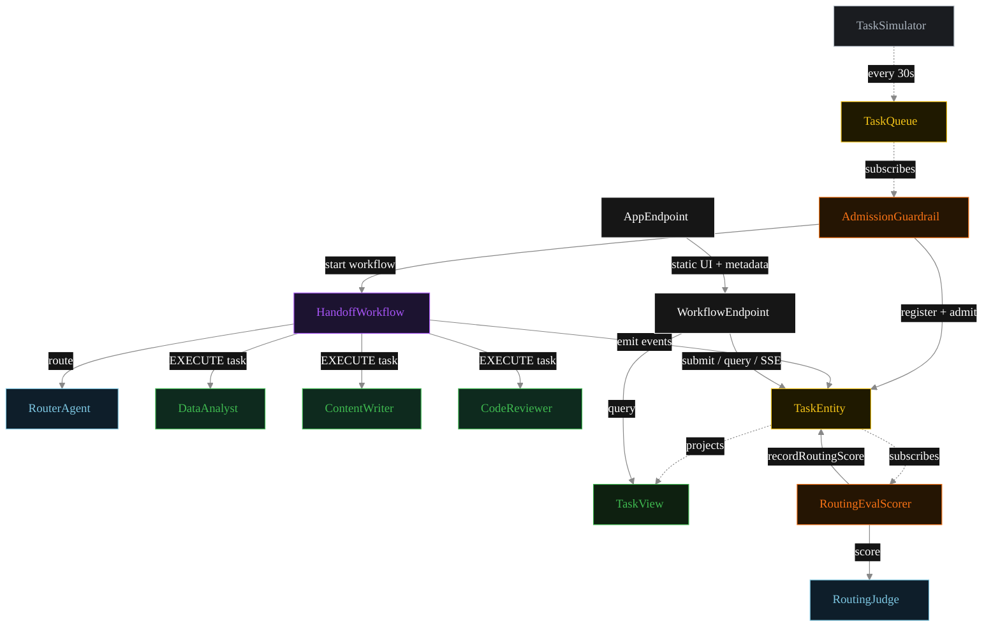
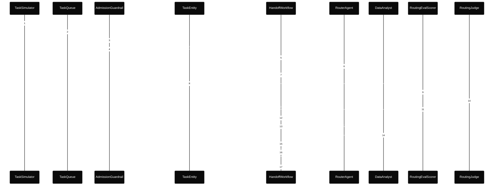
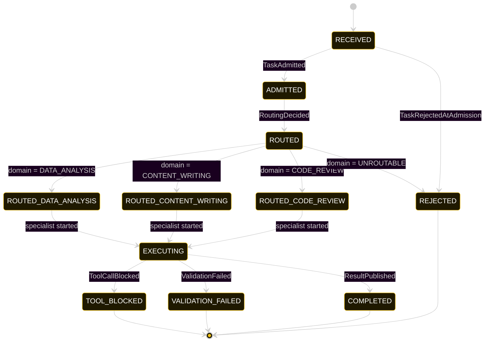
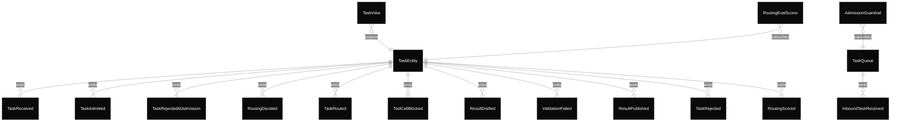

# PLAN — multi-agent-handoff-workflow

Architectural sketch consumed by `/akka:plan` and rendered on the generated system's Architecture tab.

---

## Component graph

Solid arrows = synchronous component calls. Dashed arrows = event subscriptions and scheduler ticks.

## Interaction sequence — J1 (data-analysis happy path)

The eval-event sequence (steps 7–10) runs concurrently with the workflow's continuation — `RoutingEvalScorer` is a Consumer reading the entity's event stream, independent of `HandoffWorkflow`. Both writes target the same `TaskEntity`; the entity's commands are idempotent on `taskId`.

## State machine — `TaskEntity`

The `RoutingScored` event does not change `status`; it attaches the eval result. The state machine therefore treats it as a no-op transition (omitted from the diagram for clarity).

## Entity model

## Component table — Java file targets

| Component | Path (generated) |
|---|---|
| `TaskSimulator` | `application/TaskSimulator.java` |
| `TaskQueue` | `application/TaskQueue.java` |
| `AdmissionGuardrail` | `application/AdmissionGuardrail.java` |
| `RouterAgent` | `application/RouterAgent.java` |
| `DataAnalyst` | `application/DataAnalyst.java` |
| `ContentWriter` | `application/ContentWriter.java` |
| `CodeReviewer` | `application/CodeReviewer.java` |
| `RoutingJudge` | `application/RoutingJudge.java` |
| `HandoffWorkflow` | `application/HandoffWorkflow.java` |
| `TaskEntity` | `application/TaskEntity.java` (state in `domain/Task.java`, events in `domain/TaskEvent.java`) |
| `TaskView` | `application/TaskView.java` |
| `RoutingEvalScorer` | `application/RoutingEvalScorer.java` |
| `WorkflowEndpoint` | `api/WorkflowEndpoint.java` |
| `AppEndpoint` | `api/AppEndpoint.java` |
| Task definitions | `application/WorkflowTasks.java` |
| Mock provider (option a) | `application/MockModelProvider.java` |
| Bootstrap | `Bootstrap.java` |

## Concurrency notes

- **Per-step timeout.** `routeStep` 20 s, `validateStep` 20 s, `dataStep` / `contentStep` / `codeStep` / `publishStep` 60 s each. On timeout, default recovery is `maxRetries(2).failoverTo(error)` which transitions the task to `REJECTED` with the failure reason captured.
- **Idempotency.** Every per-task primitive is keyed by `taskId`: `TaskEntity` id is `taskId`; `HandoffWorkflow` id is `taskId`; agent sessions for `RouterAgent`, `RoutingJudge` use `taskId`. Duplicate admission events fold into a single workflow start (workflow start is idempotent per id).
- **Race between eval and workflow.** `RoutingEvalScorer` (Consumer) and `HandoffWorkflow` both append events to the same `TaskEntity`. Order is not guaranteed but does not matter: `RoutingScored` only mutates `routingScore`, never `status`. The view materialises both events independently.
- **No saga compensation.** The handoff is a single-direction transfer of ownership; once the specialist returns its `TaskResult`, the workflow either publishes or records a validation failure. There is no rollback path.
- **No HITL on the happy path.** The system only surfaces blocked tool calls or validation failures for operator review; everything else flows through to `COMPLETED` autonomously.
- **Simulator throughput.** `TaskSimulator` drips one request every 30 s; the system can comfortably process each task end-to-end inside that window with mock or real LLMs.
