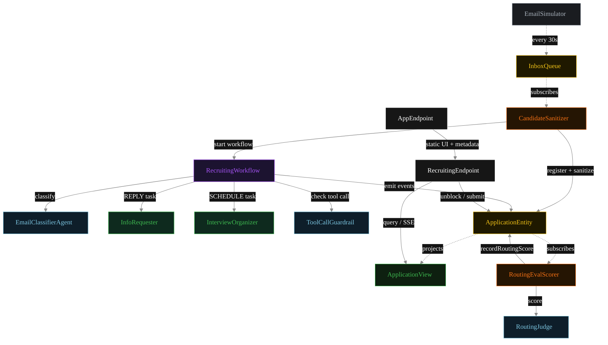
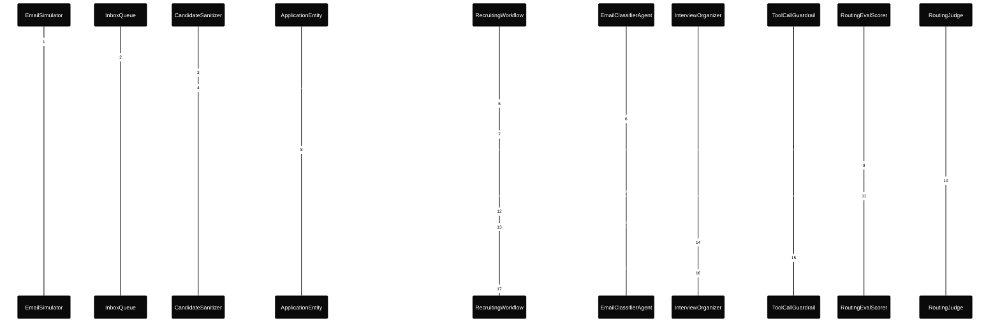
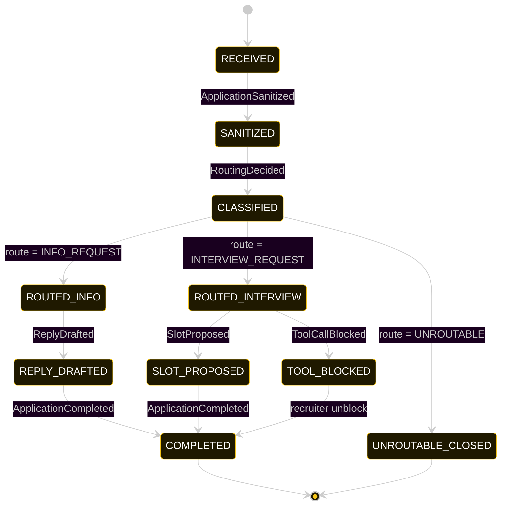
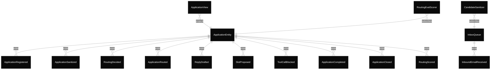

# PLAN — conditional-recruiting-router

Architectural sketch consumed by `/akka:plan` and rendered on the generated system's Architecture tab.

---

## Component graph

Solid arrows = synchronous component calls. Dashed arrows = event subscriptions and scheduler ticks.

## Interaction sequence — J2 (interview-request happy path)

The eval-event sequence (steps 7–10) runs concurrently with the workflow's continuation — `RoutingEvalScorer` is a Consumer reading the entity's event stream, independent of `RecruitingWorkflow`. Both writes target the same `ApplicationEntity`; commands are idempotent on `applicationId`.

## State machine — `ApplicationEntity`

The `RoutingScored` event does not change `status`; it attaches the eval result. The state machine treats it as a no-op transition (omitted for clarity).

## Entity model

## Component table — Java file targets

| Component | Path (generated) |
|---|---|
| `EmailSimulator` | `application/EmailSimulator.java` |
| `InboxQueue` | `application/InboxQueue.java` |
| `CandidateSanitizer` | `application/CandidateSanitizer.java` |
| `EmailClassifierAgent` | `application/EmailClassifierAgent.java` |
| `InfoRequester` | `application/InfoRequester.java` |
| `InterviewOrganizer` | `application/InterviewOrganizer.java` |
| `RoutingJudge` | `application/RoutingJudge.java` |
| `ToolCallGuardrail` | `application/ToolCallGuardrail.java` |
| `RecruitingWorkflow` | `application/RecruitingWorkflow.java` |
| `ApplicationEntity` | `application/ApplicationEntity.java` (state in `domain/Application.java`, events in `domain/ApplicationEvent.java`) |
| `ApplicationView` | `application/ApplicationView.java` |
| `RoutingEvalScorer` | `application/RoutingEvalScorer.java` |
| `RecruitingEndpoint` | `api/RecruitingEndpoint.java` |
| `AppEndpoint` | `api/AppEndpoint.java` |
| Task definitions | `application/RecruitingTasks.java` |
| Mock provider (option a) | `application/MockModelProvider.java` |
| Bootstrap | `Bootstrap.java` |

## Concurrency notes

- **Per-step timeout.** `classifyStep` 20 s, `toolGuardrailStep` 20 s, `infoStep` / `scheduleStep` 60 s each. On timeout, default recovery is `maxRetries(2).failoverTo(error)` which transitions the application to `UNROUTABLE_CLOSED` with the failure reason captured.
- **Idempotency.** Every per-application primitive is keyed by `applicationId`: `ApplicationEntity` id is `applicationId`; `RecruitingWorkflow` id is `applicationId`; agent sessions for `EmailClassifierAgent`, `RoutingJudge`, and `ToolCallGuardrail` use `applicationId`. Duplicate sanitize events fold into a single workflow start (workflow start is idempotent per id).
- **Race between eval and workflow.** `RoutingEvalScorer` (Consumer) and `RecruitingWorkflow` both append events to the same `ApplicationEntity`. Order is not guaranteed but does not matter: `RoutingScored` only mutates `routingScore`, never `status`. The view materialises both events independently.
- **No saga compensation.** The handoff is a single-direction transfer of ownership. A tool-blocked application sits in `TOOL_BLOCKED` until a recruiter unblocks via `POST /api/applications/{id}/unblock`.
- **No HITL on the happy path.** The system only waits for a human when the guardrail blocks a tool call; everything else flows through to `COMPLETED` autonomously.
- **Simulator throughput.** `EmailSimulator` drips one email every 30 s; the service can process each application end-to-end inside that window with mock or real LLMs.
