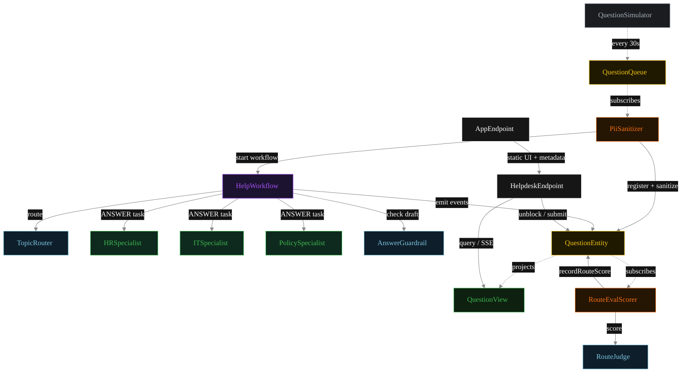
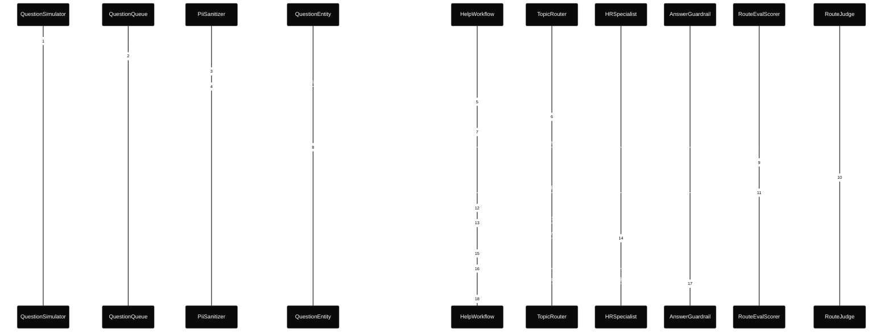
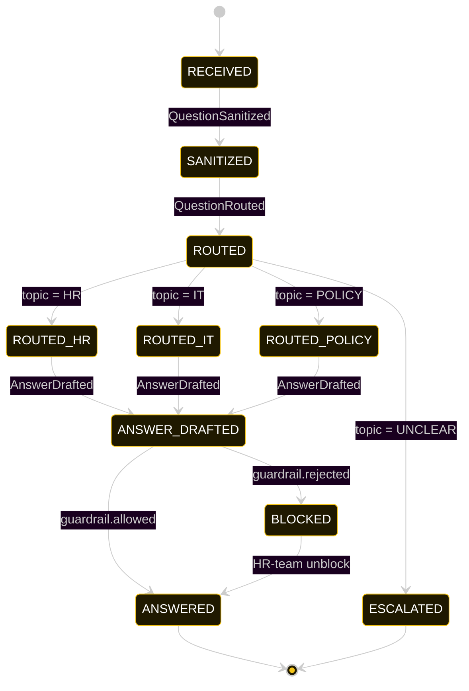
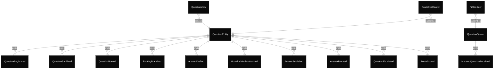

# PLAN — employee-helpdesk-router

Architectural sketch consumed by `/akka:plan` and rendered on the generated system's Architecture tab.

---

## Component graph

Solid arrows = synchronous component calls. Dashed arrows = event subscriptions and scheduler ticks.

## Interaction sequence — J1 (HR happy path)

The eval-score sequence (steps 7–10) runs concurrently with the workflow's continuation — `RouteEvalScorer` is a Consumer reading the entity's event stream, independent of `HelpWorkflow`. Both writes target the same `QuestionEntity`; commands are idempotent on `questionId`.

## State machine — `QuestionEntity`

The `RouteScored` event does not change `status`; it attaches the eval result. The state machine treats it as a no-op transition (omitted for clarity).

## Entity model

## Component table — Java file targets

| Component | Path (generated) |
|---|---|
| `QuestionSimulator` | `application/QuestionSimulator.java` |
| `QuestionQueue` | `application/QuestionQueue.java` |
| `PiiSanitizer` | `application/PiiSanitizer.java` |
| `TopicRouter` | `application/TopicRouter.java` |
| `HRSpecialist` | `application/HRSpecialist.java` |
| `ITSpecialist` | `application/ITSpecialist.java` |
| `PolicySpecialist` | `application/PolicySpecialist.java` |
| `RouteJudge` | `application/RouteJudge.java` |
| `AnswerGuardrail` | `application/AnswerGuardrail.java` |
| `HelpWorkflow` | `application/HelpWorkflow.java` |
| `QuestionEntity` | `application/QuestionEntity.java` (state in `domain/Question.java`, events in `domain/QuestionEvent.java`) |
| `QuestionView` | `application/QuestionView.java` |
| `RouteEvalScorer` | `application/RouteEvalScorer.java` |
| `HelpdeskEndpoint` | `api/HelpdeskEndpoint.java` |
| `AppEndpoint` | `api/AppEndpoint.java` |
| Task definitions | `application/HelpTasks.java` |
| Mock provider (option a) | `application/MockModelProvider.java` |
| Bootstrap | `Bootstrap.java` |

## Concurrency notes

- **Per-step timeout.** `routeStep` 20 s, `guardrailStep` 20 s, `hrStep` / `itStep` / `policyStep` / `publishStep` 60 s each. On timeout, default recovery is `maxRetries(2).failoverTo(error)` which transitions the question to `ESCALATED` with the failure reason captured.
- **Idempotency.** Every per-question primitive is keyed by `questionId`: `QuestionEntity` id is `questionId`; `HelpWorkflow` id is `questionId`; agent sessions for `TopicRouter`, `RouteJudge`, and `AnswerGuardrail` use `questionId`. Duplicate sanitize events fold into a single workflow start (workflow start is idempotent per id).
- **Race between eval and workflow.** `RouteEvalScorer` (Consumer) and `HelpWorkflow` both append events to the same `QuestionEntity`. Order is not guaranteed but does not matter: `RouteScored` only mutates `routeScore`, never `status`. The view materialises both events independently.
- **No saga compensation.** The handoff is a single-direction transfer of ownership; once the specialist returns its `Answer`, the workflow either publishes or blocks based on the guardrail verdict. There is no rollback path — a blocked draft sits in `BLOCKED` until an HR-team member unblocks via `POST /api/questions/{id}/unblock`.
- **No HITL on the happy path.** The system only waits for a human when the guardrail blocks; everything else flows through to `ANSWERED` autonomously.
- **Simulator throughput.** `QuestionSimulator` drips one question every 30 s; the system can comfortably process each question end-to-end inside that window with mock or real LLMs.
