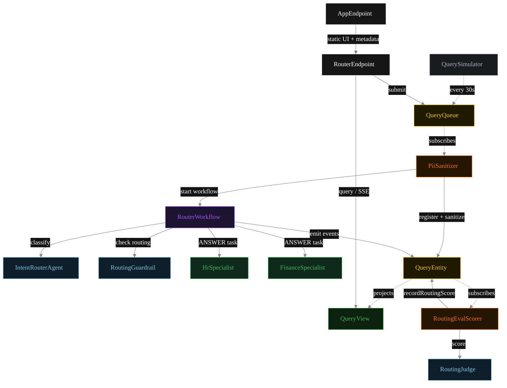
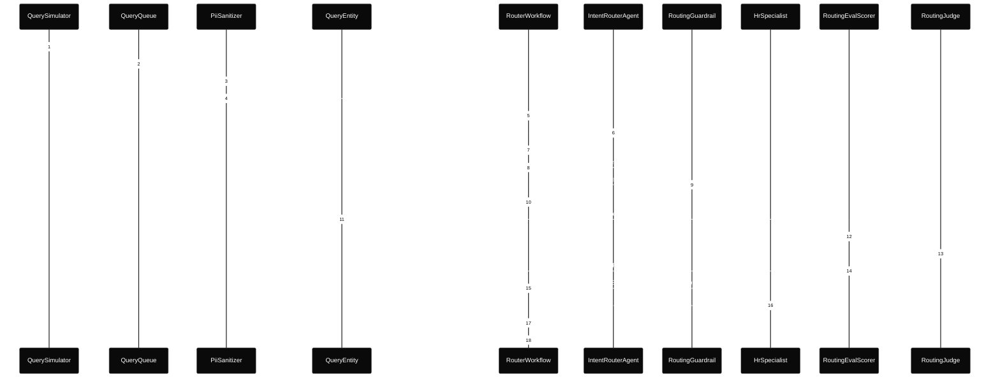
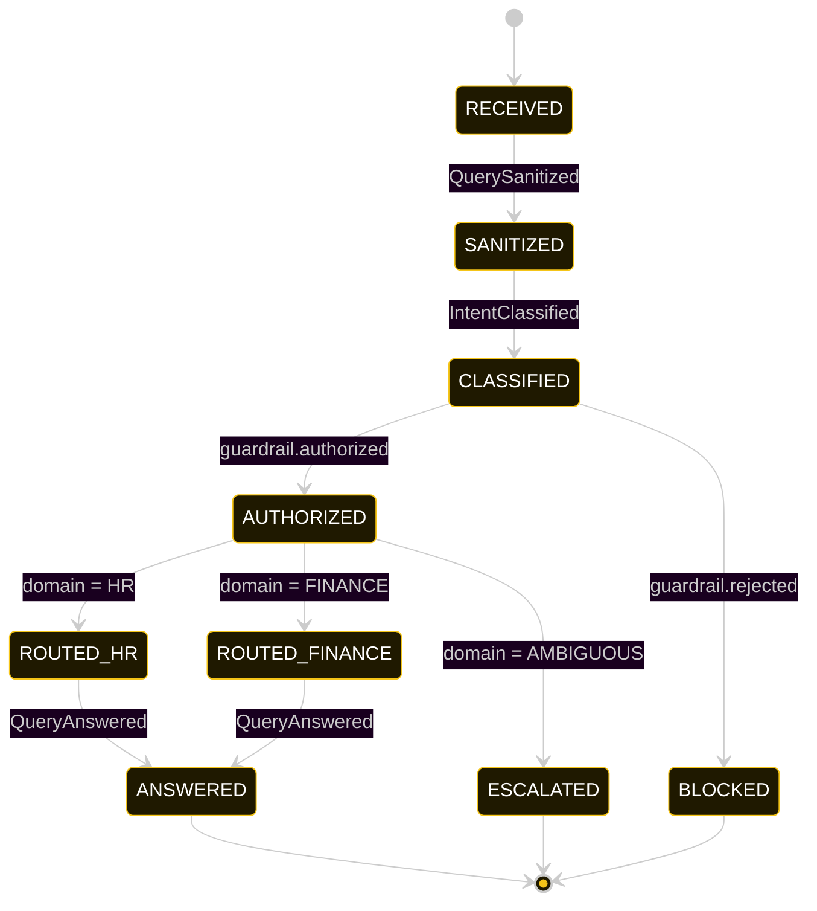
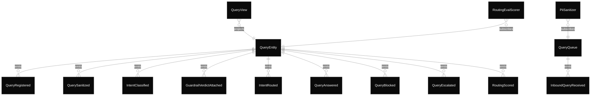

# PLAN — core-semantic-router

Architectural sketch consumed by `/akka:plan` and rendered on the generated system's Architecture tab.

---

## Component graph

Solid arrows = synchronous component calls. Dashed arrows = event subscriptions and scheduler ticks.

## Interaction sequence — J1 (HR happy path)

The eval-event sequence (steps 10–13) runs concurrently with the workflow's continuation — `RoutingEvalScorer` is a Consumer reading the entity's event stream, independent of `RouterWorkflow`. Both writes target the same `QueryEntity`; the entity's commands are idempotent on `queryId`.

## State machine — `QueryEntity`

The `RoutingScored` event does not change `status`; it attaches the eval result. The state machine treats it as a no-op transition (omitted from the diagram for clarity).

## Entity model

## Component table — Java file targets

| Component | Path (generated) |
|---|---|
| `QuerySimulator` | `application/QuerySimulator.java` |
| `QueryQueue` | `application/QueryQueue.java` |
| `PiiSanitizer` | `application/PiiSanitizer.java` |
| `IntentRouterAgent` | `application/IntentRouterAgent.java` |
| `RoutingGuardrail` | `application/RoutingGuardrail.java` |
| `HrSpecialist` | `application/HrSpecialist.java` |
| `FinanceSpecialist` | `application/FinanceSpecialist.java` |
| `RoutingJudge` | `application/RoutingJudge.java` |
| `RouterWorkflow` | `application/RouterWorkflow.java` |
| `QueryEntity` | `application/QueryEntity.java` (state in `domain/Query.java`, events in `domain/QueryEvent.java`) |
| `QueryView` | `application/QueryView.java` |
| `RoutingEvalScorer` | `application/RoutingEvalScorer.java` |
| `RouterEndpoint` | `api/RouterEndpoint.java` |
| `AppEndpoint` | `api/AppEndpoint.java` |
| Task definitions | `application/RouterTasks.java` |
| Mock provider (option a) | `application/MockModelProvider.java` |
| Bootstrap | `Bootstrap.java` |

## Concurrency notes

- **Per-step timeout.** `classifyStep` 20 s, `guardrailStep` 20 s, `hrStep` / `financeStep` / `publishStep` 60 s each. On timeout, default recovery is `maxRetries(2).failoverTo(error)` which transitions the query to `ESCALATED` with the failure reason captured.
- **Idempotency.** Every per-query primitive is keyed by `queryId`: `QueryEntity` id is `queryId`; `RouterWorkflow` id is `queryId`; agent sessions for `IntentRouterAgent`, `RoutingGuardrail`, and `RoutingJudge` use `queryId`. Duplicate sanitize events fold into a single workflow start (workflow start is idempotent per id).
- **Race between eval and workflow.** `RoutingEvalScorer` (Consumer) and `RouterWorkflow` both append events to the same `QueryEntity`. Order is not guaranteed but does not matter: `RoutingScored` only mutates `routingScore`, never `status`. The view materialises both events independently.
- **Guardrail position.** The `RoutingGuardrail` check happens before the specialist is invoked. This is the distinction from a before-agent-response guardrail — no specialist runs at all when the routing is blocked. The query lands in `BLOCKED` and no `QueryAnswer` is ever produced.
- **No saga compensation.** The handoff is a single-direction transfer; once the specialist returns its `QueryAnswer`, the workflow publishes. There is no rollback path.
- **No HITL on the happy path.** The system only surfaces blocked queries for operator attention; everything else flows to `ANSWERED` autonomously.
- **Simulator throughput.** `QuerySimulator` drips one query every 30 s; the system can comfortably process each query end-to-end inside that window with mock or real LLMs.
