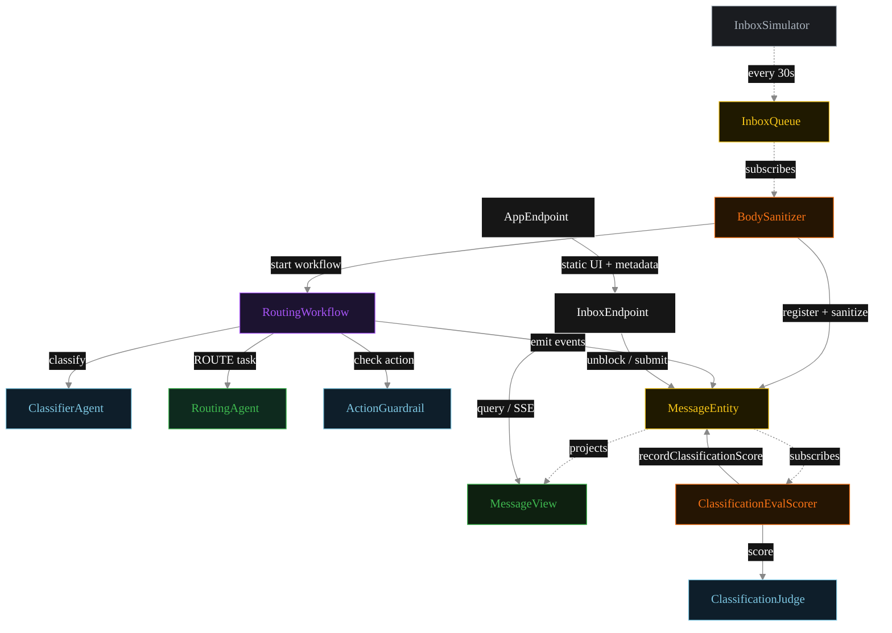
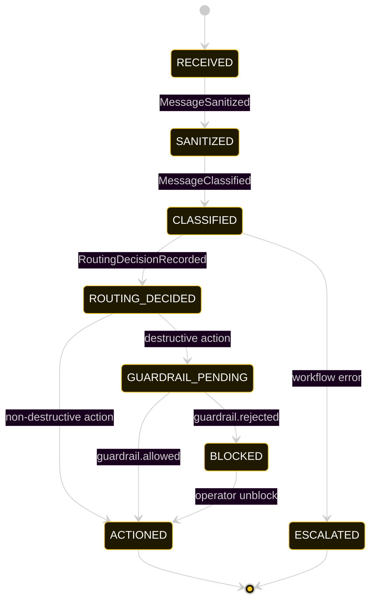
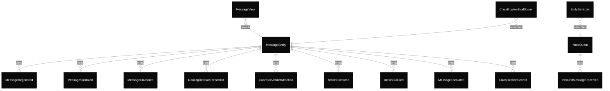

# PLAN — inbox-classifier

Architectural sketch consumed by `/akka:plan` and rendered on the generated system's Architecture tab.

---

## Component graph



Solid arrows = synchronous component calls. Dashed arrows = event subscriptions and scheduler ticks.

## Interaction sequence — J1 (urgent message happy path)

```mermaid
%%{init: {'theme':'base','themeVariables':{
  'primaryColor':'#0A0A0A','primaryTextColor':'#ffffff','primaryBorderColor':'#222',
  'lineColor':'#888','secondaryColor':'#141414','tertiaryColor':'#1C1C1C',
  'nodeTextColor':'#ffffff','stateLabelColor':'#ffffff','transitionLabelColor':'#cccccc',
  'actorTextColor':'#ffffff','noteTextColor':'#ffffff','sequenceNumberColor':'#000'
}}}%%
sequenceDiagram
  autonumber
  participant Sim as InboxSimulator
  participant Q as InboxQueue
  participant S as BodySanitizer
  participant E as MessageEntity
  participant W as RoutingWorkflow
  participant C as ClassifierAgent
  participant R as RoutingAgent
  participant Sc as ClassificationEvalScorer
  participant J as ClassificationJudge

  Sim->>Q: receive(InboundMessage)
  Q->>S: InboundMessageReceived
  S->>E: registerIncoming + attachSanitized
  S->>W: start(messageId, sanitized)
  W->>C: classify(sanitized)
  C-->>W: ClassificationDecision{URGENT}
  W->>E: recordClassification(decision) [emits MessageClassified]
  E->>Sc: MessageClassified event
  Sc->>J: score(sanitized, decision)
  J-->>Sc: ClassificationScore
  Sc->>E: recordClassificationScore [emits ClassificationScored]
  W->>R: runSingleTask(ROUTE, prompt)
  R-->>W: RoutingDecision{FLAG_URGENT}
  W->>E: recordRoutingDecision [emits RoutingDecisionRecorded]
  Note over W: FLAG_URGENT is non-destructive; guardrail skipped
  W->>E: executeAction [emits ActionExecuted, status ACTIONED]
```

The eval-event sequence (steps 7–10) runs concurrently with the workflow's continuation — `ClassificationEvalScorer` is a Consumer reading the entity's event stream, independent of `RoutingWorkflow`. Both writes target the same `MessageEntity`; commands are idempotent on `messageId`.

## State machine — `MessageEntity`



`ClassificationScored` does not change `status`; it attaches the eval result. The state machine treats it as a no-op transition (omitted for clarity).

## Entity model



## Component table — Java file targets

| Component | Path (generated) |
|---|---|
| `InboxSimulator` | `application/InboxSimulator.java` |
| `InboxQueue` | `application/InboxQueue.java` |
| `BodySanitizer` | `application/BodySanitizer.java` |
| `ClassifierAgent` | `application/ClassifierAgent.java` |
| `RoutingAgent` | `application/RoutingAgent.java` |
| `ActionGuardrail` | `application/ActionGuardrail.java` |
| `ClassificationJudge` | `application/ClassificationJudge.java` |
| `RoutingWorkflow` | `application/RoutingWorkflow.java` |
| `MessageEntity` | `application/MessageEntity.java` (state in `domain/Message.java`, events in `domain/MessageEvent.java`) |
| `MessageView` | `application/MessageView.java` |
| `ClassificationEvalScorer` | `application/ClassificationEvalScorer.java` |
| `InboxEndpoint` | `api/InboxEndpoint.java` |
| `AppEndpoint` | `api/AppEndpoint.java` |
| Task definitions | `application/InboxTasks.java` |
| Mock provider (option a) | `application/MockModelProvider.java` |
| Bootstrap | `Bootstrap.java` |

## Concurrency notes

- **Per-step timeout.** `classifyStep` 20 s, `guardrailStep` 20 s, `routeStep` / `executeStep` 60 s each. On timeout, default recovery is `maxRetries(2).failoverTo(error)` which transitions the message to `ESCALATED` with the failure reason captured.
- **Idempotency.** Every per-message primitive is keyed by `messageId`: `MessageEntity` id is `messageId`; `RoutingWorkflow` id is `messageId`; agent sessions use `messageId`. Duplicate sanitize events fold into a single workflow start.
- **Race between eval and workflow.** `ClassificationEvalScorer` (Consumer) and `RoutingWorkflow` both append events to `MessageEntity`. Order is not guaranteed but does not matter: `ClassificationScored` only mutates `classificationScore`, never `status`.
- **Conditional guardrail.** The guardrail step fires only for destructive actions. Non-destructive actions (`FLAG_URGENT`, `MOVE_TO_FOLDER`, `MARK_READ`, `FORWARD_TO_HUMAN`) skip the guardrail and proceed directly to `executeStep`. This keeps latency low for the common case.
- **No HITL on the happy path.** The system actions messages autonomously. Only blocked destructive actions wait for a human via `POST /api/messages/{id}/unblock`.
- **Simulator throughput.** `InboxSimulator` drips one message every 30 s; the system can process each end-to-end within that window with mock or real LLMs.
