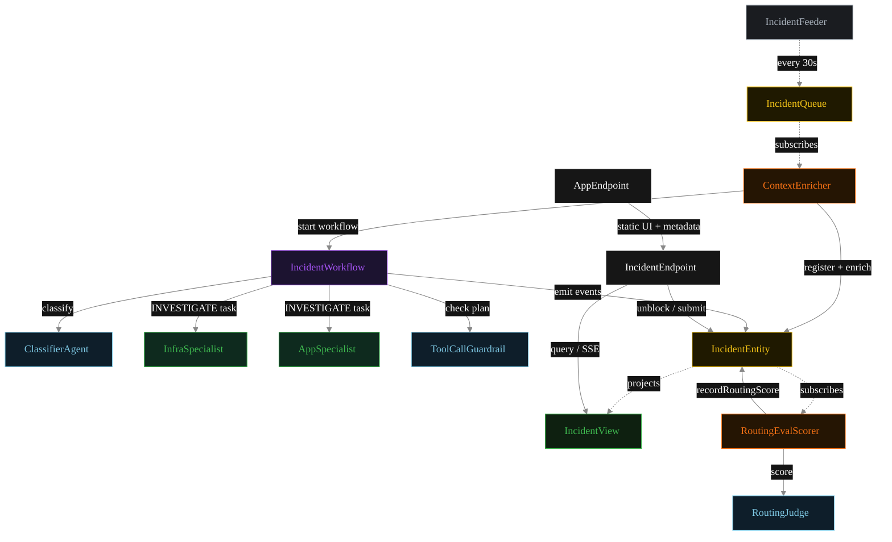
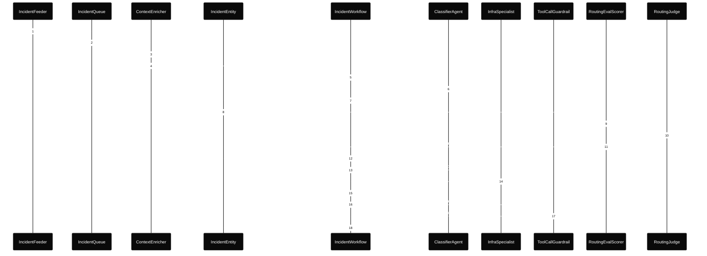
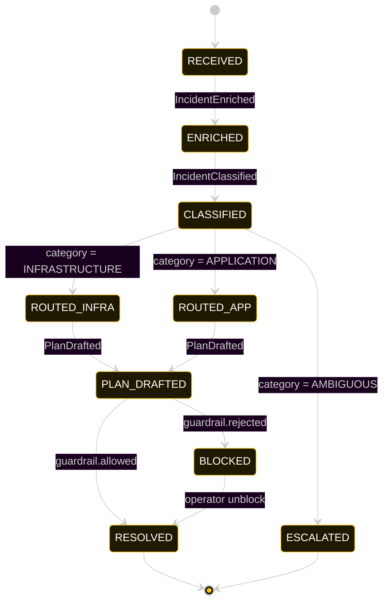
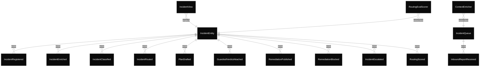

# PLAN — incident-management

Architectural sketch consumed by `/akka:plan` and rendered on the generated system's Architecture tab.

---

## Component graph

Solid arrows = synchronous component calls. Dashed arrows = event subscriptions and scheduler ticks.

## Interaction sequence — J1 (infrastructure happy path)

The eval-event sequence (steps 7–10) runs concurrently with the workflow's continuation — `RoutingEvalScorer` is a Consumer reading the entity's event stream, independent of `IncidentWorkflow`. Both writes target the same `IncidentEntity`; the entity's commands are idempotent on `incidentId`.

## State machine — `IncidentEntity`

The `RoutingScored` event does not change `status`; it attaches the eval result. The state machine therefore treats it as a no-op transition (omitted from the diagram for clarity).

## Entity model

## Component table — Java file targets

| Component | Path (generated) |
|---|---|
| `IncidentFeeder` | `application/IncidentFeeder.java` |
| `IncidentQueue` | `application/IncidentQueue.java` |
| `ContextEnricher` | `application/ContextEnricher.java` |
| `ClassifierAgent` | `application/ClassifierAgent.java` |
| `InfraSpecialist` | `application/InfraSpecialist.java` |
| `AppSpecialist` | `application/AppSpecialist.java` |
| `RoutingJudge` | `application/RoutingJudge.java` |
| `ToolCallGuardrail` | `application/ToolCallGuardrail.java` |
| `IncidentWorkflow` | `application/IncidentWorkflow.java` |
| `IncidentEntity` | `application/IncidentEntity.java` (state in `domain/Incident.java`, events in `domain/IncidentEvent.java`) |
| `IncidentView` | `application/IncidentView.java` |
| `RoutingEvalScorer` | `application/RoutingEvalScorer.java` |
| `IncidentEndpoint` | `api/IncidentEndpoint.java` |
| `AppEndpoint` | `api/AppEndpoint.java` |
| Task definitions | `application/IncidentTasks.java` |
| Mock provider (option a) | `application/MockModelProvider.java` |
| Bootstrap | `Bootstrap.java` |

## Concurrency notes

- **Per-step timeout.** `classifyStep` 20 s, `guardrailStep` 20 s, `infraStep` / `appStep` / `publishStep` 60 s each. On timeout, default recovery is `maxRetries(2).failoverTo(error)` which transitions the incident to `ESCALATED` with the failure reason captured.
- **Idempotency.** Every per-incident primitive is keyed by `incidentId`: `IncidentEntity` id is `incidentId`; `IncidentWorkflow` id is `incidentId`; agent sessions for `ClassifierAgent`, `RoutingJudge`, and `ToolCallGuardrail` use `incidentId`. Duplicate enrich events fold into a single workflow start (workflow start is idempotent per id).
- **Race between eval and workflow.** `RoutingEvalScorer` (Consumer) and `IncidentWorkflow` both append events to the same `IncidentEntity`. Order is not guaranteed but does not matter: `RoutingScored` only mutates `routingScore`, never `status`. The view materialises both events independently.
- **No saga compensation.** The handoff is a single-direction transfer of ownership; once the specialist returns its `RemediationPlan`, the workflow either publishes or blocks based on the guardrail verdict. There is no rollback path — a blocked plan sits in `BLOCKED` until an operator unblocks via `POST /api/incidents/{id}/unblock`.
- **No HITL on the happy path.** This is the distinction from `human-in-loop-gate`. The system only waits for a human when the guardrail blocks; everything else flows through to `RESOLVED` autonomously.
- **Feeder throughput.** `IncidentFeeder` drips one report every 30 s; the system can process each incident end-to-end inside that window with mock or real LLMs.
