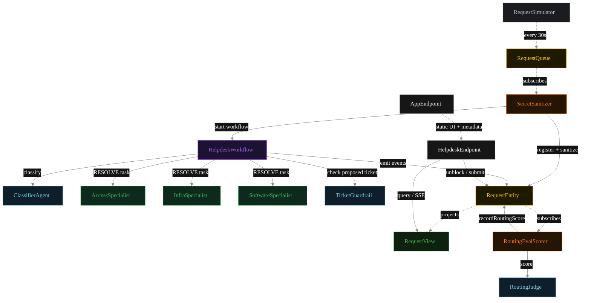
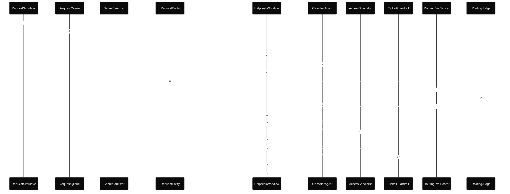
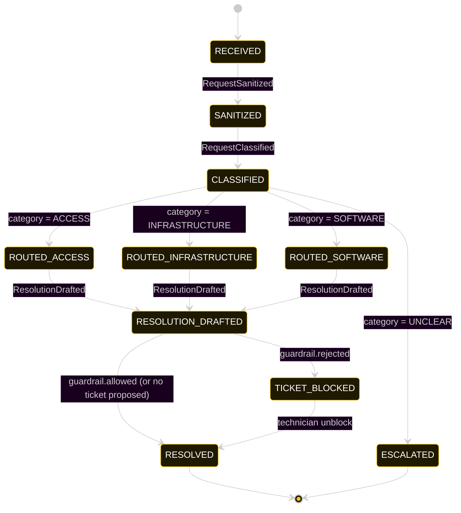
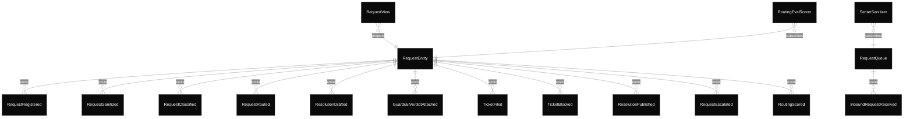

# PLAN — it-helpdesk

Architectural sketch consumed by `/akka:plan` and rendered on the generated system's Architecture tab.

---

## Component graph

Solid arrows = synchronous component calls. Dashed arrows = event subscriptions and scheduler ticks.

## Interaction sequence — J1 (access happy path)

The eval-event sequence (steps 8–11) runs concurrently with the workflow's continuation — `RoutingEvalScorer` is a Consumer reading the entity's event stream. Both writes target the same `RequestEntity`; the entity's commands are idempotent on `requestId`.

## State machine — `RequestEntity`

`RoutingScored` events do not change `status`; they attach the eval result. The state machine omits this as a no-op transition.

## Entity model

## Component table — Java file targets

| Component | Path (generated) |
|---|---|
| `RequestSimulator` | `application/RequestSimulator.java` |
| `RequestQueue` | `application/RequestQueue.java` |
| `SecretSanitizer` | `application/SecretSanitizer.java` |
| `ClassifierAgent` | `application/ClassifierAgent.java` |
| `AccessSpecialist` | `application/AccessSpecialist.java` |
| `InfraSpecialist` | `application/InfraSpecialist.java` |
| `SoftwareSpecialist` | `application/SoftwareSpecialist.java` |
| `RoutingJudge` | `application/RoutingJudge.java` |
| `TicketGuardrail` | `application/TicketGuardrail.java` |
| `HelpdeskWorkflow` | `application/HelpdeskWorkflow.java` |
| `RequestEntity` | `application/RequestEntity.java` (state in `domain/Request.java`, events in `domain/RequestEvent.java`) |
| `RequestView` | `application/RequestView.java` |
| `RoutingEvalScorer` | `application/RoutingEvalScorer.java` |
| `HelpdeskEndpoint` | `api/HelpdeskEndpoint.java` |
| `AppEndpoint` | `api/AppEndpoint.java` |
| Task definitions | `application/HelpdeskTasks.java` |
| Mock provider (option a) | `application/MockModelProvider.java` |
| Bootstrap | `Bootstrap.java` |

## Concurrency notes

- **Per-step timeout.** `classifyStep` 20 s, `guardrailStep` 20 s, `accessStep` / `infraStep` / `softwareStep` / `fileStep` / `publishStep` 60 s each. On timeout, default recovery is `maxRetries(2).failoverTo(error)`, which transitions the request to `ESCALATED`.
- **Conditional guardrail.** The guardrail step is skipped when the specialist's `Resolution.proposedTicket` is empty. Resolutions that only provide a `responseBody` without a ticket write pass through without a guardrail call.
- **Idempotency.** Every per-request primitive is keyed by `requestId`: `RequestEntity` id is `requestId`; `HelpdeskWorkflow` id is `requestId`; agent sessions use `requestId`. Duplicate sanitize events fold into a single workflow start.
- **Race between eval and workflow.** `RoutingEvalScorer` (Consumer) and `HelpdeskWorkflow` both append events to the same `RequestEntity`. Order is not guaranteed but does not matter: `RoutingScored` only mutates `routingScore`, never `status`.
- **No HITL on the happy path.** The system only waits for a human when the guardrail blocks a proposed ticket; everything else flows to `RESOLVED` autonomously.
- **Three specialists, one task type.** All three specialists declare `capability(TaskAcceptance.of(RESOLVE))`; the workflow routes to the correct one by calling `forAutonomousAgent(<Specialist>.class, requestId)`. The task type is shared; the specialist class determines who handles it.
