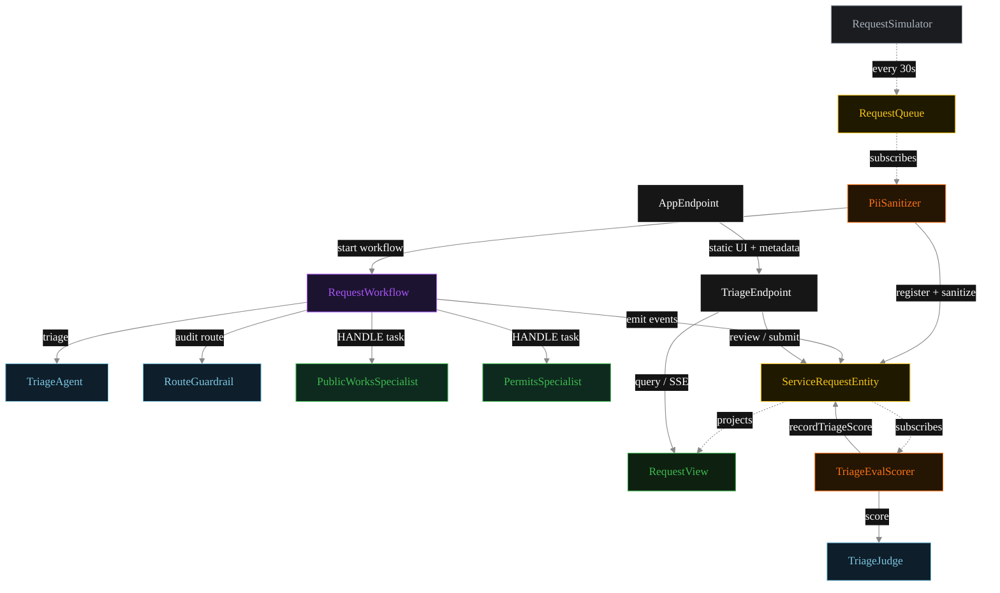
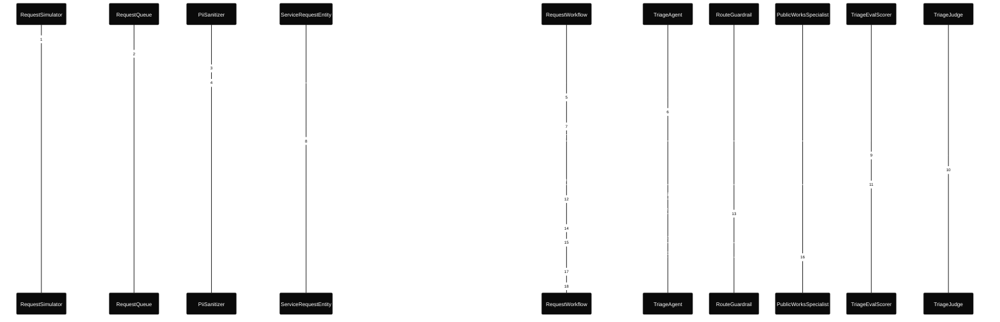
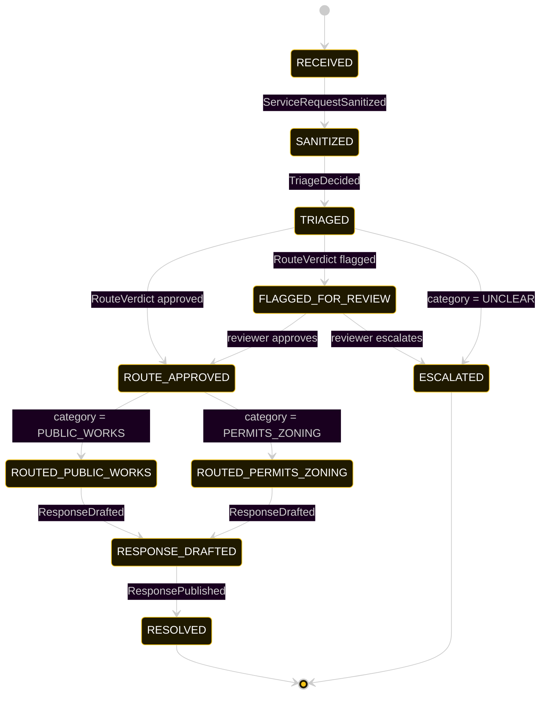
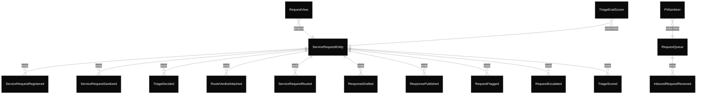

# PLAN — 311-triage

Architectural sketch consumed by `/akka:plan` and rendered on the generated system's Architecture tab.

---

## Component graph

Solid arrows = synchronous component calls. Dashed arrows = event subscriptions and scheduler ticks.

## Interaction sequence — J1 (public-works happy path)

The eval-event sequence (steps 8–11) runs concurrently with the workflow's continuation — `TriageEvalScorer` is a Consumer reading the entity's event stream, independent of `RequestWorkflow`. Both writes target the same `ServiceRequestEntity`; the entity's commands are idempotent on `requestId`.

## State machine — `ServiceRequestEntity`

The `TriageScored` event does not change `status`; it attaches the eval result. The state machine treats it as a no-op transition (omitted for clarity).

## Entity model

## Component table — Java file targets

| Component | Path (generated) |
|---|---|
| `RequestSimulator` | `application/RequestSimulator.java` |
| `RequestQueue` | `application/RequestQueue.java` |
| `PiiSanitizer` | `application/PiiSanitizer.java` |
| `TriageAgent` | `application/TriageAgent.java` |
| `RouteGuardrail` | `application/RouteGuardrail.java` |
| `PublicWorksSpecialist` | `application/PublicWorksSpecialist.java` |
| `PermitsSpecialist` | `application/PermitsSpecialist.java` |
| `TriageJudge` | `application/TriageJudge.java` |
| `RequestWorkflow` | `application/RequestWorkflow.java` |
| `ServiceRequestEntity` | `application/ServiceRequestEntity.java` (state in `domain/ServiceRequest.java`, events in `domain/ServiceRequestEvent.java`) |
| `RequestView` | `application/RequestView.java` |
| `TriageEvalScorer` | `application/TriageEvalScorer.java` |
| `TriageEndpoint` | `api/TriageEndpoint.java` |
| `AppEndpoint` | `api/AppEndpoint.java` |
| Task definitions | `application/ServiceTasks.java` |
| Mock provider (option a) | `application/MockModelProvider.java` |
| Bootstrap | `Bootstrap.java` |

## Concurrency notes

- **Per-step timeout.** `triageStep` 20 s, `routeGuardrailStep` 20 s, `publicWorksStep` / `permitsStep` / `publishStep` 60 s each. On timeout, default recovery is `maxRetries(2).failoverTo(error)` which transitions the request to `ESCALATED` with the failure reason captured.
- **Idempotency.** Every per-request primitive is keyed by `requestId`: `ServiceRequestEntity` id is `requestId`; `RequestWorkflow` id is `requestId`; agent sessions for `TriageAgent`, `RouteGuardrail`, `TriageJudge` use `requestId`. Duplicate sanitize events fold into a single workflow start (workflow start is idempotent per id).
- **Race between eval and workflow.** `TriageEvalScorer` (Consumer) and `RequestWorkflow` both append events to the same `ServiceRequestEntity`. Order is not guaranteed but does not matter: `TriageScored` only mutates `triageScore`, never `status`. The view materialises both events independently.
- **No saga compensation.** The handoff is a single-direction transfer of ownership; once the specialist returns its `DepartmentResponse`, the workflow publishes to `RESOLVED`. There is no rollback path — a flagged route sits in `FLAGGED_FOR_REVIEW` until a reviewer acts via `POST /api/requests/{id}/review`.
- **No HITL on the happy path.** The system only waits for a human when the route guardrail flags; everything else flows through to `RESOLVED` autonomously.
- **Simulator throughput.** `RequestSimulator` drips one request every 30 s; the system can process each request end-to-end inside that window with mock or real LLMs.
