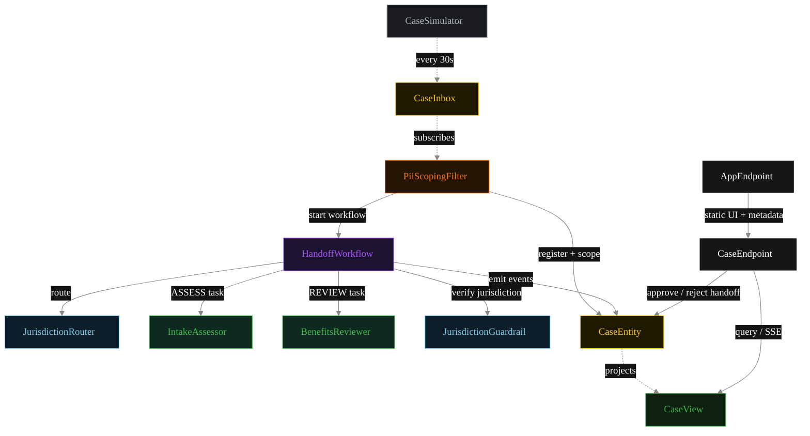
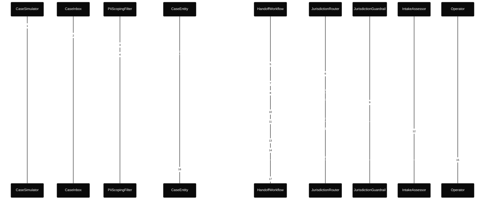
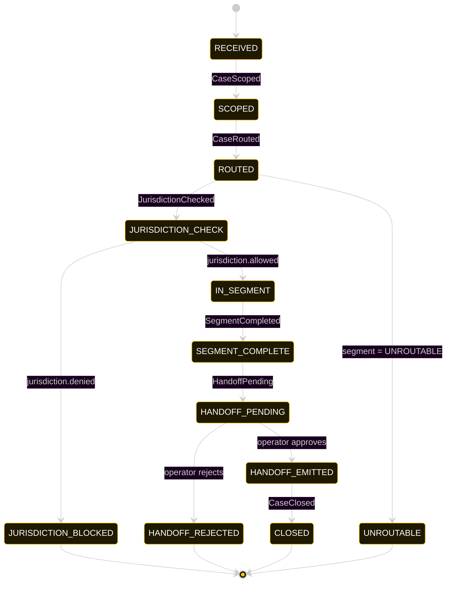
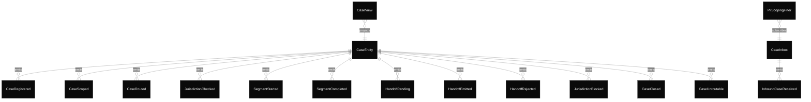

# PLAN — cross-agency-case-handoff-mesh

Architectural sketch consumed by `/akka:plan` and rendered on the generated system's Architecture tab.

---

## Component graph

Solid arrows = synchronous component calls. Dashed arrows = event subscriptions and scheduler ticks.

## Interaction sequence — J1 (intake-to-benefits happy path)

The approval step (steps 14–16) suspends the workflow until the operator acts. `HandoffWorkflow.approvalStep` blocks until `CaseEntity` receives an `approveHandoff` or `rejectHandoffOp` command from the `CaseEndpoint`.

## State machine — `CaseEntity`

A two-segment case (intake then benefits) cycles through `HANDOFF_EMITTED → ROUTED` for the second segment before reaching `CLOSED`. The diagram shows the per-segment loop; the terminal states are shared.

## Entity model

## Component table — Java file targets

| Component | Path (generated) |
|---|---|
| `CaseSimulator` | `application/CaseSimulator.java` |
| `CaseInbox` | `application/CaseInbox.java` |
| `PiiScopingFilter` | `application/PiiScopingFilter.java` |
| `JurisdictionRouter` | `application/JurisdictionRouter.java` |
| `IntakeAssessor` | `application/IntakeAssessor.java` |
| `BenefitsReviewer` | `application/BenefitsReviewer.java` |
| `JurisdictionGuardrail` | `application/JurisdictionGuardrail.java` |
| `HandoffWorkflow` | `application/HandoffWorkflow.java` |
| `CaseEntity` | `application/CaseEntity.java` (state in `domain/Case.java`, events in `domain/CaseEvent.java`) |
| `CaseView` | `application/CaseView.java` |
| `CaseEndpoint` | `api/CaseEndpoint.java` |
| `AppEndpoint` | `api/AppEndpoint.java` |
| Task definitions | `application/CaseTasks.java` |
| Mock provider (option a) | `application/MockModelProvider.java` |
| Bootstrap | `Bootstrap.java` |

## Concurrency notes

- **Per-step timeout.** `routeStep` 20 s, `guardStep` 20 s, `segmentStep` 60 s, `approvalStep` 60 s, `emitStep` 20 s. On timeout, default recovery is `maxRetries(2).failoverTo(error)`, which transitions the case to `UNROUTABLE` with a timeout reason captured.
- **Idempotency.** Every per-case primitive is keyed by `caseId`: `CaseEntity` id is `caseId`; `HandoffWorkflow` id is `caseId`; agent sessions for `JurisdictionRouter` and `JurisdictionGuardrail` use `caseId`. Duplicate scoping events fold into a single workflow start.
- **HITL suspension.** `approvalStep` suspends the workflow indefinitely. The case sits in `HANDOFF_PENDING` until an operator calls `approve-handoff` or `reject-handoff`. There is no auto-timeout — cases pending approval wait until an operator acts.
- **Jurisdiction guardrail fires before the agent.** `guardStep` runs before `segmentStep` in every iteration of the loop. If the guardrail blocks, `segmentStep` is never entered for that iteration; the workflow emits `JurisdictionBlocked` and terminates.
- **Sequential chain, not a fan-out.** The mesh processes one agency segment at a time. After a handoff is approved, the next segment's route → guard → agent → approval cycle begins. The two agency agents never run in parallel for the same case.
- **Simulator throughput.** `CaseSimulator` drips one case every 30 s. Each case can spend an unbounded time in `HANDOFF_PENDING`; the simulator is unaware of pending approvals. Cases accumulate if the operator is slow; the system handles any queue depth.
