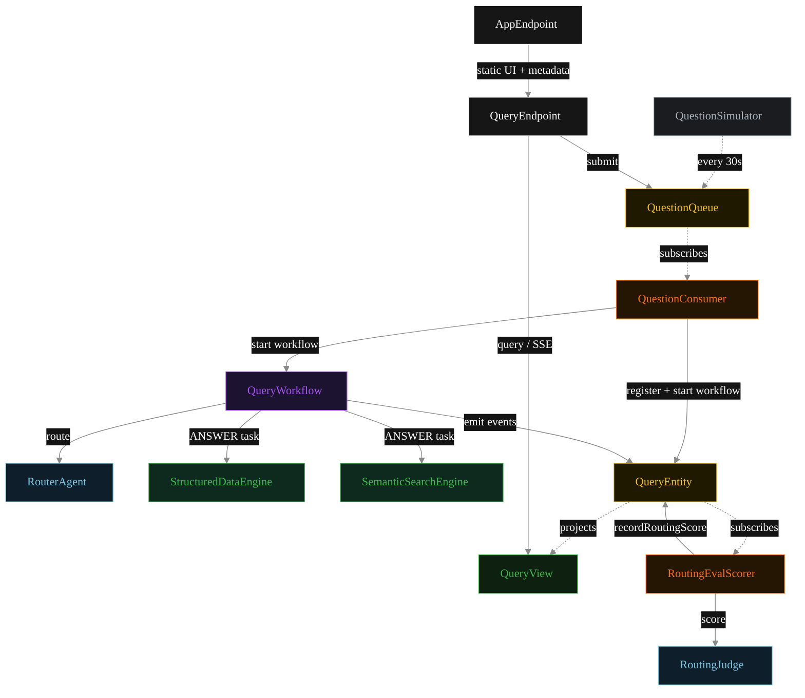
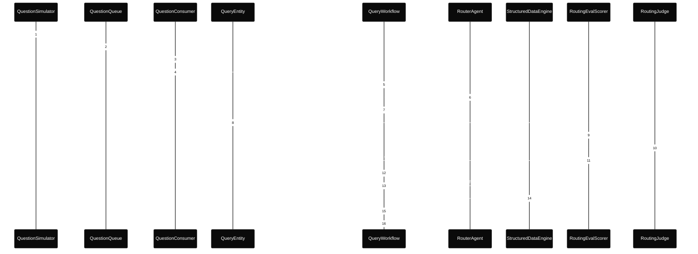
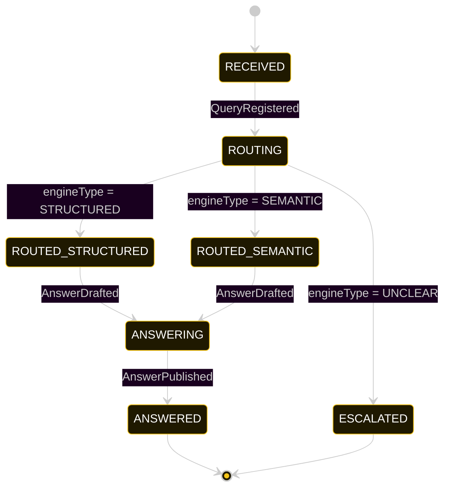
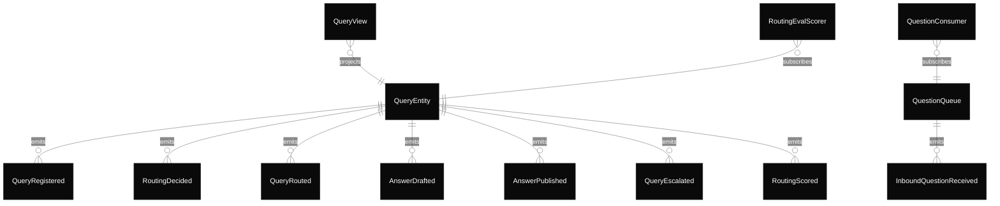

# PLAN — router-query-engine

Architectural sketch consumed by `/akka:plan` and rendered on the generated system's Architecture tab.

---

## Component graph

Solid arrows = synchronous component calls. Dashed arrows = event subscriptions and scheduler ticks.

## Interaction sequence — J1 (structured-data happy path)

The eval-event sequence (steps 7–10) runs concurrently with the workflow's continuation — `RoutingEvalScorer` is a Consumer reading the entity's event stream, independent of `QueryWorkflow`. Both writes target the same `QueryEntity`; the entity's commands are idempotent on `queryId`.

## State machine — `QueryEntity`

The `RoutingScored` event does not change `status`; it attaches the eval result. The state machine therefore treats it as a no-op transition (omitted from the diagram for clarity).

## Entity model

## Component table — Java file targets

| Component | Path (generated) |
|---|---|
| `QuestionSimulator` | `application/QuestionSimulator.java` |
| `QuestionQueue` | `application/QuestionQueue.java` |
| `QuestionConsumer` | `application/QuestionConsumer.java` |
| `RouterAgent` | `application/RouterAgent.java` |
| `StructuredDataEngine` | `application/StructuredDataEngine.java` |
| `SemanticSearchEngine` | `application/SemanticSearchEngine.java` |
| `RoutingJudge` | `application/RoutingJudge.java` |
| `QueryWorkflow` | `application/QueryWorkflow.java` |
| `QueryEntity` | `application/QueryEntity.java` (state in `domain/Query.java`, events in `domain/QueryEvent.java`) |
| `QueryView` | `application/QueryView.java` |
| `RoutingEvalScorer` | `application/RoutingEvalScorer.java` |
| `QueryEndpoint` | `api/QueryEndpoint.java` |
| `AppEndpoint` | `api/AppEndpoint.java` |
| Task definitions | `application/QueryTasks.java` |
| Mock provider (option a) | `application/MockModelProvider.java` |
| Bootstrap | `Bootstrap.java` |

## Concurrency notes

- **Per-step timeout.** `routeStep` 20 s; `structuredStep` / `semanticStep` / `publishStep` 60 s each. On timeout, default recovery is `maxRetries(2).failoverTo(error)` which transitions the query to `ESCALATED` with the failure reason captured.
- **Idempotency.** Every per-query primitive is keyed by `queryId`: `QueryEntity` id is `queryId`; `QueryWorkflow` id is `queryId`; agent session for `RouterAgent` and `RoutingJudge` uses `queryId`. Duplicate consumer events fold into a single workflow start (workflow start is idempotent per id).
- **Race between eval and workflow.** `RoutingEvalScorer` (Consumer) and `QueryWorkflow` both append events to the same `QueryEntity`. Order is not guaranteed but does not matter: `RoutingScored` only mutates `routingScore`, never `status`. The view materialises both events independently.
- **No saga compensation.** The handoff is a single-direction transfer; once the chosen engine returns its `Answer`, the workflow publishes. There is no rollback path — escalated queries sit in `ESCALATED` as a permanent terminal state.
- **No HITL on the happy path.** The system publishes answers without operator review. This is the key distinction from a human-in-loop pattern; it is appropriate for research-intelligence use cases where the answer is advisory, not binding.
- **Simulator throughput.** `QuestionSimulator` drips one question every 30 s; the system can comfortably process each query end-to-end inside that window with mock or real LLMs.
