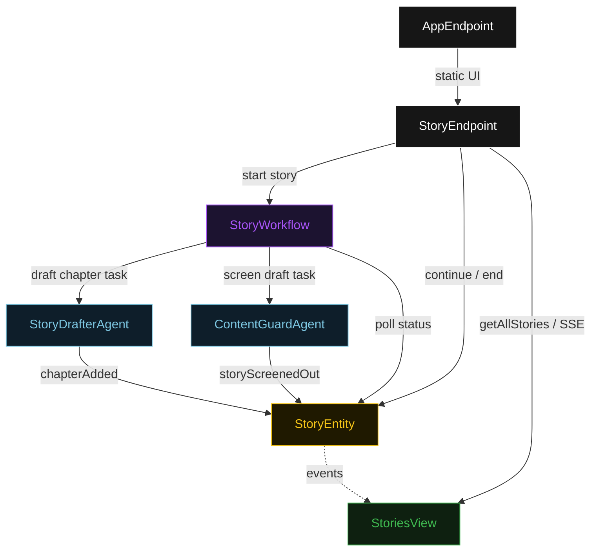
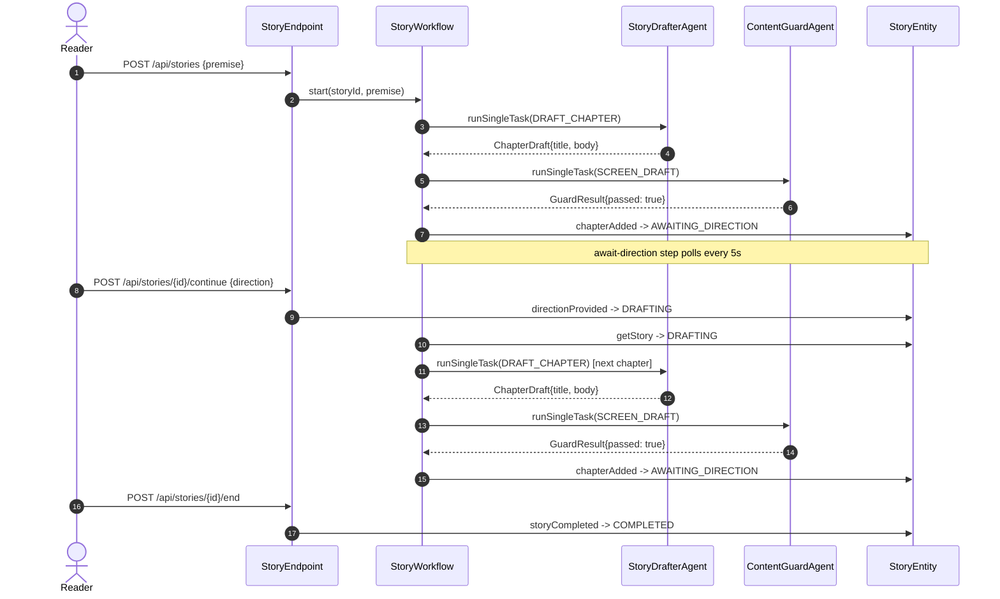
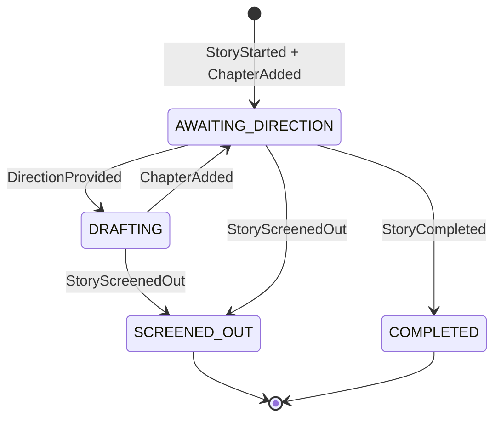
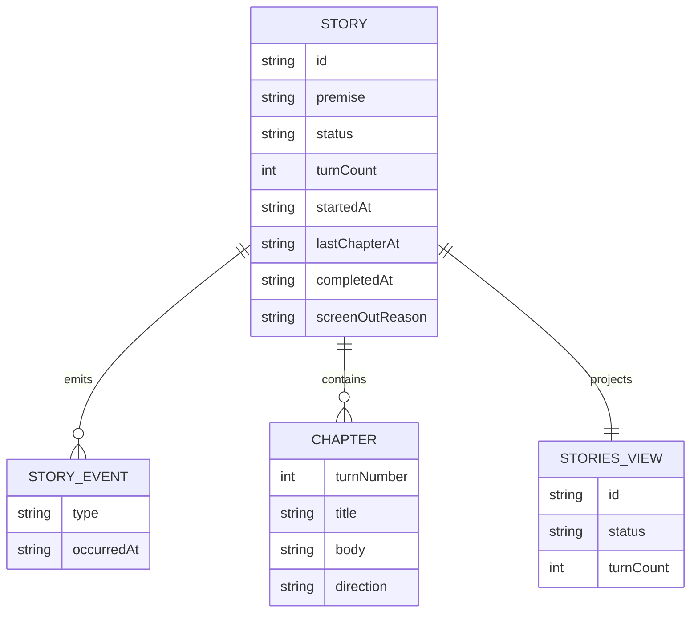

# PLAN — hitl-story-crafting

Architectural sketch for HITL Story Crafting. All four mermaid diagrams plus the component table.

---

## Component graph

## Interaction sequence

## State machine

## Entity model

## Component table

| Component | Path (generated) |
|---|---|
| StoryDrafterAgent | `application/StoryDrafterAgent.java` |
| ContentGuardAgent | `application/ContentGuardAgent.java` |
| StoryWorkflow | `application/StoryWorkflow.java` |
| StoryTasks | `application/StoryTasks.java` |
| StoryEntity | `application/StoryEntity.java` |
| StoriesView | `application/StoriesView.java` |
| StoryEndpoint | `api/StoryEndpoint.java` |
| AppEndpoint | `api/AppEndpoint.java` |
| Story / Chapter / events / records | `domain/*.java` |

## Concurrency notes

- **Step timeouts.** `draftChapterStep` and `screenDraftStep` call agents; both set `stepTimeout(60s)` to absorb LLM latency. The default 5 s step timeout would expire before a language model responds (Lesson 4).
- **Await-direction step.** The workflow does not block a thread; `awaitDirectionStep` reads `StoryEntity.getStory`, and on `AWAITING_DIRECTION` self-schedules a 5-second resume timer until the reader acts.
- **Loop termination.** On `COMPLETED` or `SCREENED_OUT`, the await-direction step returns a terminal workflow result, ending the workflow without external cancellation.
- **Idempotency.** `storyId` is the workflow id and the entity id; re-delivery of `chapterAdded` is absorbed by event-applier checks on `turnCount`.
- **Content guard placement.** `screenDraftStep` runs before `chapterAdded` is written. A rejected draft never touches `StoryEntity`, so the state machine never enters an inconsistent partially-written chapter state.
