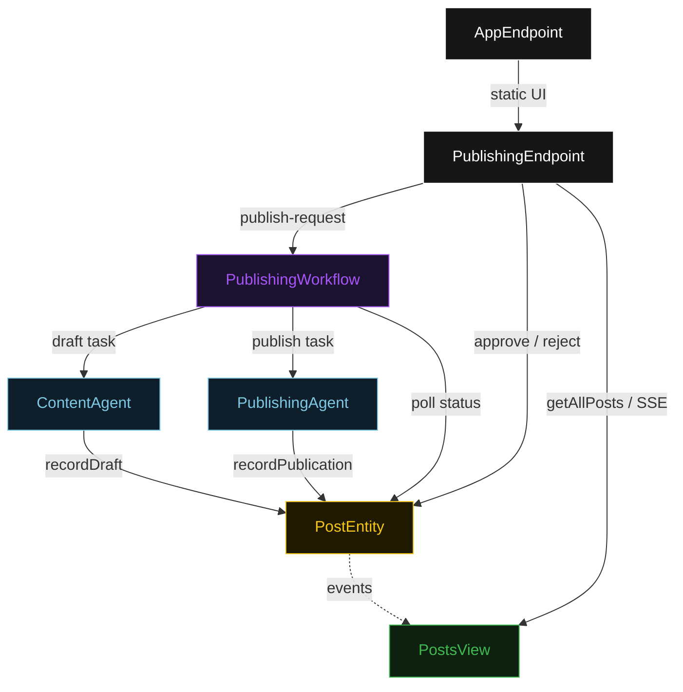
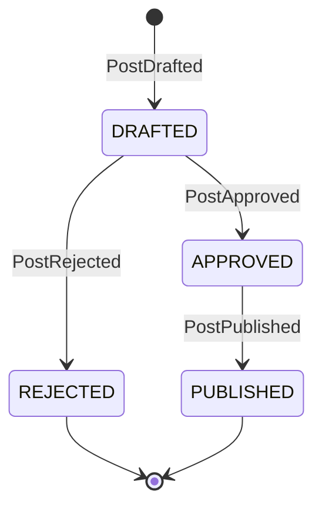
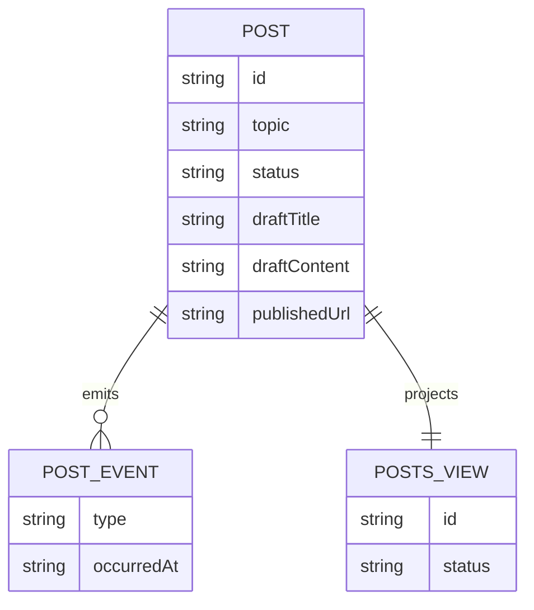

# PLAN — publishing

Architectural sketch for HITL Blog Publishing. All four mermaid diagrams plus the component table.

---

## Component graph



## Interaction sequence

```mermaid
sequenceDiagram
  autonumber
  actor User
  participant EP as PublishingEndpoint
  participant WF as PublishingWorkflow
  participant CA as ContentAgent
  participant PE as PostEntity
  participant PA as PublishingAgent

  User->>EP: POST /api/publish-request {topic}
  EP->>WF: start(postId, topic)
  WF->>CA: runSingleTask(DRAFT)
  CA-->>WF: DraftPost{title, content}
  WF->>PE: recordDraft -> DRAFTED
  Note over WF,PE: await-approval task paused; workflow polls status every 5s
  User->>EP: POST /api/posts/{id}/approve
  EP->>PE: approve -> APPROVED
  WF->>PE: getPost -> APPROVED
  WF->>PA: runSingleTask(PUBLISH) [guard: status == APPROVED]
  PA-->>WF: PublishedPost{url, publishedAt}
  WF->>PE: recordPublication -> PUBLISHED
```

## State machine



## Entity model



## Component table

| Component | Path (generated) |
|---|---|
| ContentAgent | `application/ContentAgent.java` |
| PublishingAgent | `application/PublishingAgent.java` |
| PublishingWorkflow | `application/PublishingWorkflow.java` |
| PublishingTasks | `application/PublishingTasks.java` |
| PostEntity | `application/PostEntity.java` |
| PostsView | `application/PostsView.java` |
| PublishingEndpoint | `api/PublishingEndpoint.java` |
| AppEndpoint | `api/AppEndpoint.java` |
| Post / events / records | `domain/*.java` |

## Concurrency notes

- **Step timeouts.** `draftStep` and `publishStep` call agents; both set `stepTimeout(60s)` to absorb LLM latency. The default 5 s step timeout would retry forever (Lesson 4).
- **Await-approval task.** The workflow does not block a thread; `awaitApprovalStep` reads `PostEntity.getPost`, and on `DRAFTED` self-schedules a 5-second resume timer until the human transitions the status.
- **Idempotency.** `postId` is the workflow id and the entity id; re-delivery of `recordDraft` / `recordPublication` is absorbed by event-applier checks on current status.
- **Publish guard.** Before the publish tool runs, the before-tool-call guardrail re-reads `PostEntity.status`; if it is not `APPROVED`, the call is blocked. No compensation path is needed because publish is the terminal write.
