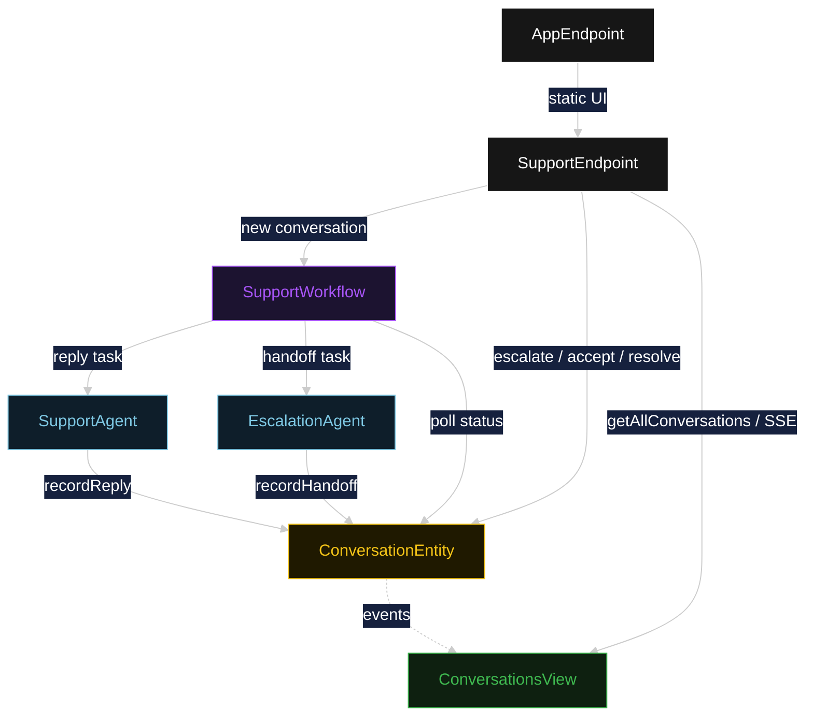
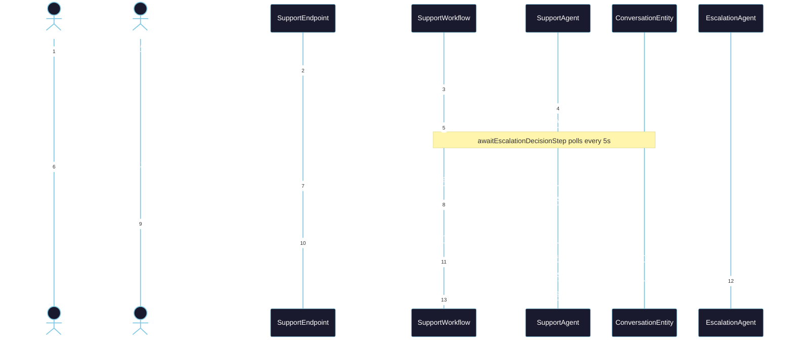
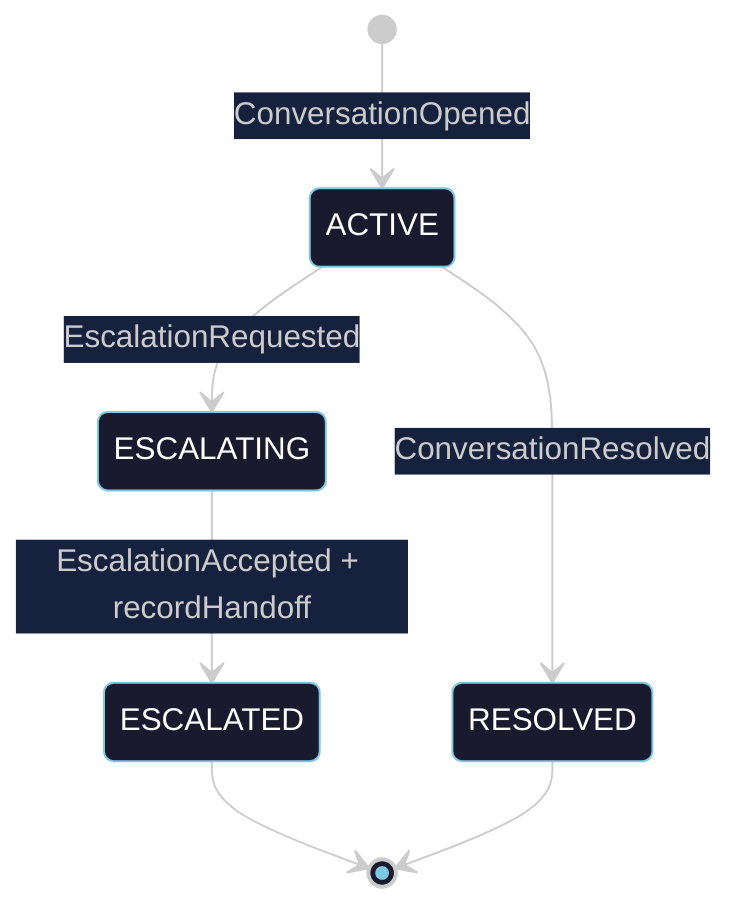
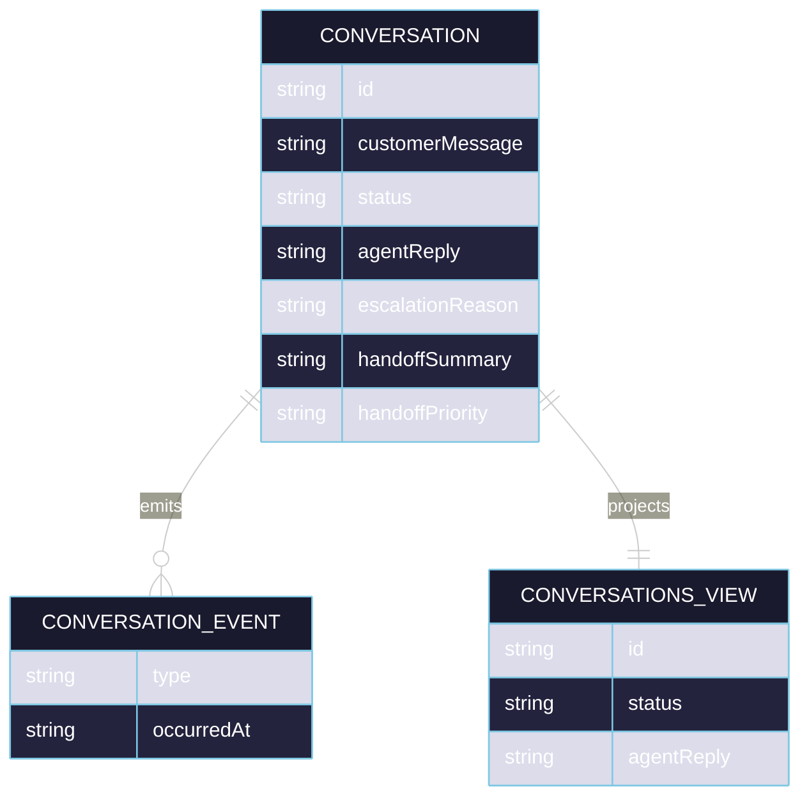

# PLAN — akka-cx-with-escalation

Architectural sketch for OpenAI Agents Customer Service with Escalation. All four mermaid diagrams plus the component table.

---

## Component graph

## Interaction sequence

## State machine

## Entity model

## Component table

| Component | Path (generated) |
|---|---|
| SupportAgent | `application/SupportAgent.java` |
| EscalationAgent | `application/EscalationAgent.java` |
| SupportWorkflow | `application/SupportWorkflow.java` |
| SupportTasks | `application/SupportTasks.java` |
| ConversationEntity | `application/ConversationEntity.java` |
| ConversationsView | `application/ConversationsView.java` |
| SupportEndpoint | `api/SupportEndpoint.java` |
| AppEndpoint | `api/AppEndpoint.java` |
| Conversation / events / records | `domain/*.java` |

## Concurrency notes

- **Step timeouts.** `replyStep` and `acceptEscalationStep` call agents; both set `stepTimeout(60s)` to absorb LLM latency. The default 5 s step timeout would retry prematurely (Lesson 4).
- **Await-escalation-decision task.** The workflow does not block a thread; `awaitEscalationDecisionStep` reads `ConversationEntity.getConversation`, and on `ACTIVE` it self-schedules a 5-second resume timer until the conversation moves to `ESCALATING` or `RESOLVED`.
- **Escalation acceptance poll.** `acceptEscalationStep` similarly polls until `acceptedBy` is present on the entity before calling `EscalationAgent`.
- **Idempotency.** `conversationId` is the workflow id and entity id; re-delivery of `recordReply` / `recordHandoff` is absorbed by event-applier status checks.
- **Escalation guard.** Before the handoff task runs, the workflow verifies `ConversationEntity.status == ESCALATING` and `acceptedBy` is non-empty. No compensation is needed because the handoff is the terminal write.
