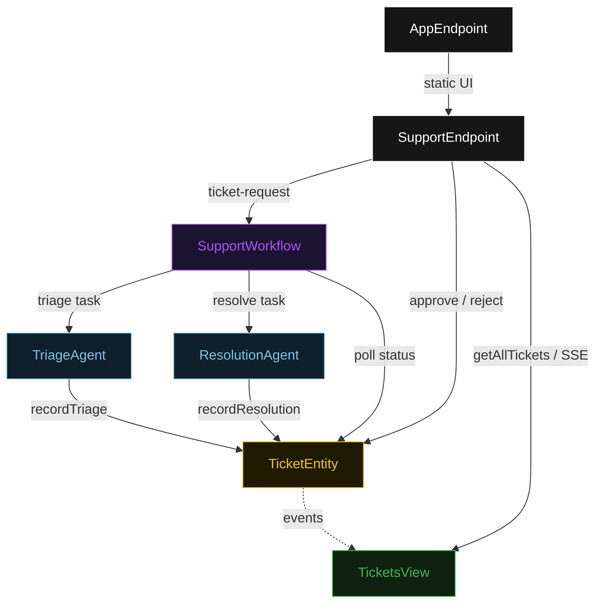
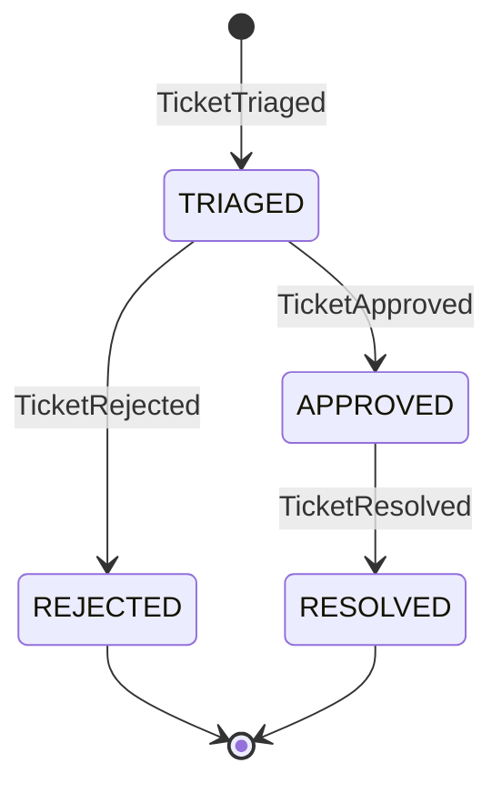
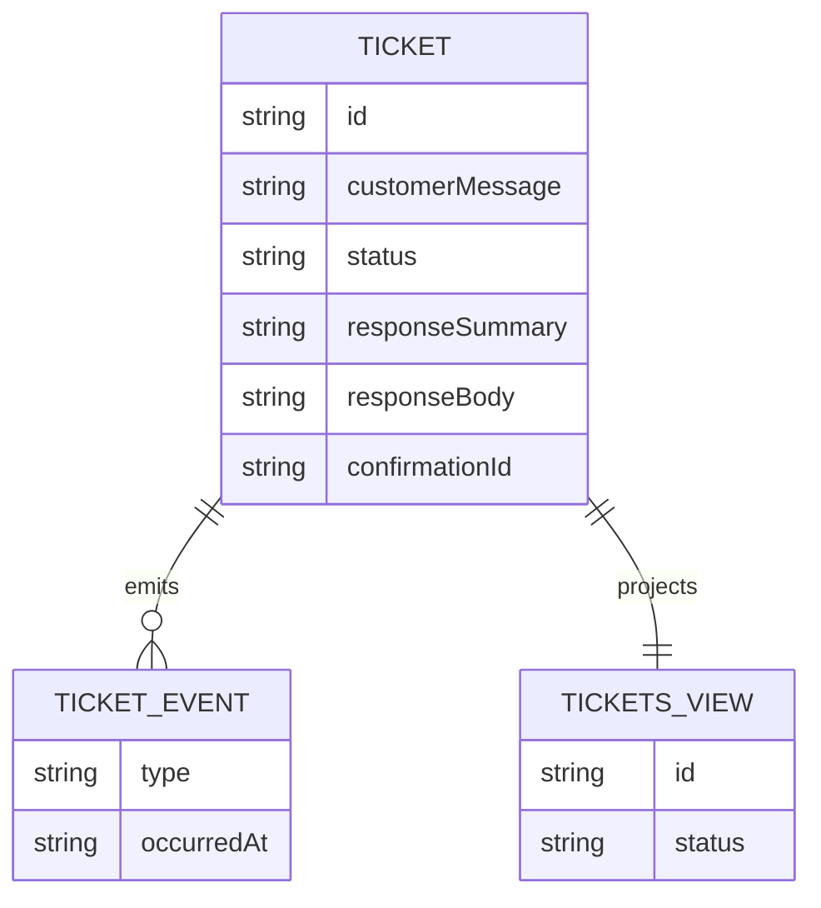

# PLAN — assistloop-support

Architectural sketch for AssistLoop Customer Support. All four mermaid diagrams plus the component table.

---

## Component graph



## Interaction sequence

```mermaid
sequenceDiagram
  autonumber
  actor Supervisor
  participant EP as SupportEndpoint
  participant WF as SupportWorkflow
  participant TA as TriageAgent
  participant TE as TicketEntity
  participant RA as ResolutionAgent

  Supervisor->>EP: POST /api/ticket-request {customerMessage}
  EP->>WF: start(ticketId, customerMessage)
  WF->>TA: runSingleTask(TRIAGE)
  TA-->>WF: DraftResponse{summary, body}
  WF->>TE: recordTriage -> TRIAGED
  Note over WF,TE: await-approval task paused; workflow polls status every 5s
  Supervisor->>EP: POST /api/tickets/{id}/approve
  EP->>TE: approve -> APPROVED
  WF->>TE: getTicket -> APPROVED
  WF->>RA: runSingleTask(RESOLVE) [guard: status == APPROVED]
  RA-->>WF: DeliveredResolution{confirmationId, deliveredAt}
  WF->>TE: recordResolution -> RESOLVED
```

## State machine



## Entity model



## Component table

| Component | Path (generated) |
|---|---|
| TriageAgent | `application/TriageAgent.java` |
| ResolutionAgent | `application/ResolutionAgent.java` |
| SupportWorkflow | `application/SupportWorkflow.java` |
| SupportTasks | `application/SupportTasks.java` |
| TicketEntity | `application/TicketEntity.java` |
| TicketsView | `application/TicketsView.java` |
| SupportEndpoint | `api/SupportEndpoint.java` |
| AppEndpoint | `api/AppEndpoint.java` |
| Ticket / events / records | `domain/*.java` |

## Concurrency notes

- **Step timeouts.** `triageStep` and `resolveStep` call agents; both set `stepTimeout(60s)` to absorb LLM latency. The default 5 s step timeout would retry forever (Lesson 4).
- **Await-approval task.** The workflow does not block a thread; `awaitApprovalStep` reads `TicketEntity.getTicket`, and on `TRIAGED` self-schedules a 5-second resume timer until the supervisor transitions the status.
- **Idempotency.** `ticketId` is the workflow id and the entity id; re-delivery of `recordTriage` / `recordResolution` is absorbed by event-applier checks on current status.
- **Resolution guard.** Before the deliver-response tool runs, the before-tool-call guardrail re-reads `TicketEntity.status`; if it is not `APPROVED`, the call is blocked. No compensation path is needed because resolution is the terminal write.
