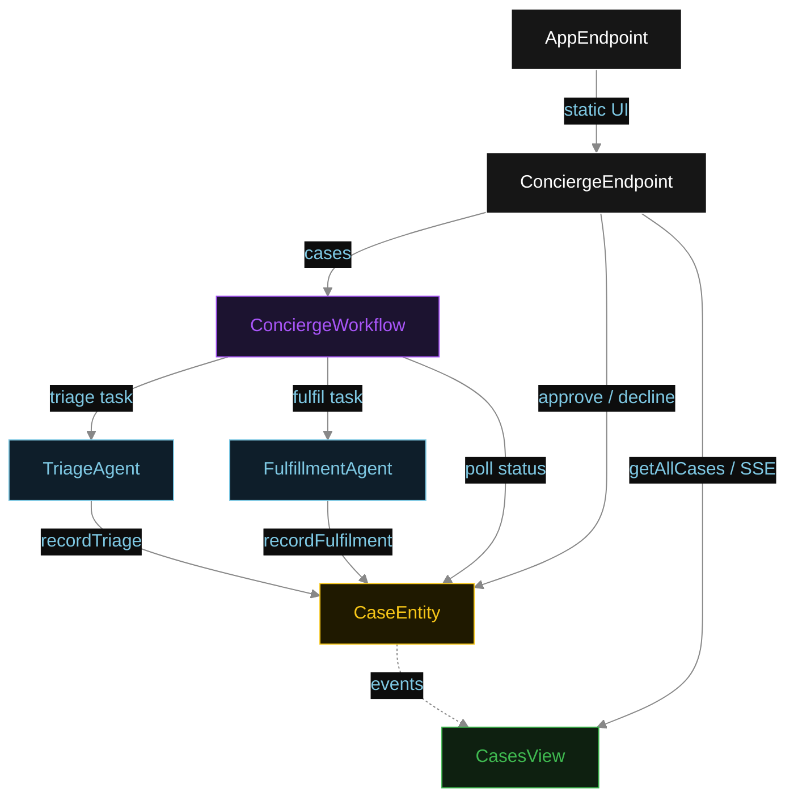
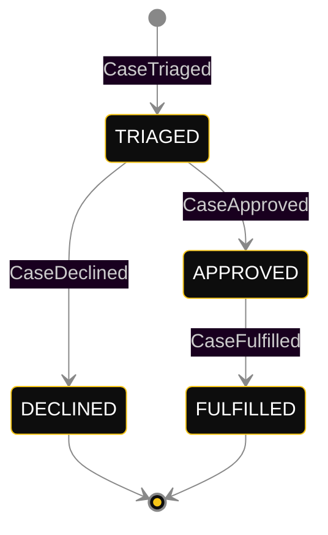
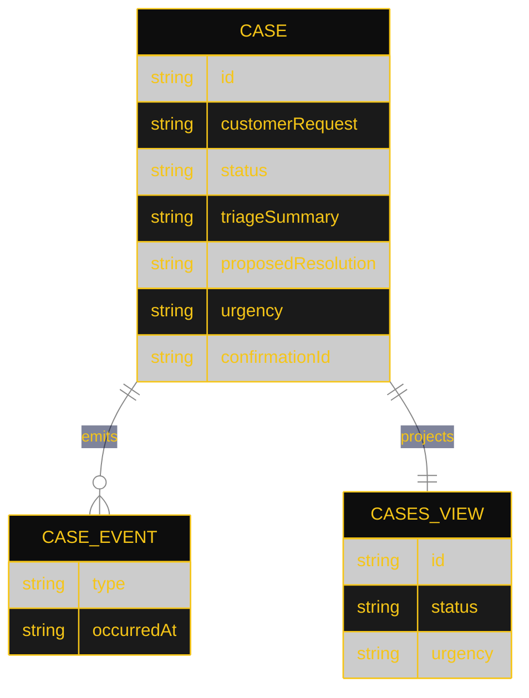

# PLAN — hitl-concierge

Architectural sketch for HITL Concierge. All four mermaid diagrams plus the component table.

---

## Component graph



## Interaction sequence

```mermaid
%%{init: {"theme": "base", "themeVariables": {"primaryColor": "#0e1e2a", "primaryTextColor": "#e0e0e0", "primaryBorderColor": "#555", "lineColor": "#888", "secondaryColor": "#1c1330", "background": "#0d0d0d", "mainBkg": "#0d0d0d", "transitionLabelColor": "#cccccc"}}}%%
sequenceDiagram
  autonumber
  actor Specialist
  participant EP as ConciergeEndpoint
  participant WF as ConciergeWorkflow
  participant TA as TriageAgent
  participant CE as CaseEntity
  participant FA as FulfillmentAgent

  Specialist->>EP: POST /api/cases {customerRequest}
  EP->>WF: start(caseId, customerRequest)
  WF->>TA: runSingleTask(TRIAGE)
  TA-->>WF: TriageResult{summary, proposedResolution, urgency}
  WF->>CE: recordTriage -> TRIAGED
  Note over WF,CE: await-approval task paused; workflow polls status every 5s
  Specialist->>EP: POST /api/cases/{id}/approve
  EP->>CE: approve -> APPROVED
  WF->>CE: getCase -> APPROVED
  WF->>FA: runSingleTask(FULFIL) [guard: status == APPROVED]
  FA-->>WF: FulfilledCase{confirmationId, fulfilledAt}
  WF->>CE: recordFulfilment -> FULFILLED
```

## State machine



## Entity model



## Component table

| Component | Path (generated) |
|---|---|
| TriageAgent | `application/TriageAgent.java` |
| FulfillmentAgent | `application/FulfillmentAgent.java` |
| ConciergeWorkflow | `application/ConciergeWorkflow.java` |
| ConciergeTasks | `application/ConciergeTasks.java` |
| CaseEntity | `application/CaseEntity.java` |
| CasesView | `application/CasesView.java` |
| ConciergeEndpoint | `api/ConciergeEndpoint.java` |
| AppEndpoint | `api/AppEndpoint.java` |
| Case / events / records | `domain/*.java` |

## Concurrency notes

- **Step timeouts.** `triageStep` and `fulfilStep` call agents; both set `stepTimeout(60s)` to absorb LLM latency. The default 5 s step timeout would retry forever (Lesson 4).
- **Await-approval task.** The workflow does not block a thread; `awaitApprovalStep` reads `CaseEntity.getCase`, and on `TRIAGED` self-schedules a 5-second resume timer until the specialist transitions the status.
- **Idempotency.** `caseId` is the workflow id and the entity id; re-delivery of `recordTriage` / `recordFulfilment` is absorbed by event-applier checks on current status.
- **Fulfilment guard.** Before the fulfilment tool runs, the before-tool-call guardrail re-reads `CaseEntity.status`; if it is not `APPROVED`, the call is blocked. No compensation path is needed because fulfilment is the terminal write.
