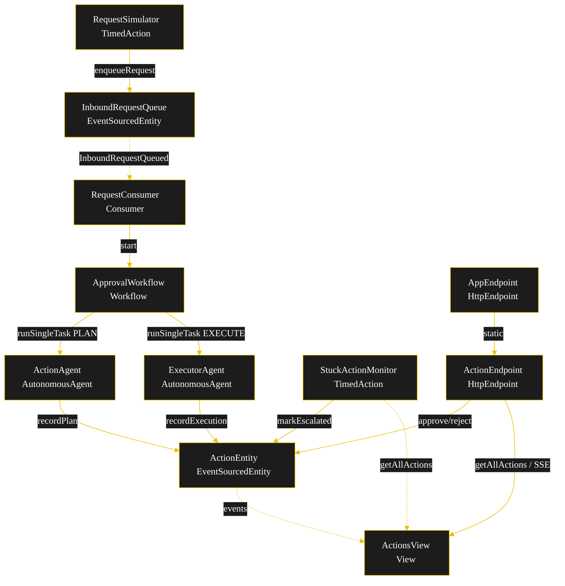
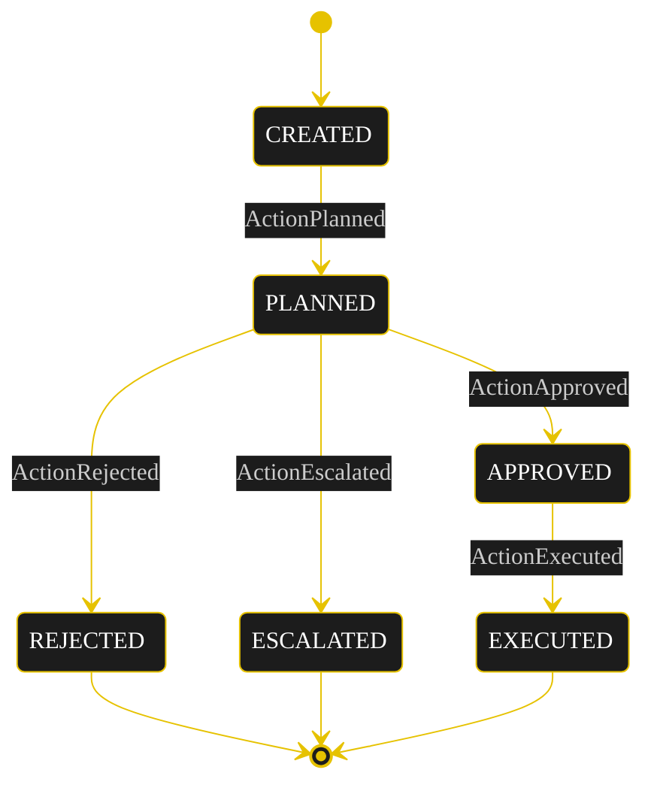
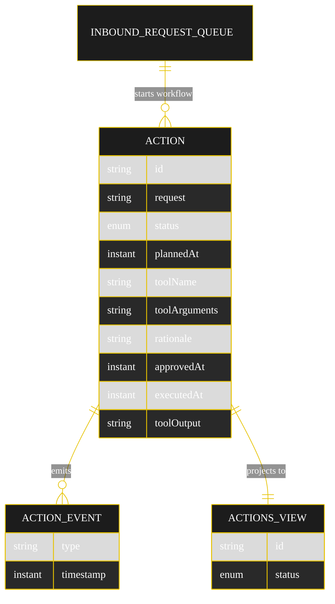

# Implementation Plan — `async-hitl-tool-gate`

The architecture `SPEC.md` resolves to once run through `/akka:specify` → `/akka:plan`. Diagrams render on the Architecture tab. All mermaid blocks use the Akka theme variables plus the Lesson 24 CSS overrides for state-diagram labels (state names white-on-dark, edge labels `overflow:visible`).

---

## Component graph



## Interaction sequence

```mermaid
%%{init: {'theme':'base','themeVariables':{'primaryColor':'#1c1c1c','primaryTextColor':'#ffffff','primaryBorderColor':'#e6c200','lineColor':'#e6c200','fontFamily':'Instrument Sans, sans-serif'}}}%%
sequenceDiagram
  participant U as User/Client
  participant EP as ActionEndpoint
  participant WF as ApprovalWorkflow
  participant AA as ActionAgent
  participant ENT as ActionEntity
  participant EA as ExecutorAgent
  U->>EP: POST /api/requests
  EP->>WF: start(actionId, request)
  WF->>AA: runSingleTask(PLAN)
  AA-->>WF: ActionPlan
  WF->>ENT: recordPlan -> PLANNED
  Note over WF,ENT: awaitApprovalStep polls; pauses on PLANNED (5s resume timer)
  U->>EP: POST /api/actions/{id}/approve
  EP->>ENT: approve -> APPROVED
  WF->>ENT: getAction (APPROVED)
  WF->>EA: runSingleTask(EXECUTE)
  Note over EA: before-tool-call guardrail checks status == APPROVED
  EA-->>WF: ToolResult
  WF->>ENT: recordExecution -> EXECUTED
```

## State machine



## Entity model



## Component table

| Component | Kind | File |
|---|---|---|
| `ActionAgent` | AutonomousAgent | `application/ActionAgent.java` |
| `ExecutorAgent` | AutonomousAgent | `application/ExecutorAgent.java` |
| `ApprovalTasks` | task definitions | `application/ApprovalTasks.java` |
| `ActionEntity` | EventSourcedEntity | `application/ActionEntity.java` |
| `InboundRequestQueue` | EventSourcedEntity | `application/InboundRequestQueue.java` |
| `ActionsView` | View | `application/ActionsView.java` |
| `ApprovalWorkflow` | Workflow | `application/ApprovalWorkflow.java` |
| `RequestConsumer` | Consumer | `application/RequestConsumer.java` |
| `RequestSimulator` | TimedAction | `application/RequestSimulator.java` |
| `StuckActionMonitor` | TimedAction | `application/StuckActionMonitor.java` |
| `ActionEndpoint` | HttpEndpoint | `api/ActionEndpoint.java` |
| `AppEndpoint` | HttpEndpoint | `api/AppEndpoint.java` |
| `Bootstrap` | service-setup | `Bootstrap.java` |
| `Action`, `ActionStatus`, `ActionEvent` | domain | `domain/*.java` |

Validator component count: **2 http-endpoint · 2 timed-action · 1 view · 1 workflow · 1 service-setup · 2 autonomous-agent · 1 consumer · 2 event-sourced-entity**.

## Concurrency notes

- **Step timeouts (Lesson 4):** `planStep` and `executeStep` 60 s (LLM calls); `awaitApprovalStep` 10 s, which re-arms a 5 s resume timer while status is `PLANNED`. Default 5 s would time out agent steps.
- **Idempotency:** the workflow id is the `actionId` (a fresh UUID per inbound request), so a redelivered `InboundRequestQueued` event maps to a distinct workflow instance; `ActionEntity` command handlers are no-ops when the target status is already reached.
- **No saga/compensation:** the only side-effecting step is the simulated tool call, gated behind the `APPROVED` status and the before-tool-call guardrail; rejection and escalation are terminal with no rollback needed.
- **View indexing (Lesson 2):** `ActionsView` exposes one query (`getAllActions`); status filtering happens client-side in the endpoint and monitor — enum columns cannot be auto-indexed.
