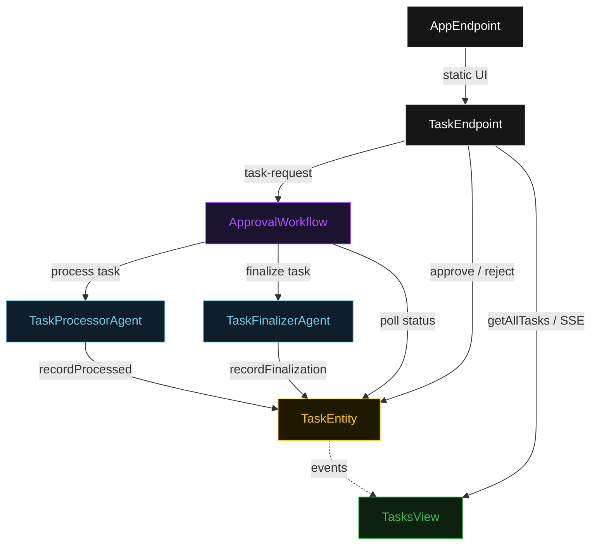
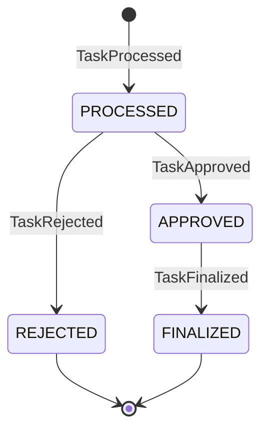
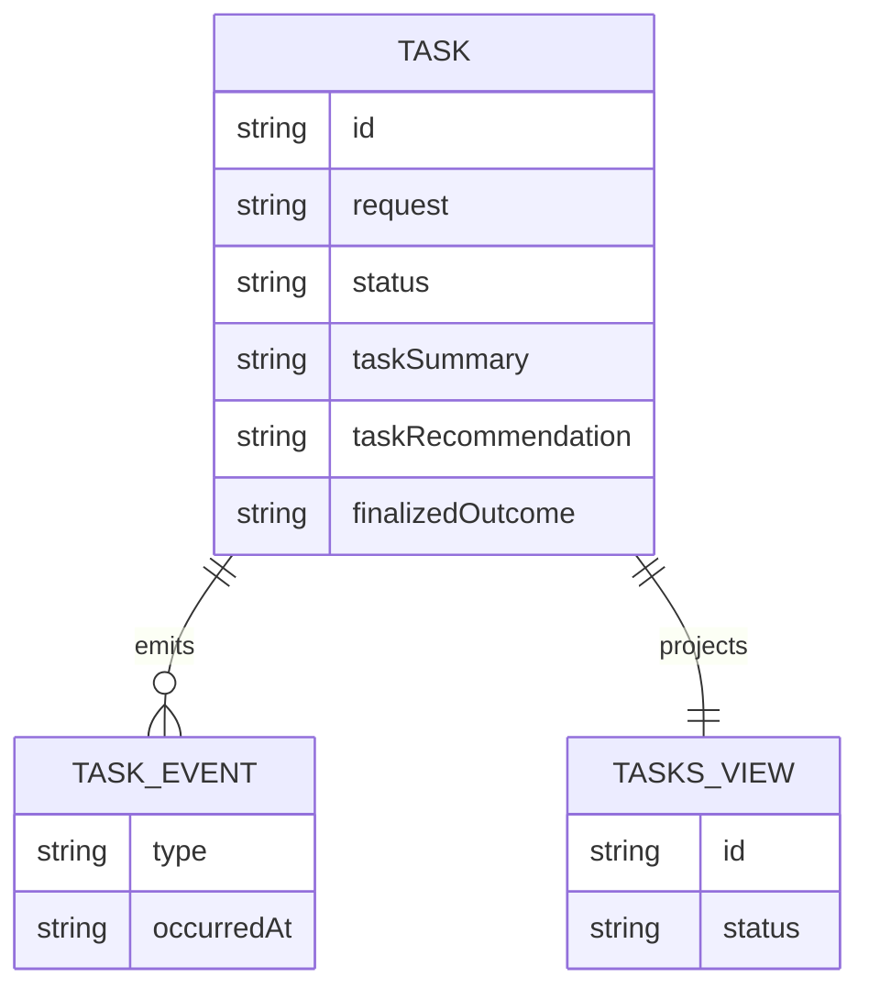

# PLAN — hitl-pattern

Architectural sketch for Human-in-the-Loop. All four mermaid diagrams plus the component table.

---

## Component graph



## Interaction sequence

```mermaid
sequenceDiagram
  autonumber
  actor User
  participant EP as TaskEndpoint
  participant WF as ApprovalWorkflow
  participant TPA as TaskProcessorAgent
  participant TE as TaskEntity
  participant TFA as TaskFinalizerAgent

  User->>EP: POST /api/task-request {request}
  EP->>WF: start(taskId, request)
  WF->>TPA: runSingleTask(PROCESS)
  TPA-->>WF: ProcessedTask{summary, recommendation}
  WF->>TE: recordProcessed -> PROCESSED
  Note over WF,TE: await-approval task paused; workflow polls status every 5s
  User->>EP: POST /api/tasks/{id}/approve
  EP->>TE: approve -> APPROVED
  WF->>TE: getTask -> APPROVED
  WF->>TFA: runSingleTask(FINALIZE) [guard: status == APPROVED]
  TFA-->>WF: FinalizedTask{outcome, finalizedAt}
  WF->>TE: recordFinalization -> FINALIZED
```

## State machine



## Entity model



## Component table

| Component | Path (generated) |
|---|---|
| TaskProcessorAgent | `application/TaskProcessorAgent.java` |
| TaskFinalizerAgent | `application/TaskFinalizerAgent.java` |
| ApprovalWorkflow | `application/ApprovalWorkflow.java` |
| ApprovalTasks | `application/ApprovalTasks.java` |
| TaskEntity | `application/TaskEntity.java` |
| TasksView | `application/TasksView.java` |
| TaskEndpoint | `api/TaskEndpoint.java` |
| AppEndpoint | `api/AppEndpoint.java` |
| Task / events / records | `domain/*.java` |

## Concurrency notes

- **Step timeouts.** `processStep` and `finalizeStep` call agents; both set `stepTimeout(60s)` to absorb LLM latency. The default 5 s step timeout would expire before the agent returns (Lesson 4).
- **Await-approval task.** The workflow does not block a thread; `awaitApprovalStep` reads `TaskEntity.getTask`, and on `PROCESSED` self-schedules a 5-second resume timer until the human transitions the status.
- **Idempotency.** `taskId` is the workflow id and the entity id; re-delivery of `recordProcessed` / `recordFinalization` is absorbed by event-applier checks on current status.
- **Finalize guard.** Before the finalize tool runs, the before-tool-call guardrail re-reads `TaskEntity.status`; if it is not `APPROVED`, the call is blocked. No compensation path is needed because finalization is the terminal write.
