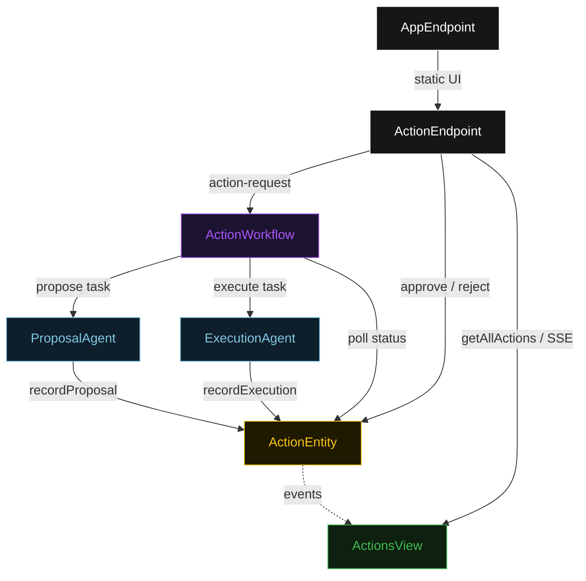
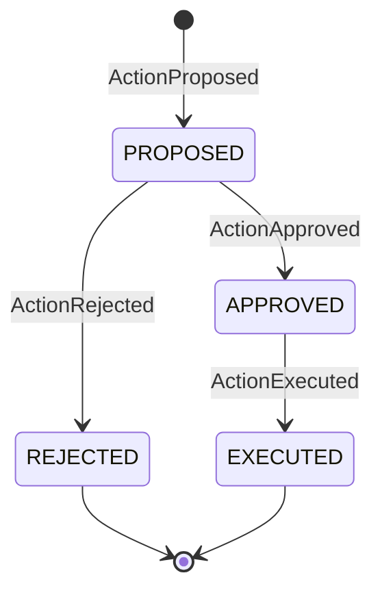
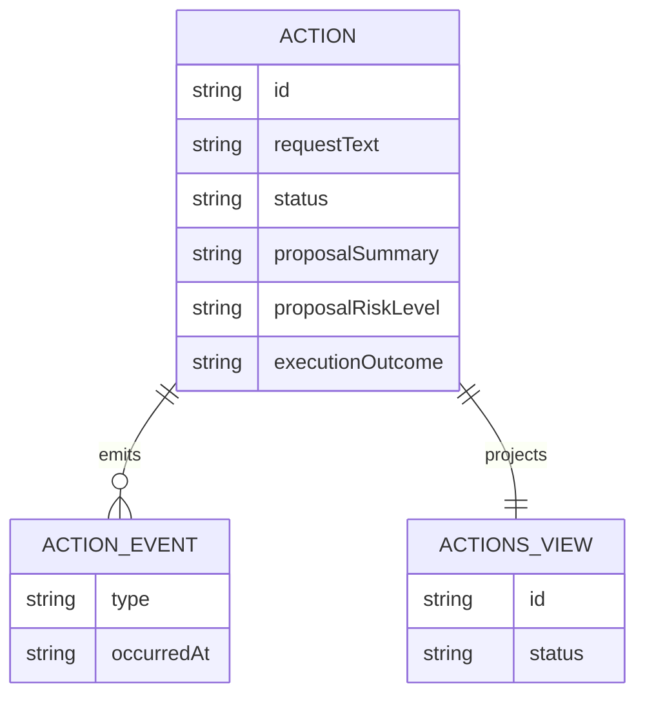

# PLAN — hitl-agent

Architectural sketch for Human-in-the-Loop Agent. All four mermaid diagrams plus the component table.

---

## Component graph



## Interaction sequence

```mermaid
sequenceDiagram
  autonumber
  actor User
  participant EP as ActionEndpoint
  participant WF as ActionWorkflow
  participant PA as ProposalAgent
  participant AE as ActionEntity
  participant EA as ExecutionAgent

  User->>EP: POST /api/action-request {requestText}
  EP->>WF: start(actionId, requestText)
  WF->>PA: runSingleTask(PROPOSE)
  PA-->>WF: ActionProposal{summary, rationale, riskLevel}
  WF->>AE: recordProposal -> PROPOSED
  Note over WF,AE: await-approval task paused; workflow polls status every 5s
  User->>EP: POST /api/actions/{id}/approve
  EP->>AE: approve -> APPROVED
  WF->>AE: getAction -> APPROVED
  WF->>EA: runSingleTask(EXECUTE) [guard: status == APPROVED]
  EA-->>WF: ActionResult{outcome, completedAt}
  WF->>AE: recordExecution -> EXECUTED
```

## State machine



## Entity model



## Component table

| Component | Path (generated) |
|---|---|
| ProposalAgent | `application/ProposalAgent.java` |
| ExecutionAgent | `application/ExecutionAgent.java` |
| ActionWorkflow | `application/ActionWorkflow.java` |
| ActionTasks | `application/ActionTasks.java` |
| ActionEntity | `application/ActionEntity.java` |
| ActionsView | `application/ActionsView.java` |
| ActionEndpoint | `api/ActionEndpoint.java` |
| AppEndpoint | `api/AppEndpoint.java` |
| Action / events / records | `domain/*.java` |

## Concurrency notes

- **Step timeouts.** `proposeStep` and `executeStep` call agents; both set `stepTimeout(60s)` to absorb LLM latency. The default 5 s step timeout would retry prematurely (Lesson 4).
- **Await-approval task.** The workflow does not block a thread; `awaitApprovalStep` reads `ActionEntity.getAction`, and on `PROPOSED` self-schedules a 5-second resume timer until the human transitions the status.
- **Idempotency.** `actionId` is the workflow id and the entity id; re-delivery of `recordProposal` / `recordExecution` is absorbed by event-applier checks on current status.
- **Execution guard.** Before the execution tool runs, the before-tool-call guardrail re-reads `ActionEntity.status`; if it is not `APPROVED`, the call is blocked. No compensation path is needed because execute is the terminal write.
