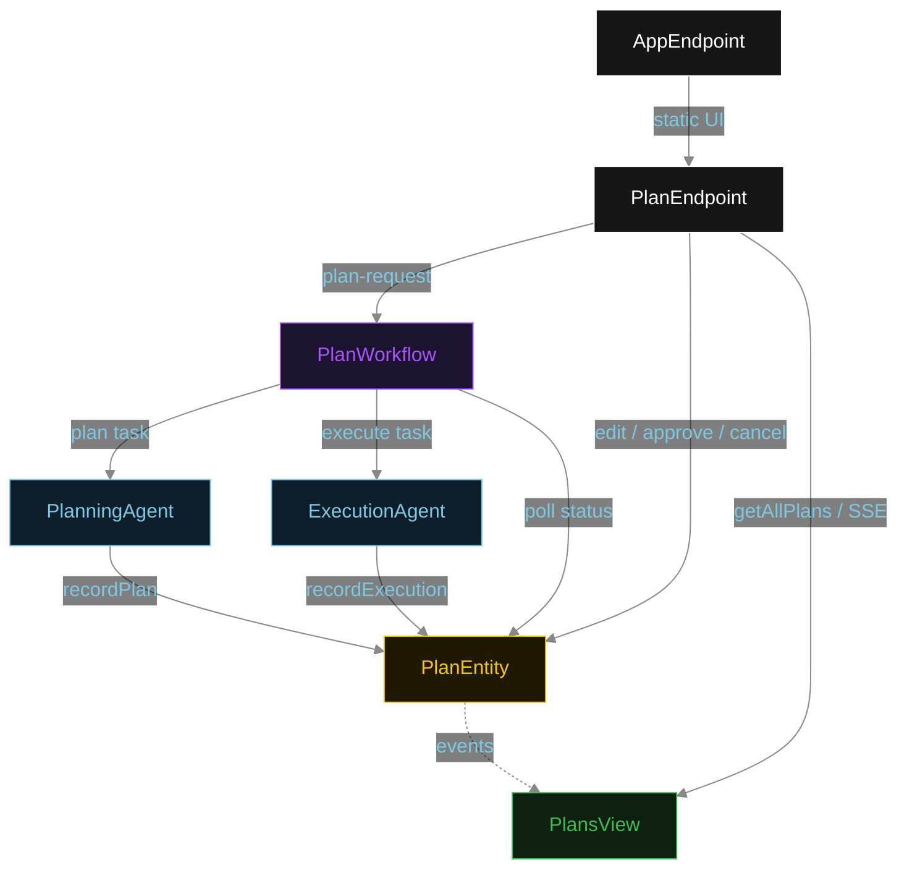
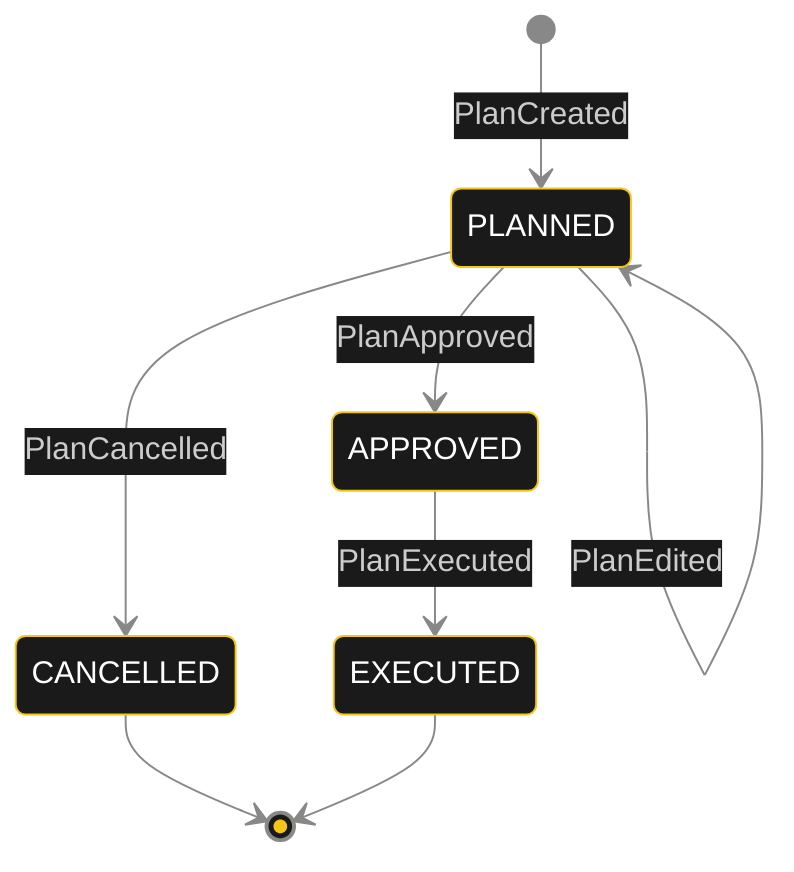
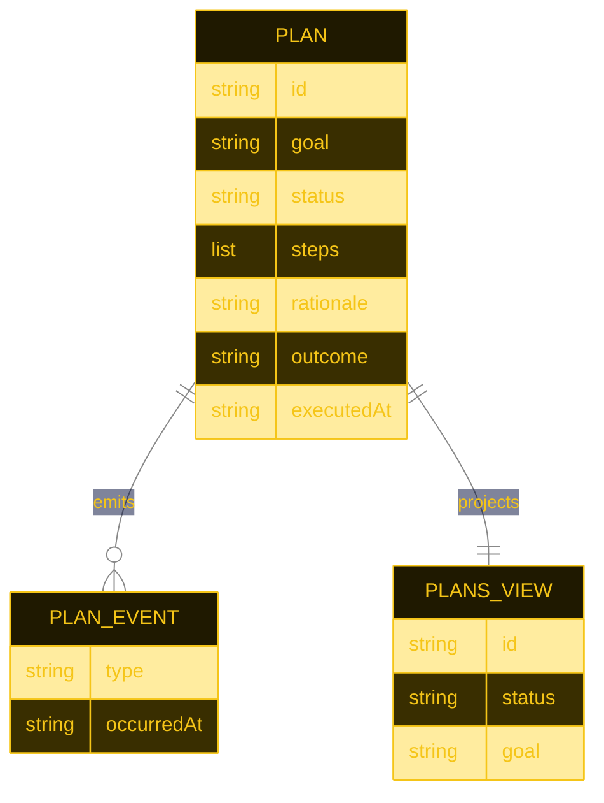

# PLAN — plan-approval-gate

Architectural sketch for Plan Approval Gate (HITL). All four mermaid diagrams plus the component table.

---

## Component graph



## Interaction sequence

```mermaid
%%{init: {'theme': 'base', 'themeVariables': {'primaryColor': '#0e1e2a', 'primaryTextColor': '#e0e0e0', 'lineColor': '#888', 'transitionLabelColor': '#cccccc'}}}%%
sequenceDiagram
  autonumber
  actor User
  participant EP as PlanEndpoint
  participant WF as PlanWorkflow
  participant PA as PlanningAgent
  participant PE as PlanEntity
  participant EA as ExecutionAgent

  User->>EP: POST /api/plan-request {goal}
  EP->>WF: start(planId, goal)
  WF->>PA: runSingleTask(PLAN)
  PA-->>WF: AgentPlan{steps, rationale}
  WF->>PE: recordPlan -> PLANNED
  Note over WF,PE: await-approval task paused; workflow polls status every 5s
  User->>EP: PATCH /api/plans/{id}/edit {revisedSteps}
  EP->>PE: editPlan -> PLANNED (steps updated)
  User->>EP: POST /api/plans/{id}/approve
  EP->>PE: approve -> APPROVED
  WF->>PE: getPlan -> APPROVED
  WF->>EA: runSingleTask(EXECUTE) [guard: status == APPROVED]
  EA-->>WF: ExecutionResult{outcome, completedAt}
  WF->>PE: recordExecution -> EXECUTED
```

## State machine



## Entity model



## Component table

| Component | Path (generated) |
|---|---|
| PlanningAgent | `application/PlanningAgent.java` |
| ExecutionAgent | `application/ExecutionAgent.java` |
| PlanWorkflow | `application/PlanWorkflow.java` |
| PlanTasks | `application/PlanTasks.java` |
| PlanEntity | `application/PlanEntity.java` |
| PlansView | `application/PlansView.java` |
| PlanEndpoint | `api/PlanEndpoint.java` |
| AppEndpoint | `api/AppEndpoint.java` |
| Plan / events / records | `domain/*.java` |

## Concurrency notes

- **Step timeouts.** `planStep` and `executeStep` call agents; both set `stepTimeout(60s)` to absorb LLM latency. The default 5 s step timeout would exhaust before the agent returns (Lesson 4).
- **Await-approval task.** The workflow does not block a thread; `awaitApprovalStep` reads `PlanEntity.getPlan`, and on `PLANNED` self-schedules a 5-second resume timer until the human transitions the status.
- **Edit support.** While status is `PLANNED`, the `editPlan` command replaces `steps` and records a `PlanEdited` event; the workflow continues polling and detects the edited plan when it next reads status.
- **Idempotency.** `planId` is the workflow id and the entity id; re-delivery of `recordPlan` / `recordExecution` is absorbed by event-applier checks on current status.
- **Execution guard.** Before the execute tool runs, the before-tool-call guardrail re-reads `PlanEntity.status`; if it is not `APPROVED`, the call is blocked and no outcome is written.
