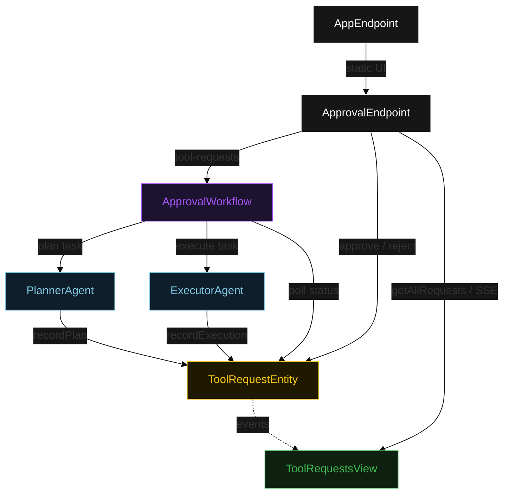
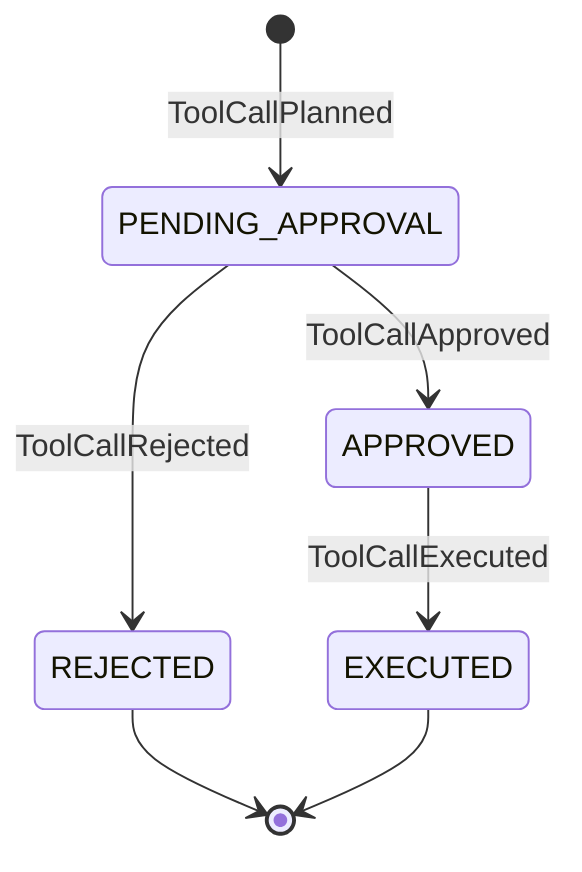
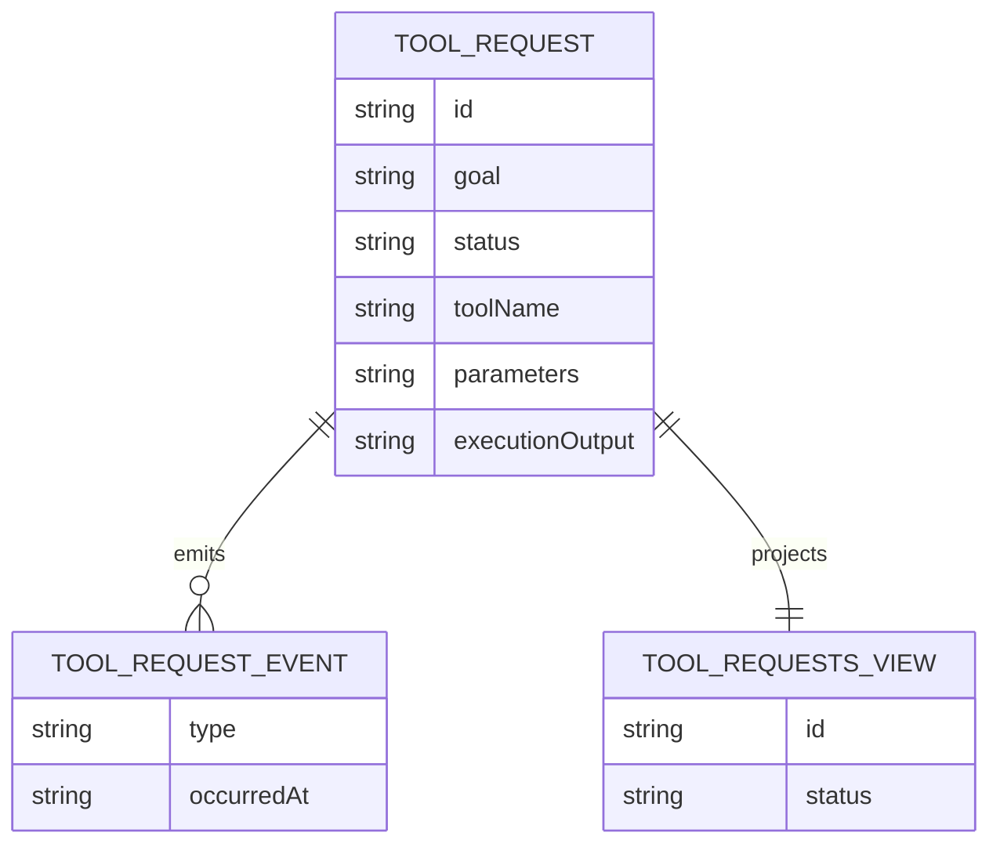

# PLAN — tool-call-approval

Architectural sketch for HITL Tool Approval. All four mermaid diagrams plus the component table.

---

## Component graph



## Interaction sequence

```mermaid
sequenceDiagram
  autonumber
  actor Operator
  participant EP as ApprovalEndpoint
  participant WF as ApprovalWorkflow
  participant PA as PlannerAgent
  participant TE as ToolRequestEntity
  participant EA as ExecutorAgent

  Operator->>EP: POST /api/tool-requests {goal}
  EP->>WF: start(requestId, goal)
  WF->>PA: runSingleTask(PLAN)
  PA-->>WF: ToolCallPlan{toolName, parameters, rationale}
  WF->>TE: recordPlan -> PENDING_APPROVAL
  Note over WF,TE: await-approval task paused; workflow polls status every 5s
  Operator->>EP: POST /api/tool-requests/{id}/approve {editedParameters?}
  EP->>TE: approve -> APPROVED
  WF->>TE: getRequest -> APPROVED
  WF->>EA: runSingleTask(EXECUTE) [guard: status == APPROVED]
  EA-->>WF: ToolCallResult{output, executedAt}
  WF->>TE: recordExecution -> EXECUTED
```

## State machine



## Entity model



## Component table

| Component | Path (generated) |
|---|---|
| PlannerAgent | `application/PlannerAgent.java` |
| ExecutorAgent | `application/ExecutorAgent.java` |
| ApprovalWorkflow | `application/ApprovalWorkflow.java` |
| ApprovalTasks | `application/ApprovalTasks.java` |
| ToolRequestEntity | `application/ToolRequestEntity.java` |
| ToolRequestsView | `application/ToolRequestsView.java` |
| ApprovalEndpoint | `api/ApprovalEndpoint.java` |
| AppEndpoint | `api/AppEndpoint.java` |
| ToolRequest / events / records | `domain/*.java` |

## Concurrency notes

- **Step timeouts.** `planStep` and `executeStep` call agents; both set `stepTimeout(60s)` to absorb LLM latency. The default 5 s step timeout would cause premature retries (Lesson 4).
- **Await-approval task.** The workflow does not block a thread; `awaitApprovalStep` reads `ToolRequestEntity.getRequest`, and on `PENDING_APPROVAL` self-schedules a 5-second resume timer until the human transitions the status.
- **Parameter editing.** When the operator approves with `editedParameters` present, `ToolCallApproved` records the override in the entity; `executeStep` reads the entity to obtain the effective parameters before calling `ExecutorAgent`.
- **Idempotency.** `requestId` is the workflow id and the entity id; re-delivery of `recordPlan` / `recordExecution` is absorbed by event-applier checks on current status.
- **Execute guard.** Before the execute tool runs, the before-tool-call guardrail re-reads `ToolRequestEntity.status`; if it is not `APPROVED`, the call is blocked. No compensation path is needed because execution is the terminal write.
