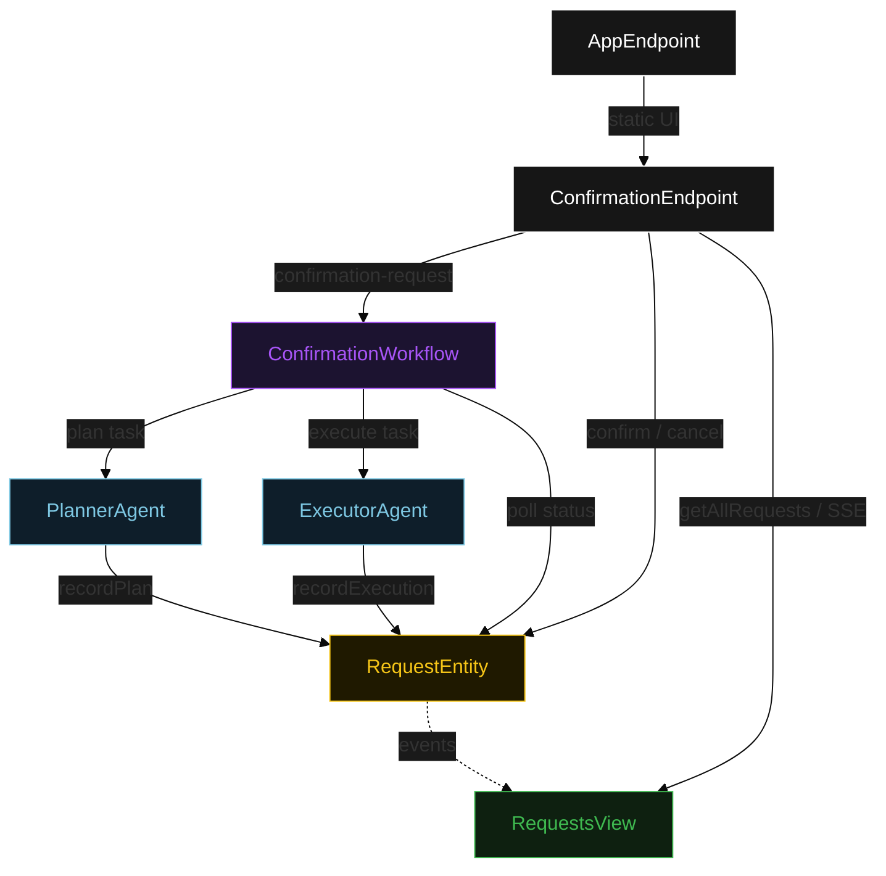
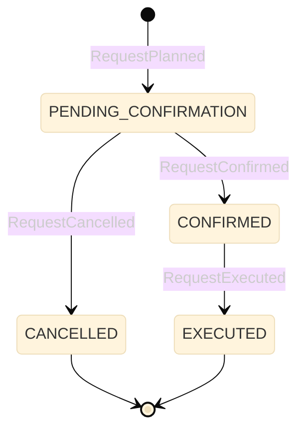
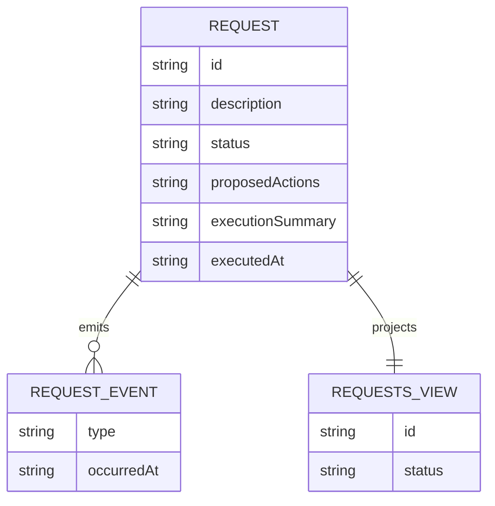

# PLAN — user-confirmation-agent

Architectural sketch for User Confirmation Agents. All four mermaid diagrams plus the component table.

---

## Component graph



## Interaction sequence

```mermaid
sequenceDiagram
  autonumber
  actor User
  participant EP as ConfirmationEndpoint
  participant WF as ConfirmationWorkflow
  participant PA as PlannerAgent
  participant RE as RequestEntity
  participant EA as ExecutorAgent

  User->>EP: POST /api/confirmation-request {description}
  EP->>WF: start(requestId, description)
  WF->>PA: runSingleTask(PLAN)
  PA-->>WF: ActionPlan{actions}
  WF->>RE: recordPlan -> PENDING_CONFIRMATION
  Note over WF,RE: await-confirmation task paused; workflow polls status every 5s
  User->>EP: POST /api/requests/{id}/confirm
  EP->>RE: confirm -> CONFIRMED
  WF->>RE: getRequest -> CONFIRMED
  WF->>EA: runSingleTask(EXECUTE) [guard: status == CONFIRMED]
  EA-->>WF: ExecutionResult{summary, executedAt}
  WF->>RE: recordExecution -> EXECUTED
```

## State machine



## Entity model



## Component table

| Component | Path (generated) |
|---|---|
| PlannerAgent | `application/PlannerAgent.java` |
| ExecutorAgent | `application/ExecutorAgent.java` |
| ConfirmationWorkflow | `application/ConfirmationWorkflow.java` |
| ConfirmationTasks | `application/ConfirmationTasks.java` |
| RequestEntity | `application/RequestEntity.java` |
| RequestsView | `application/RequestsView.java` |
| ConfirmationEndpoint | `api/ConfirmationEndpoint.java` |
| AppEndpoint | `api/AppEndpoint.java` |
| Request / events / records | `domain/*.java` |

## Concurrency notes

- **Step timeouts.** `planStep` and `executeStep` call agents; both set `stepTimeout(60s)` to absorb LLM latency. The default 5 s step timeout would retry forever (Lesson 4).
- **Await-confirmation task.** The workflow does not block a thread; `awaitConfirmationStep` reads `RequestEntity.getRequest`, and on `PENDING_CONFIRMATION` self-schedules a 5-second resume timer until the human transitions the status.
- **Idempotency.** `requestId` is the workflow id and the entity id; re-delivery of `recordPlan` / `recordExecution` is absorbed by event-applier checks on current status.
- **Execution guard.** Before the execute tool runs, the before-tool-call guardrail re-reads `RequestEntity.status`; if it is not `CONFIRMED`, the call is blocked. No compensation path is needed because execution is the terminal write.
