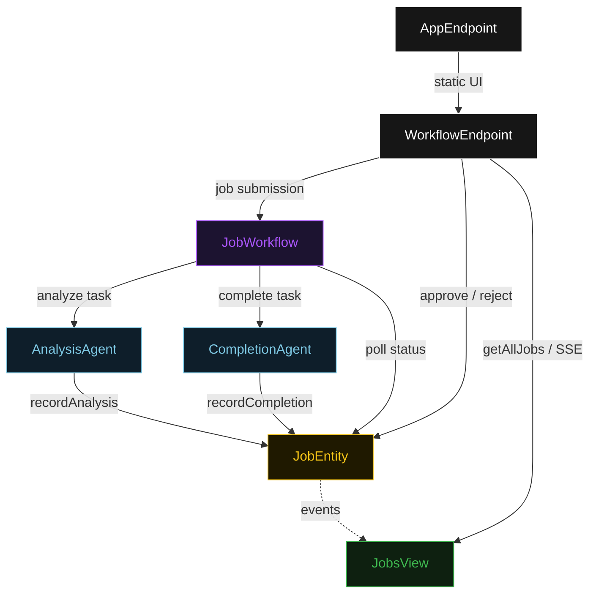
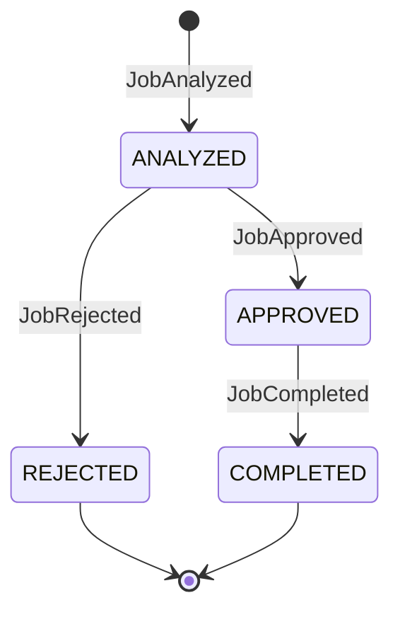
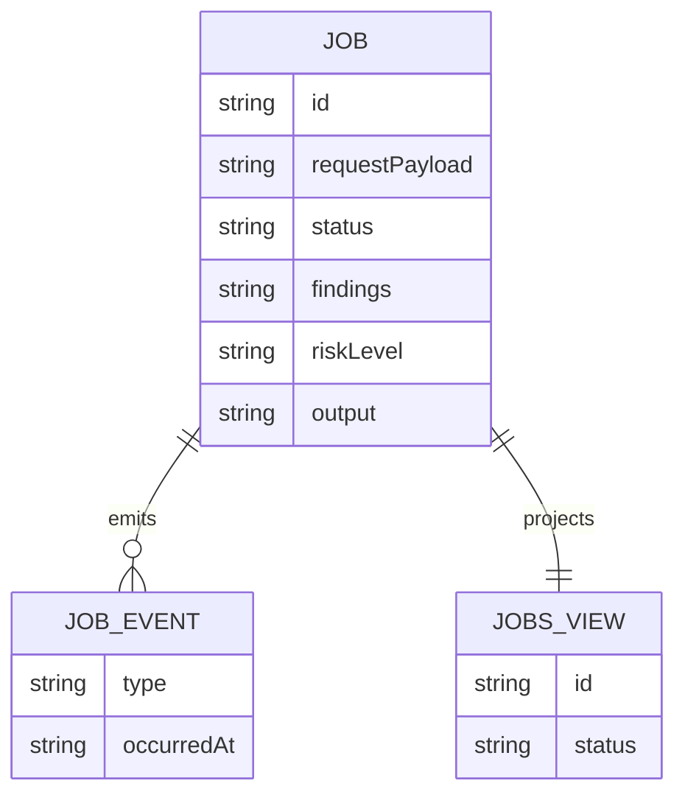

# PLAN — workflow-server-hitl

Architectural sketch for WorkflowServer (REST + Streaming + HITL). All four mermaid diagrams plus the component table.

---

## Component graph



## Interaction sequence

```mermaid
sequenceDiagram
  autonumber
  actor User
  participant EP as WorkflowEndpoint
  participant WF as JobWorkflow
  participant AA as AnalysisAgent
  participant JE as JobEntity
  participant CA as CompletionAgent

  User->>EP: POST /api/jobs {requestPayload}
  EP->>WF: start(jobId, requestPayload)
  WF->>AA: runSingleTask(ANALYZE)
  AA-->>WF: AnalysisSummary{findings, riskLevel}
  WF->>JE: recordAnalysis -> ANALYZED
  Note over WF,JE: await-approval task paused; workflow polls status every 5s
  User->>EP: POST /api/jobs/{id}/approve
  EP->>JE: approve -> APPROVED
  WF->>JE: getJob -> APPROVED
  WF->>CA: runSingleTask(COMPLETE) [guard: status == APPROVED]
  CA-->>WF: JobResult{output, completedAt}
  WF->>JE: recordCompletion -> COMPLETED
```

## State machine



## Entity model



## Component table

| Component | Path (generated) |
|---|---|
| AnalysisAgent | `application/AnalysisAgent.java` |
| CompletionAgent | `application/CompletionAgent.java` |
| JobWorkflow | `application/JobWorkflow.java` |
| JobTasks | `application/JobTasks.java` |
| JobEntity | `application/JobEntity.java` |
| JobsView | `application/JobsView.java` |
| WorkflowEndpoint | `api/WorkflowEndpoint.java` |
| AppEndpoint | `api/AppEndpoint.java` |
| Job / events / records | `domain/*.java` |

## Concurrency notes

- **Step timeouts.** `analyzeStep` and `completeStep` call agents; both set `stepTimeout(60s)` to absorb LLM latency. The default 5 s step timeout would time out before most LLM responses arrive (Lesson 4).
- **Await-approval task.** The workflow does not hold a thread; `awaitApprovalStep` reads `JobEntity.getJob`, and on `ANALYZED` self-schedules a 5-second resume timer until the human transitions the status.
- **Idempotency.** `jobId` is the workflow id and the entity id; re-delivery of `recordAnalysis` / `recordCompletion` is absorbed by event-applier guards on current status.
- **Completion guard.** Before the completion tool runs, the before-tool-call guardrail re-reads `JobEntity.status`; if it is not `APPROVED`, the call is blocked. No compensation path is needed because completion is the terminal write.
- **SSE streaming.** `JobsView` emits row updates as SSE events; the `WorkflowEndpoint` SSE endpoint streams these directly to connected clients so the UI reflects state transitions without polling.
