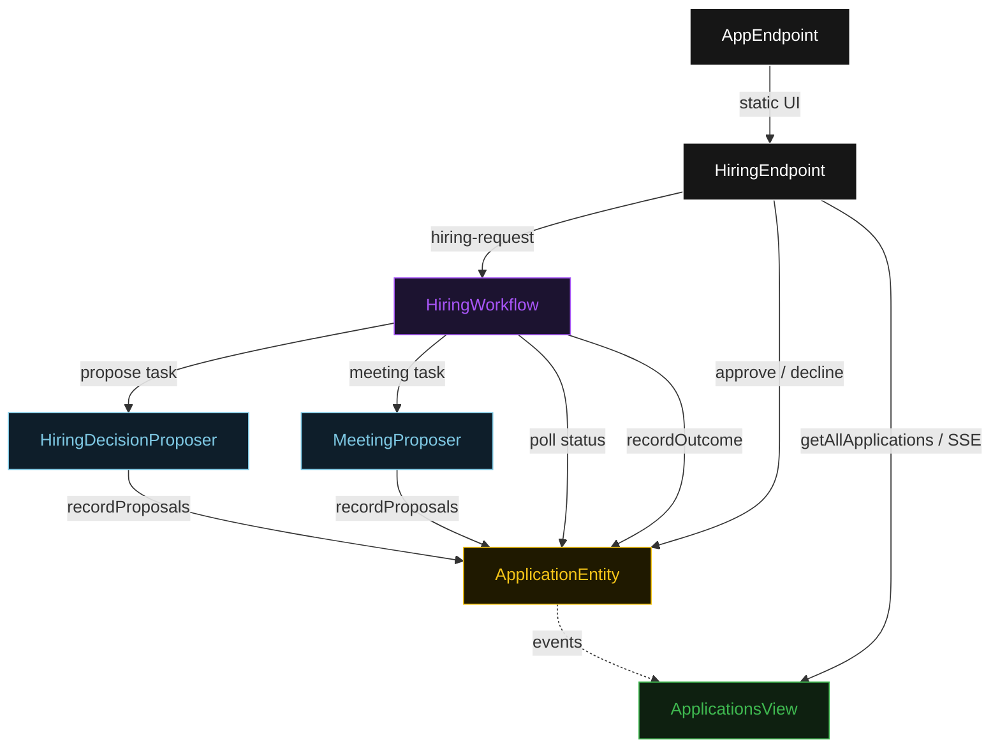
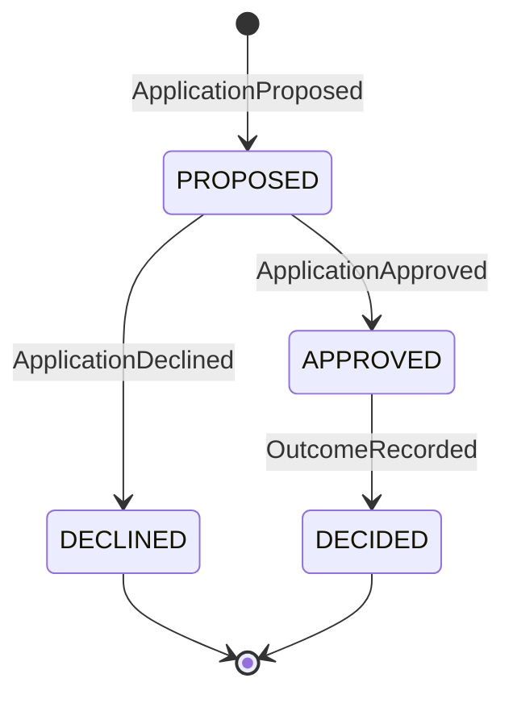
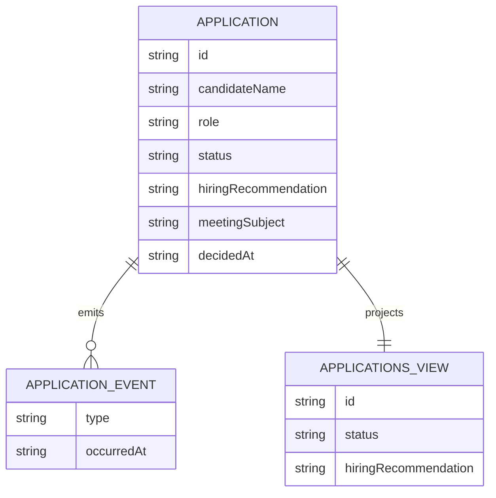

# PLAN — hiring-hitl-gate

Architectural sketch for Human-in-the-Loop Hiring. All four mermaid diagrams plus the component table.

---

## Component graph



## Interaction sequence

```mermaid
sequenceDiagram
  autonumber
  actor Recruiter
  participant EP as HiringEndpoint
  participant WF as HiringWorkflow
  participant HDP as HiringDecisionProposer
  participant MP as MeetingProposer
  participant AE as ApplicationEntity
  participant DRS as DecisionsReachedService

  Recruiter->>EP: POST /api/hiring-request {candidateName, role, ...}
  EP->>WF: start(applicationId, candidate)
  WF->>HDP: runSingleTask(HIRE_DECISION)
  HDP-->>WF: HiringProposal{recommendation, rationale}
  WF->>MP: runSingleTask(MEETING)
  MP-->>WF: MeetingProposal{subject, body, suggestedSlots}
  WF->>AE: recordProposals -> PROPOSED
  Note over WF,AE: await-validator task paused; workflow polls status every 5s
  Recruiter->>EP: POST /api/applications/{id}/approve
  EP->>AE: approve -> APPROVED
  WF->>AE: getApplication -> APPROVED
  WF->>DRS: recordOutcome [guard: status == APPROVED]
  DRS-->>WF: RecordedOutcome{decidedAt}
  WF->>AE: recordOutcome -> DECIDED
```

## State machine



## Entity model



## Component table

| Component | Path (generated) |
|---|---|
| HiringDecisionProposer | `application/HiringDecisionProposer.java` |
| MeetingProposer | `application/MeetingProposer.java` |
| HiringWorkflow | `application/HiringWorkflow.java` |
| HiringTasks | `application/HiringTasks.java` |
| ApplicationEntity | `application/ApplicationEntity.java` |
| ApplicationsView | `application/ApplicationsView.java` |
| HiringEndpoint | `api/HiringEndpoint.java` |
| AppEndpoint | `api/AppEndpoint.java` |
| Application / events / records | `domain/*.java` |

## Concurrency notes

- **Step timeouts.** `proposeStep` calls both agents; it sets `stepTimeout(60s)` to absorb LLM latency. The default 5 s step timeout would expire before the agents return (Lesson 4).
- **Await-validator task.** The workflow does not block a thread; `awaitValidatorStep` reads `ApplicationEntity.getApplication`, and on `PROPOSED` self-schedules a 5-second resume timer until the hiring manager transitions the status.
- **Idempotency.** `applicationId` is the workflow id and entity id; re-delivery of `recordProposals` / `recordOutcome` is absorbed by event-applier checks on current status.
- **Outcome guard.** Before the outcome-recording tool runs, the before-tool-call guardrail re-reads `ApplicationEntity.status`; if it is not `APPROVED`, the call is blocked. No compensation path is needed because outcome recording is the terminal write.
- **Special-category sanitizer.** The before-agent-response sanitizer on `HiringDecisionProposer` removes inferred protected-attribute signals before the `HiringProposal` is written to `ApplicationEntity`.
