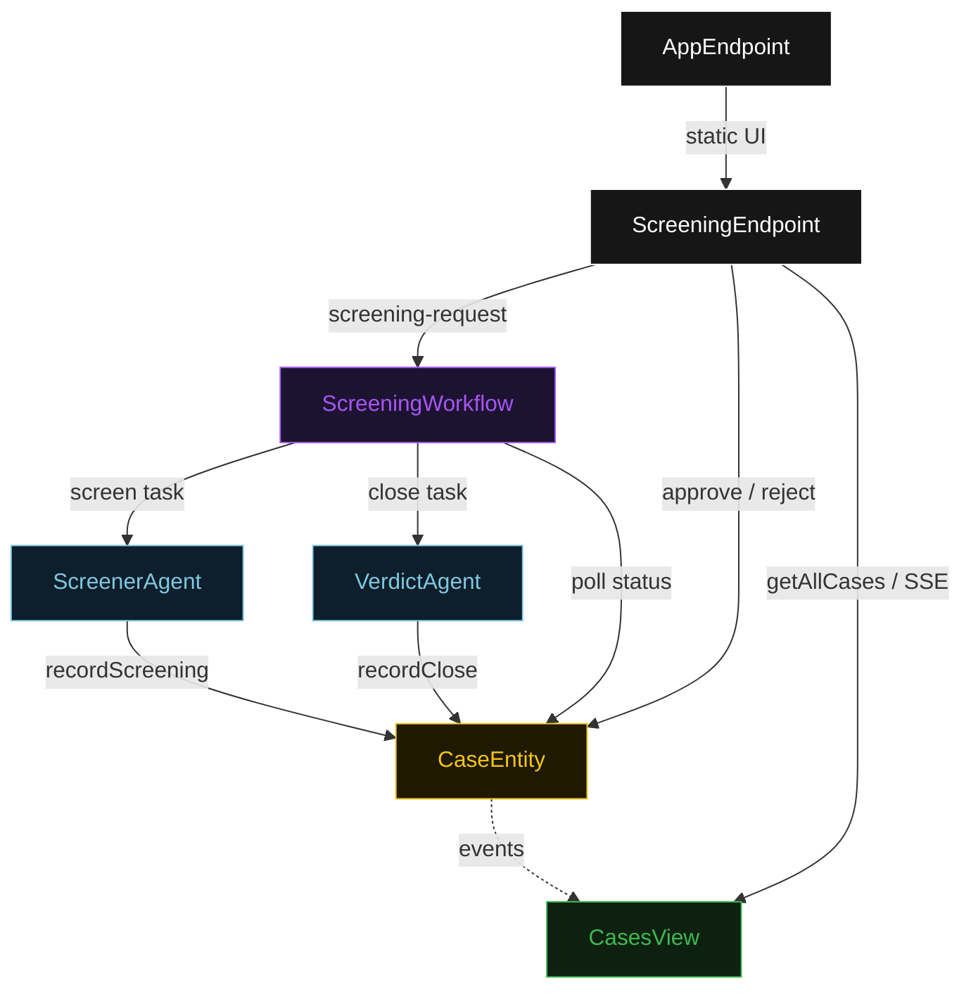
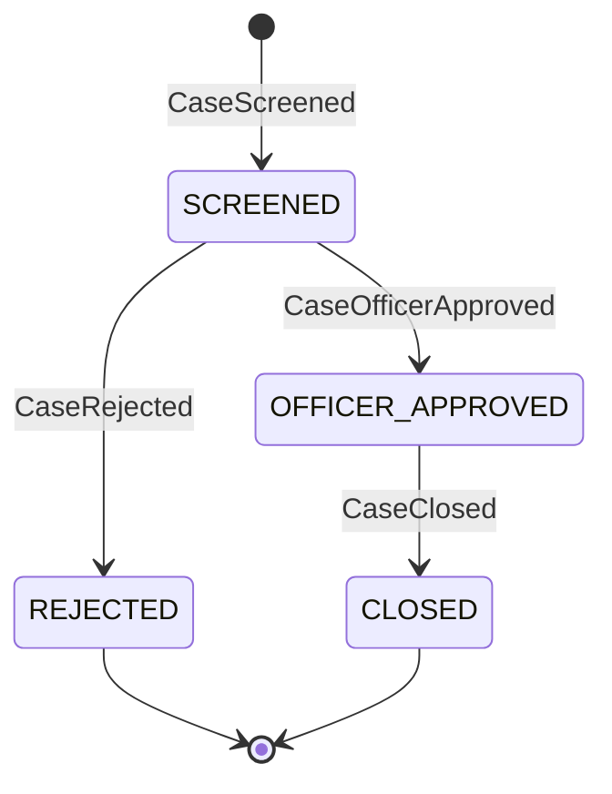
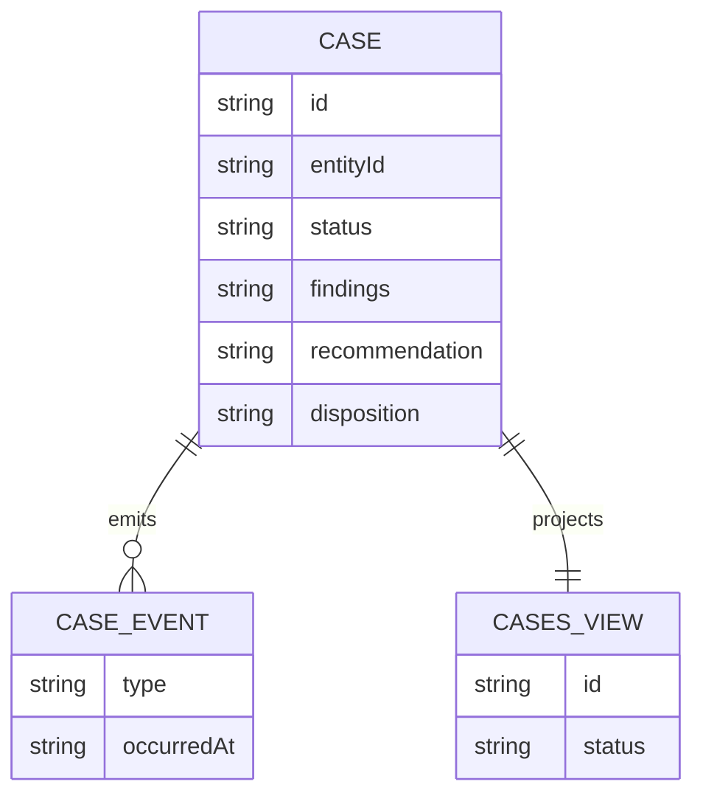

# PLAN — kyc-screener

Architectural sketch for KYC Screener. All four mermaid diagrams plus the component table.

---

## Component graph



## Interaction sequence

```mermaid
sequenceDiagram
  autonumber
  actor Officer
  participant EP as ScreeningEndpoint
  participant WF as ScreeningWorkflow
  participant SA as ScreenerAgent
  participant CE as CaseEntity
  participant VA as VerdictAgent

  Officer->>EP: POST /api/screening-request {entityId, documents}
  EP->>WF: start(caseId, entityId, documents)
  WF->>SA: runSingleTask(SCREEN)
  SA-->>WF: ScreeningResult{entityId, findings, recommendation}
  WF->>CE: recordScreening -> SCREENED
  Note over WF,CE: await-approval task paused; workflow polls status every 5s
  Officer->>EP: POST /api/cases/{id}/approve
  EP->>CE: approve -> OFFICER_APPROVED
  WF->>CE: getCase -> OFFICER_APPROVED
  WF->>VA: runSingleTask(CLOSE) [guard: status == OFFICER_APPROVED]
  VA-->>WF: ClosedCase{caseId, disposition, closedAt}
  WF->>CE: recordClose -> CLOSED
```

## State machine



## Entity model



## Component table

| Component | Path (generated) |
|---|---|
| ScreenerAgent | `application/ScreenerAgent.java` |
| VerdictAgent | `application/VerdictAgent.java` |
| ScreeningWorkflow | `application/ScreeningWorkflow.java` |
| ScreeningTasks | `application/ScreeningTasks.java` |
| CaseEntity | `application/CaseEntity.java` |
| CasesView | `application/CasesView.java` |
| ScreeningEndpoint | `api/ScreeningEndpoint.java` |
| AppEndpoint | `api/AppEndpoint.java` |
| Case / events / records | `domain/*.java` |

## Concurrency notes

- **Step timeouts.** `screenStep` and `closeStep` call agents; both set `stepTimeout(60s)` to absorb LLM latency. The default 5 s step timeout would retry forever (Lesson 4).
- **Await-approval task.** The workflow does not block a thread; `awaitApprovalStep` reads `CaseEntity.getCase`, and on `SCREENED` self-schedules a 5-second resume timer until the compliance officer transitions the status.
- **Idempotency.** `caseId` is the workflow id and the entity id; re-delivery of `recordScreening` / `recordClose` is absorbed by event-applier checks on current status.
- **Close guard.** Before the close tool runs, the before-agent-response guardrail verifies that `ScreeningResult.findings` cites at least one source document reference; if absent the result is rejected and the agent retries. The before-tool-call check on `VerdictAgent` re-reads `CaseEntity.status`; if it is not `OFFICER_APPROVED`, the close call is blocked.
