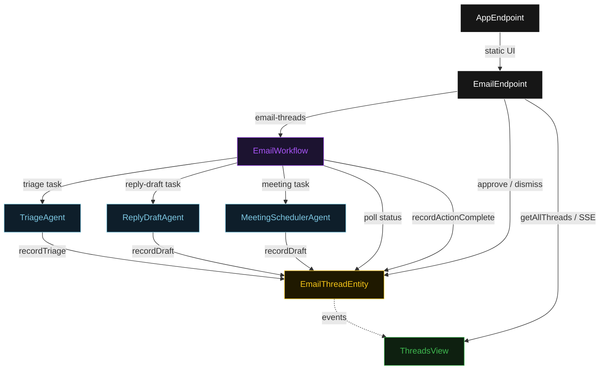
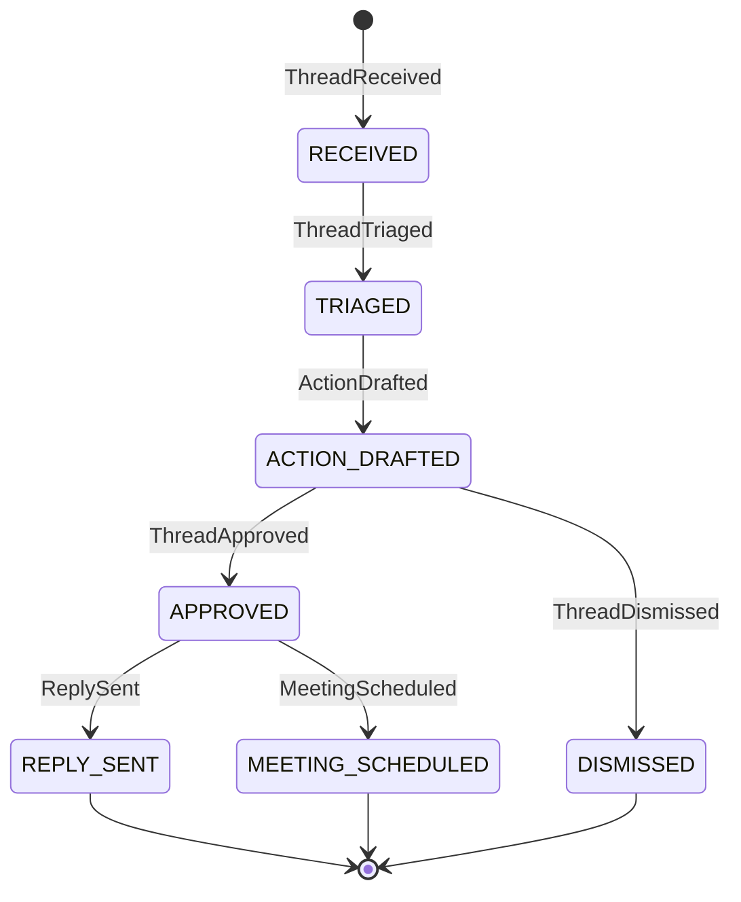
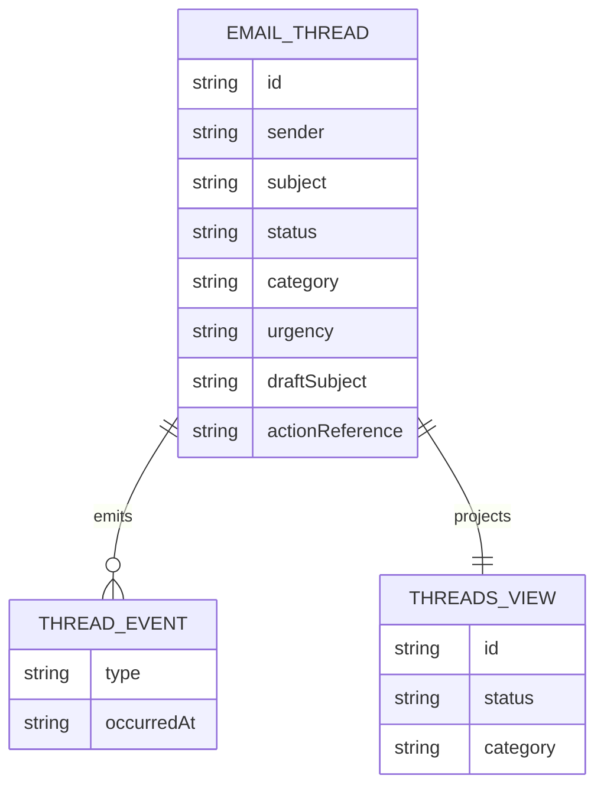

# PLAN — ambient-email-assistant

Architectural sketch for Ambient Email Assistant. All four mermaid diagrams plus the component table.

---

## Component graph



## Interaction sequence

```mermaid
sequenceDiagram
  autonumber
  actor Operator
  participant EP as EmailEndpoint
  participant WF as EmailWorkflow
  participant TA as TriageAgent
  participant RA as ReplyDraftAgent
  participant TE as EmailThreadEntity

  Operator->>EP: POST /api/email-threads {sender, subject, body}
  EP->>WF: start(threadId, emailPayload)
  WF->>TA: runSingleTask(TRIAGE)
  TA-->>WF: EmailClassification{category, urgency, suggestedAction}
  WF->>TE: recordTriage -> TRIAGED
  WF->>RA: runSingleTask(REPLY_DRAFT) [if suggestedAction=reply]
  RA-->>WF: ReplyDraft{subject, body}
  WF->>TE: recordDraft -> ACTION_DRAFTED
  Note over WF,TE: await-approval task paused; workflow polls status every 5s
  Operator->>EP: POST /api/threads/{id}/approve
  EP->>TE: approve -> APPROVED
  WF->>TE: getThread -> APPROVED
  WF->>TE: recordActionComplete [guard: status == APPROVED] -> REPLY_SENT
```

## State machine



## Entity model



## Component table

| Component | Path (generated) |
|---|---|
| TriageAgent | `application/TriageAgent.java` |
| ReplyDraftAgent | `application/ReplyDraftAgent.java` |
| MeetingSchedulerAgent | `application/MeetingSchedulerAgent.java` |
| EmailWorkflow | `application/EmailWorkflow.java` |
| EmailTasks | `application/EmailTasks.java` |
| EmailThreadEntity | `application/EmailThreadEntity.java` |
| ThreadsView | `application/ThreadsView.java` |
| EmailEndpoint | `api/EmailEndpoint.java` |
| AppEndpoint | `api/AppEndpoint.java` |
| EmailThread / events / records | `domain/*.java` |

## Concurrency notes

- **Step timeouts.** `triageStep`, `draftActionStep`, and `executeActionStep` call agents; all three set `stepTimeout(60s)` to absorb LLM and integration latency. The default 5 s step timeout would retry before the agent returns (Lesson 4).
- **Await-approval task.** The workflow does not block a thread; `awaitApprovalStep` reads `EmailThreadEntity.getThread`, and while status is `ACTION_DRAFTED` it self-schedules a 5-second resume timer until the operator transitions the status.
- **Branch on suggestedAction.** `draftActionStep` reads the `EmailClassification` returned by `triageStep` and routes to `ReplyDraftAgent` or `MeetingSchedulerAgent`. Unrecognised action types default to `ReplyDraftAgent`.
- **Action guard.** Before any Gmail send or Calendar create tool runs, the before-tool-call guardrail re-reads `EmailThreadEntity.status`; if it is not `APPROVED`, the call is blocked and the workflow moves the thread to an error-acknowledged state.
- **Idempotency.** `threadId` is the workflow id and the entity id; re-delivery of `recordTriage` or `recordDraft` is absorbed by event-applier checks on current status.
