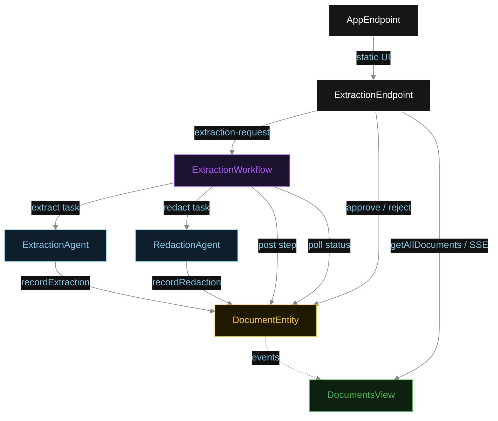
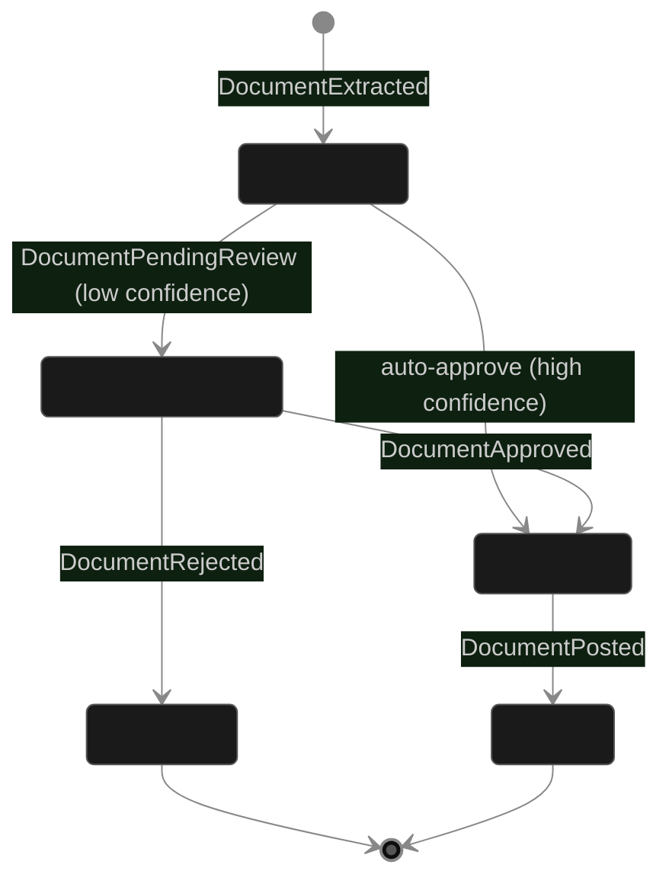
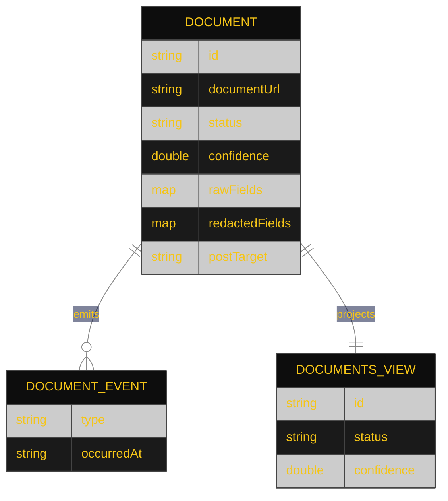

# PLAN — hitl-pdf-extract

Architectural sketch for HITL PDF Data Extraction. All four mermaid diagrams plus the component table.

---

## Component graph



## Interaction sequence

```mermaid
%%{init: {'theme': 'base', 'themeVariables': {'primaryColor': '#0e1e2a', 'primaryTextColor': '#e0e0e0', 'primaryBorderColor': '#444', 'lineColor': '#888', 'background': '#111', 'mainBkg': '#0d0d0d', 'actorBkg': '#1a1a1a', 'actorBorder': '#555', 'actorTextColor': '#e0e0e0', 'noteBkgColor': '#1c1c1c', 'noteTextColor': '#ccc', 'activationBkgColor': '#2a2a2a', 'activationBorderColor': '#888', 'signalColor': '#F5C518', 'signalTextColor': '#e0e0e0', 'labelBoxBkgColor': '#1a1a1a', 'labelBoxBorderColor': '#555', 'labelTextColor': '#e0e0e0', 'loopTextColor': '#e0e0e0', 'sequenceNumberColor': '#000'}}}%%
sequenceDiagram
  autonumber
  actor User
  participant EP as ExtractionEndpoint
  participant WF as ExtractionWorkflow
  participant EA as ExtractionAgent
  participant RA as RedactionAgent
  participant DE as DocumentEntity

  User->>EP: POST /api/extraction-request {documentUrl}
  EP->>WF: start(documentId, documentUrl)
  WF->>EA: runSingleTask(EXTRACT)
  EA-->>WF: ExtractionResult{fields, confidence}
  WF->>DE: recordExtraction -> EXTRACTED
  WF->>RA: runSingleTask(REDACT)
  RA-->>WF: RedactedResult{fields}
  WF->>DE: recordRedaction
  Note over WF,DE: confidence < 0.85: setPendingReview; polls every 5s
  User->>EP: POST /api/documents/{id}/approve
  EP->>DE: approve -> APPROVED
  WF->>DE: getDocument -> APPROVED
  WF->>DE: recordPost [guard: status == APPROVED]
  DE-->>WF: PostReceipt{postTarget, postedAt}
  WF->>DE: recordPost -> POSTED
```

## State machine



## Entity model



## Component table

| Component | Path (generated) |
|---|---|
| ExtractionAgent | `application/ExtractionAgent.java` |
| RedactionAgent | `application/RedactionAgent.java` |
| ExtractionWorkflow | `application/ExtractionWorkflow.java` |
| ExtractionTasks | `application/ExtractionTasks.java` |
| DocumentEntity | `application/DocumentEntity.java` |
| DocumentsView | `application/DocumentsView.java` |
| ExtractionEndpoint | `api/ExtractionEndpoint.java` |
| AppEndpoint | `api/AppEndpoint.java` |
| Document / events / records | `domain/*.java` |

## Concurrency notes

- **Step timeouts.** `extractStep`, `redactStep`, and `postStep` call agents or perform downstream writes; all set `stepTimeout(60s)` to absorb LLM latency. The default 5 s step timeout would expire before most real extractions complete (Lesson 4).
- **Await-review task.** The workflow does not block a thread; `awaitReviewStep` reads `DocumentEntity.getDocument`, and on `PENDING_REVIEW` self-schedules a 5-second resume timer until the human transitions the status.
- **Confidence gate.** When confidence meets the threshold, `awaitReviewStep` calls `approve` directly on `DocumentEntity`, converting EXTRACTED to APPROVED without human input.
- **Post guard.** Before the simulated post tool runs, the before-tool-call guardrail re-reads `DocumentEntity.status`; if it is not `APPROVED`, the call is blocked. No compensation path is needed because posting is the terminal write.
- **Idempotency.** `documentId` is the workflow id and the entity id; re-delivery of `recordExtraction` / `recordPost` is absorbed by event-applier checks on current status.
