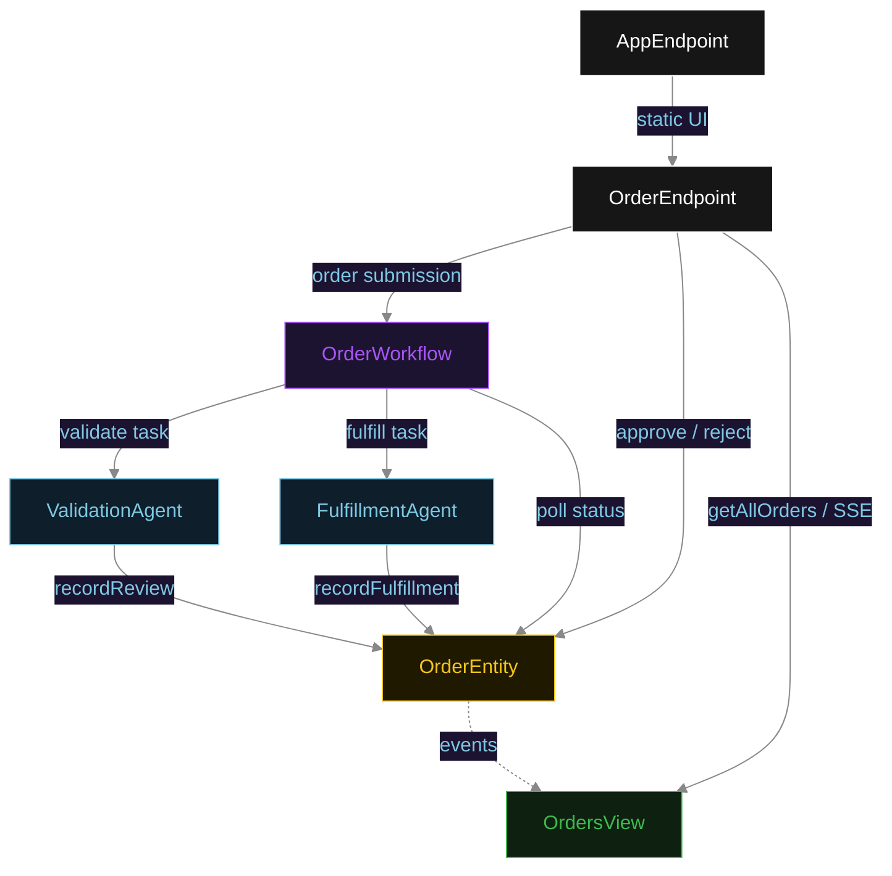
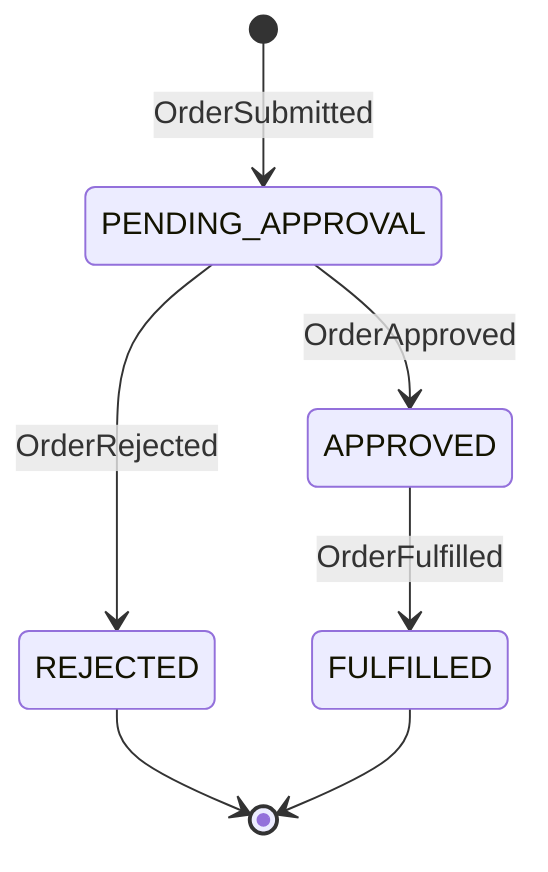
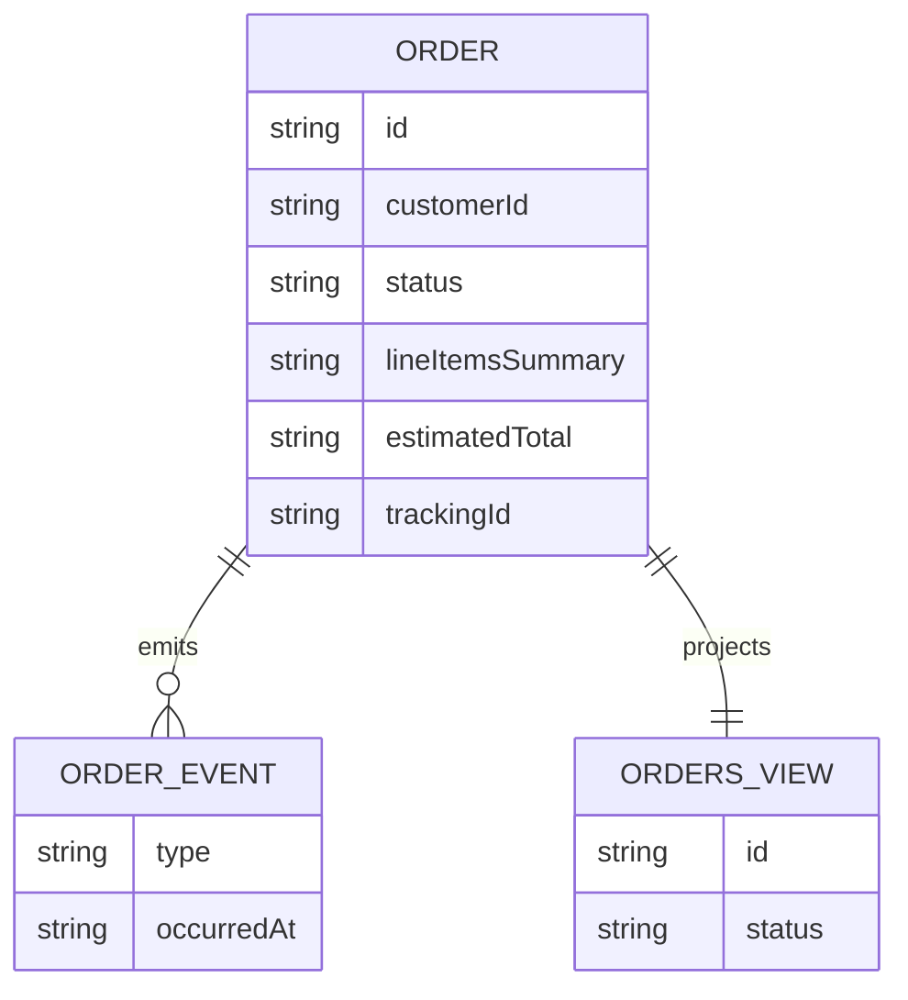

# PLAN — order-processing

Architectural sketch for HITL Order Processing. All four mermaid diagrams plus the component table.

---

## Component graph



## Interaction sequence

```mermaid
sequenceDiagram
  autonumber
  actor Operator
  participant EP as OrderEndpoint
  participant WF as OrderWorkflow
  participant VA as ValidationAgent
  participant OE as OrderEntity
  participant FA as FulfillmentAgent

  Operator->>EP: POST /api/orders {customerId, lineItems}
  EP->>WF: start(orderId, orderPayload)
  WF->>VA: runSingleTask(VALIDATE)
  VA-->>WF: OrderReview{lineItems, estimatedTotal, riskFlags}
  WF->>OE: recordReview -> PENDING_APPROVAL
  Note over WF,OE: await-approval task paused; workflow polls status every 5s
  Operator->>EP: POST /api/orders/{id}/approve
  EP->>OE: approve -> APPROVED
  WF->>OE: getOrder -> APPROVED
  WF->>FA: runSingleTask(FULFILL) [guard: status == APPROVED]
  FA-->>WF: DispatchConfirmation{trackingId, dispatchedAt}
  WF->>OE: recordFulfillment -> FULFILLED
```

## State machine



## Entity model



## Component table

| Component | Path (generated) |
|---|---|
| ValidationAgent | `application/ValidationAgent.java` |
| FulfillmentAgent | `application/FulfillmentAgent.java` |
| OrderWorkflow | `application/OrderWorkflow.java` |
| OrderTasks | `application/OrderTasks.java` |
| OrderEntity | `application/OrderEntity.java` |
| OrdersView | `application/OrdersView.java` |
| OrderEndpoint | `api/OrderEndpoint.java` |
| AppEndpoint | `api/AppEndpoint.java` |
| Order / events / records | `domain/*.java` |

## Concurrency notes

- **Step timeouts.** `validateStep` and `fulfillStep` call agents; both set `stepTimeout(60s)` to absorb LLM latency. The default 5 s step timeout would retry forever (Lesson 4).
- **Await-approval task.** The workflow does not block a thread; `awaitApprovalStep` reads `OrderEntity.getOrder`, and on `PENDING_APPROVAL` self-schedules a 5-second resume timer until the human transitions the status.
- **Idempotency.** `orderId` is the workflow id and the entity id; re-delivery of `recordReview` / `recordFulfillment` is absorbed by event-applier checks on current status.
- **Fulfillment guard.** Before the dispatch tool runs, the before-tool-call guardrail re-reads `OrderEntity.status`; if it is not `APPROVED`, the call is blocked. No compensation path is needed because dispatch is the terminal write.
