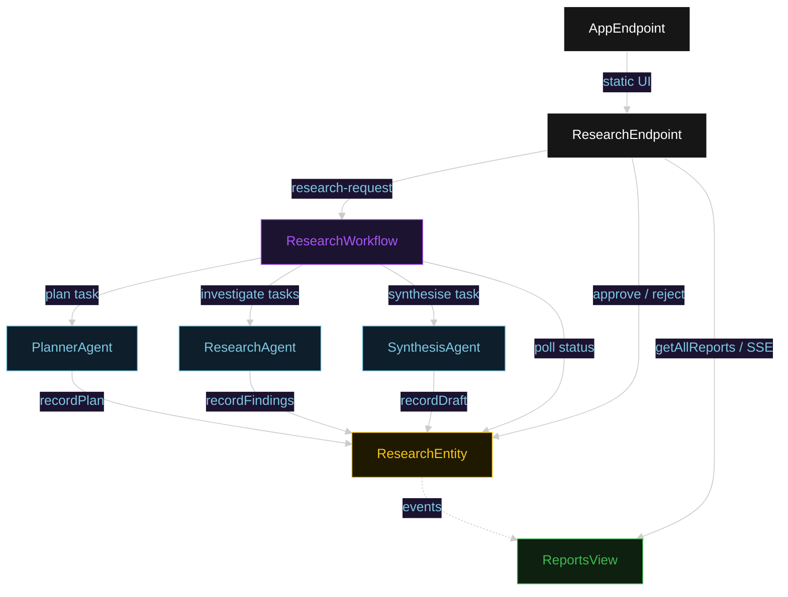
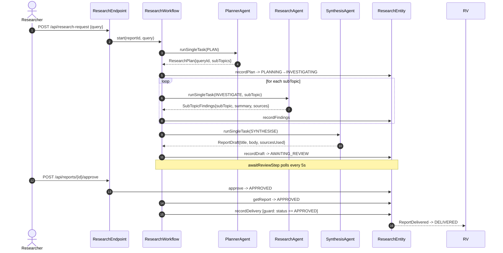
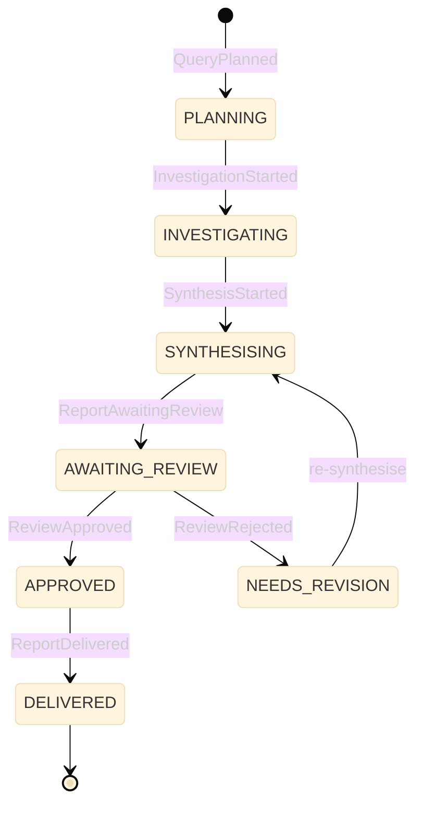
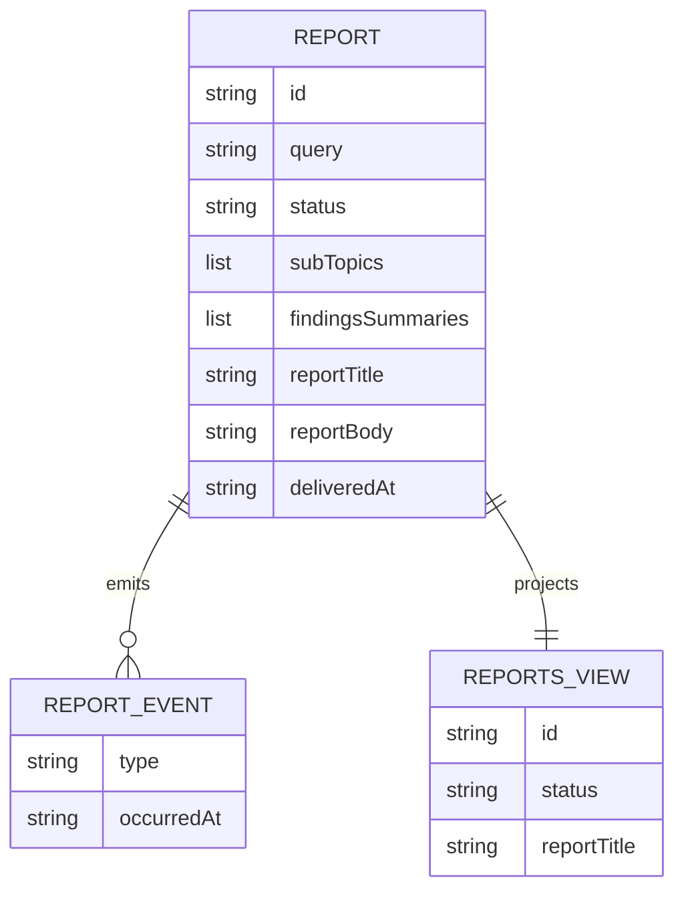

# PLAN — deep-research-hitl

Architectural sketch for HITL Deep Research. All four mermaid diagrams plus the component table.

---

## Component graph

## Interaction sequence

## State machine

## Entity model

## Component table

| Component | Path (generated) |
|---|---|
| PlannerAgent | `application/PlannerAgent.java` |
| ResearchAgent | `application/ResearchAgent.java` |
| SynthesisAgent | `application/SynthesisAgent.java` |
| ResearchWorkflow | `application/ResearchWorkflow.java` |
| ResearchTasks | `application/ResearchTasks.java` |
| ResearchEntity | `application/ResearchEntity.java` |
| ReportsView | `application/ReportsView.java` |
| ResearchEndpoint | `api/ResearchEndpoint.java` |
| AppEndpoint | `api/AppEndpoint.java` |
| Report / events / records | `domain/*.java` |

## Concurrency notes

- **Step timeouts.** `planStep`, each `investigateStep` iteration, and `synthesiseStep` call agents; all set `stepTimeout(120s)` to absorb LLM latency across the multi-step fan-out. `deliverStep` sets `stepTimeout(60s)` (Lesson 4).
- **Await-review task.** The workflow does not block a thread; `awaitReviewStep` reads `ResearchEntity.getReport`, and on `AWAITING_REVIEW` self-schedules a 5-second resume timer until the human transitions the status. On `NEEDS_REVISION` the workflow loops back to `synthesiseStep`.
- **Idempotency.** `reportId` is the workflow id and the entity id; re-delivery of `recordPlan` / `recordFindings` / `recordDraft` / `recordDelivery` is absorbed by event-applier checks on current status.
- **Deliver guard.** Before the deliver tool runs, the before-tool-call guardrail re-reads `ResearchEntity.status`; if it is not `APPROVED`, the call is blocked and the report stays in `AWAITING_REVIEW`.
