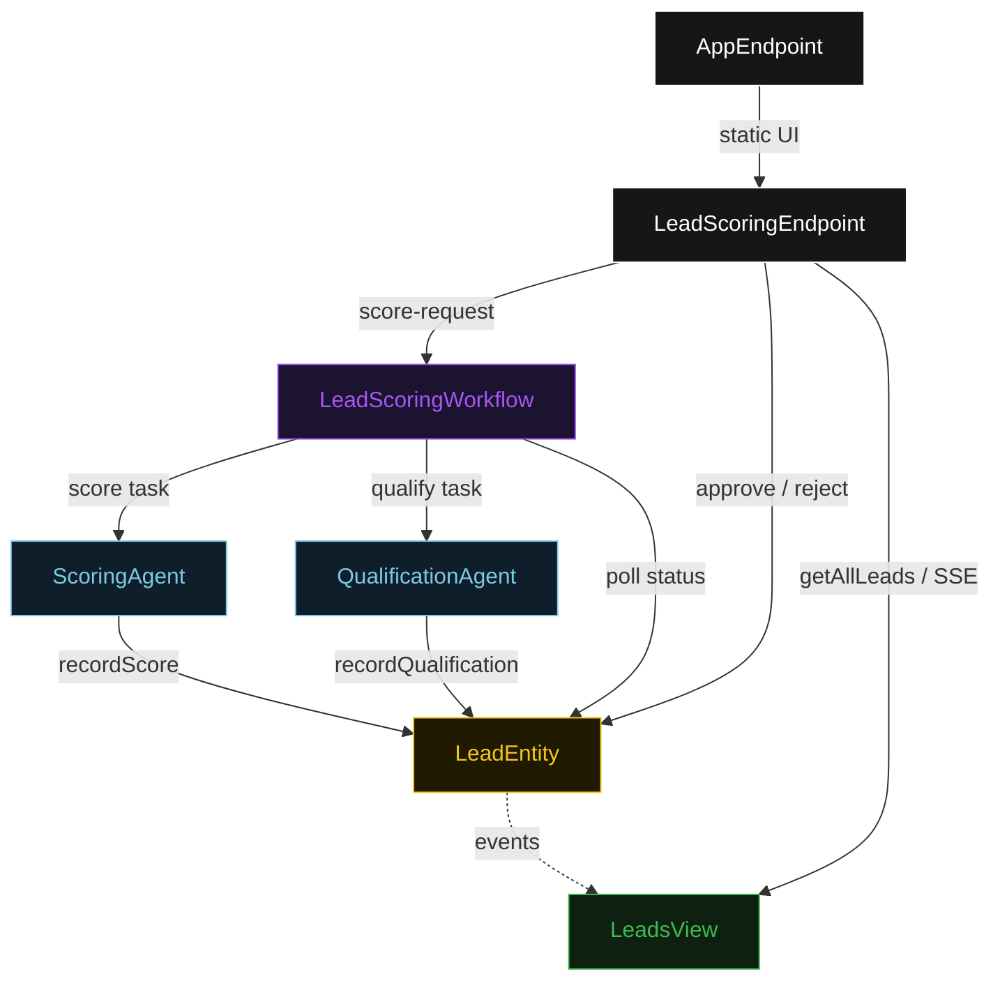
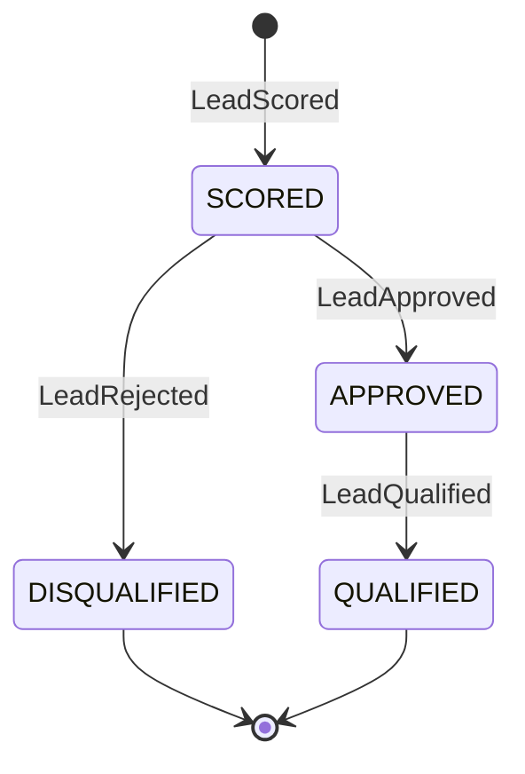
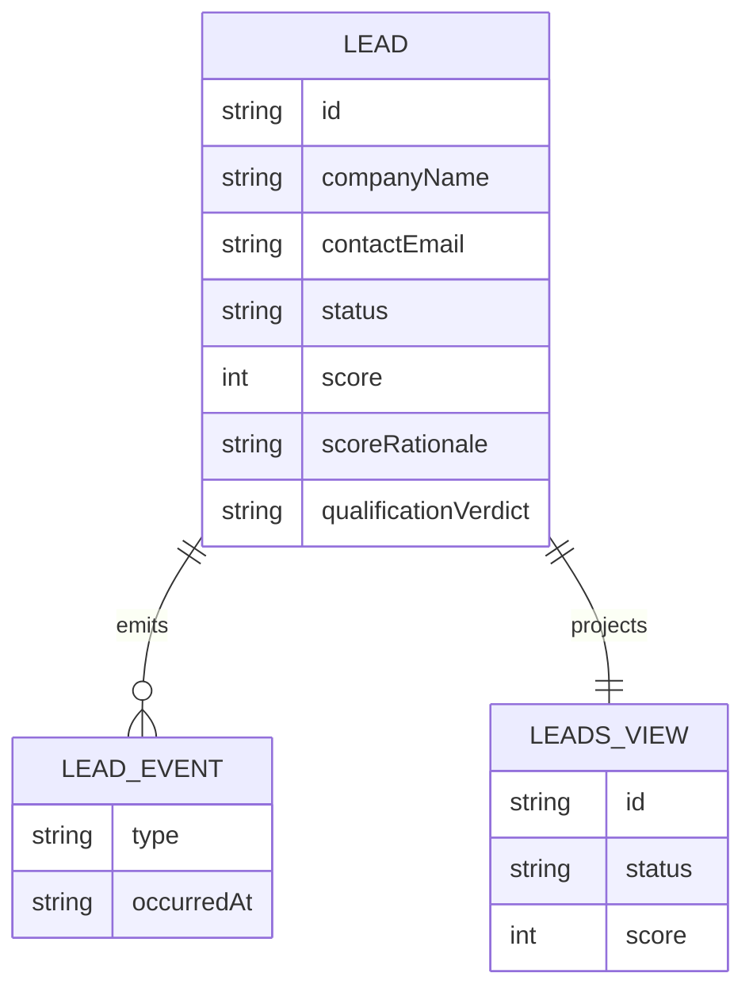

# PLAN — lead-score-flow

Architectural sketch for Lead Score Flow. All four mermaid diagrams plus the component table.

---

## Component graph



## Interaction sequence

```mermaid
sequenceDiagram
  autonumber
  actor Reviewer
  participant EP as LeadScoringEndpoint
  participant WF as LeadScoringWorkflow
  participant SA as ScoringAgent
  participant LE as LeadEntity
  participant QA as QualificationAgent

  Reviewer->>EP: POST /api/score-request {companyName, contactEmail}
  EP->>WF: start(leadId, profile)
  WF->>SA: runSingleTask(SCORE)
  SA-->>WF: LeadScore{score, rationale, confidence}
  WF->>LE: recordScore -> SCORED
  Note over WF,LE: await-review task paused; workflow polls status every 5s
  Reviewer->>EP: POST /api/leads/{id}/approve
  EP->>LE: approve -> APPROVED
  WF->>LE: getLead -> APPROVED
  WF->>QA: runSingleTask(QUALIFY) [guard: status == APPROVED]
  QA-->>WF: QualificationSummary{verdict, nextSteps}
  WF->>LE: recordQualification -> QUALIFIED
```

## State machine



## Entity model



## Component table

| Component | Path (generated) |
|---|---|
| ScoringAgent | `application/ScoringAgent.java` |
| QualificationAgent | `application/QualificationAgent.java` |
| LeadScoringWorkflow | `application/LeadScoringWorkflow.java` |
| LeadScoringTasks | `application/LeadScoringTasks.java` |
| LeadEntity | `application/LeadEntity.java` |
| LeadsView | `application/LeadsView.java` |
| LeadScoringEndpoint | `api/LeadScoringEndpoint.java` |
| AppEndpoint | `api/AppEndpoint.java` |
| Lead / events / records | `domain/*.java` |

## Concurrency notes

- **Step timeouts.** `scoreStep` and `qualifyStep` call agents; both set `stepTimeout(60s)` to absorb LLM latency. The default 5 s step timeout would retry forever (Lesson 4).
- **Await-review task.** The workflow does not block a thread; `awaitReviewStep` reads `LeadEntity.getLead`, and on `SCORED` self-schedules a 5-second resume timer until the human transitions the status.
- **Idempotency.** `leadId` is the workflow id and the entity id; re-delivery of `recordScore` / `recordQualification` is absorbed by event-applier checks on current status.
- **Qualify guard.** Before the qualification tool runs, the before-tool-call guardrail re-reads `LeadEntity.status`; if it is not `APPROVED`, the call is blocked. No compensation path is needed because qualification is the terminal write.
- **Eval event.** After `recordScore` completes, the workflow emits a scoring eval event carrying the score, confidence, and input profile for drift analysis.
