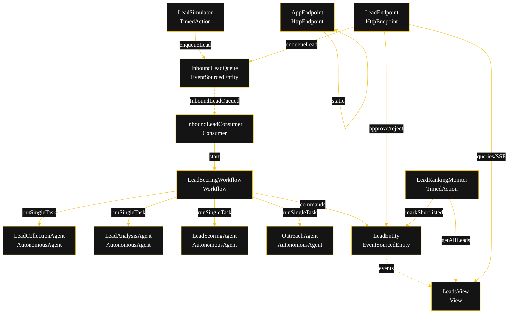
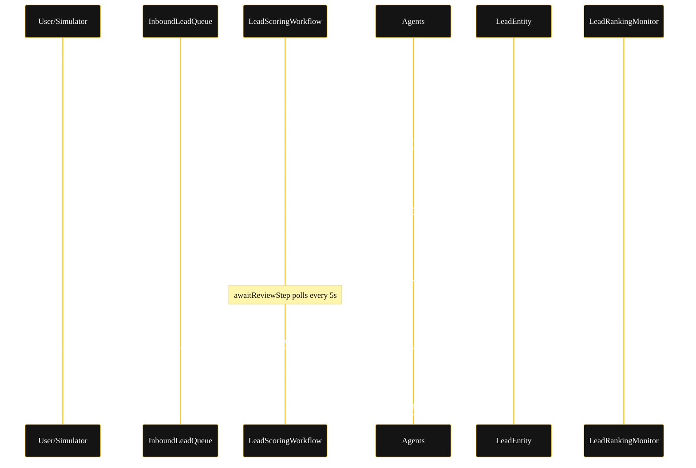
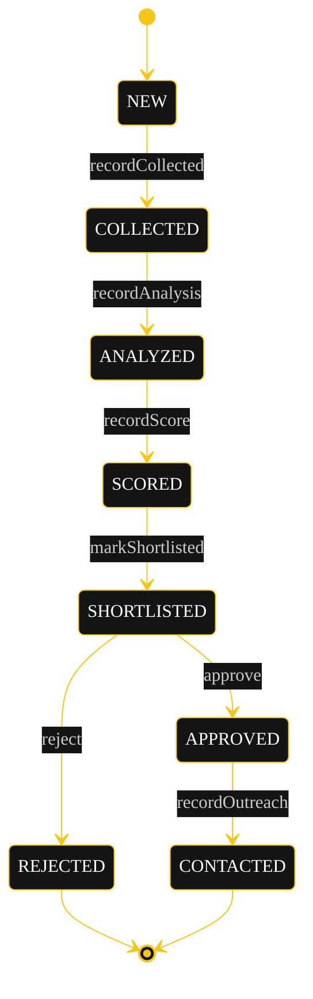
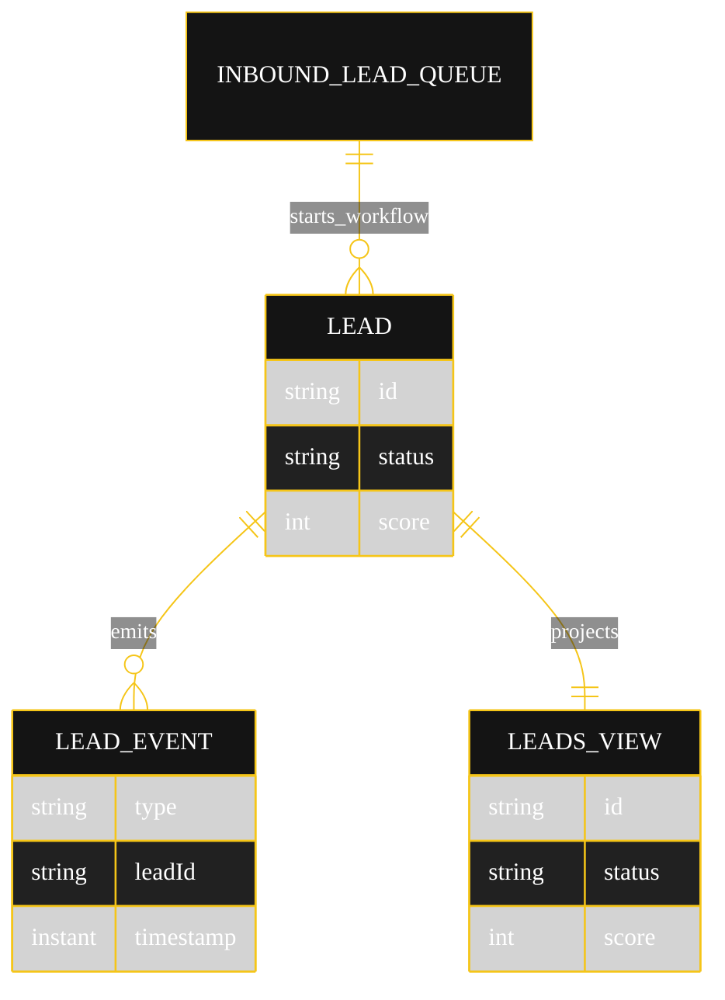

# Implementation Plan — Lead Score HITL

The architecture `SPEC.md` resolves to once run through `/akka:specify` → `/akka:plan`. Diagrams render on the Architecture tab; they carry the Akka theme variables plus the CSS overrides for state-diagram labels and edge-label `foreignObject` overflow (Lesson 24).

---

## Component graph

Solid arrows are synchronous commands; dashed arrows are event subscriptions.

## Interaction sequence

## State machine

State labels need the CSS overrides from Lesson 24 — the `g.statediagram-state .label` path does not inherit `primaryTextColor`, and edge labels clip without `overflow:visible` on their `foreignObject`.

## Entity model

## Component table

| Component | Kind | File |
|---|---|---|
| `LeadCollectionAgent` | AutonomousAgent | `application/LeadCollectionAgent.java` |
| `LeadAnalysisAgent` | AutonomousAgent | `application/LeadAnalysisAgent.java` |
| `LeadScoringAgent` | AutonomousAgent | `application/LeadScoringAgent.java` |
| `OutreachAgent` | AutonomousAgent | `application/OutreachAgent.java` |
| `LeadScoringTasks` | task definitions | `application/LeadScoringTasks.java` |
| `PiiSanitizer` | helper | `application/PiiSanitizer.java` |
| `LeadScoringWorkflow` | Workflow | `application/LeadScoringWorkflow.java` |
| `LeadEntity` | EventSourcedEntity | `application/LeadEntity.java` |
| `InboundLeadQueue` | EventSourcedEntity | `application/InboundLeadQueue.java` |
| `LeadsView` | View | `application/LeadsView.java` |
| `InboundLeadConsumer` | Consumer | `application/InboundLeadConsumer.java` |
| `LeadSimulator` | TimedAction | `application/LeadSimulator.java` |
| `LeadRankingMonitor` | TimedAction | `application/LeadRankingMonitor.java` |
| `LeadEndpoint` | HttpEndpoint | `api/LeadEndpoint.java` |
| `AppEndpoint` | HttpEndpoint | `api/AppEndpoint.java` |
| `Bootstrap` | service-setup | `Bootstrap.java` |
| `Lead`, `LeadStatus`, `LeadEvent` | domain | `domain/*.java` |

## Concurrency notes

- **Step timeouts (Lesson 4).** `collectStep`, `analyzeStep`, `scoreStep`, `outreachStep` set `stepTimeout(60s)` because they call agents. `awaitReviewStep` uses `stepTimeout(10s)` and self-schedules a 5s resume timer while the lead is `SCORED` or `SHORTLISTED`.
- **Idempotency.** Each workflow instance is keyed by `leadId`; agent calls use `forAutonomousAgent(Agent.class, role + leadId)` so retries reuse the same session. `markShortlisted` is a no-op if the lead is already past `SCORED`.
- **No saga.** All side effects are in-process EventSourcedEntity commands; there is nothing external to compensate. A rejected lead is terminal; an approved lead drafts outreach exactly once because `recordOutreach` is only emitted from `outreachStep`.
- **View indexing (Lesson 2).** `LeadsView` has one query with no `WHERE status` clause; status and top-3 ranking are filtered and sorted client-side in `LeadEndpoint` and `LeadRankingMonitor`.
