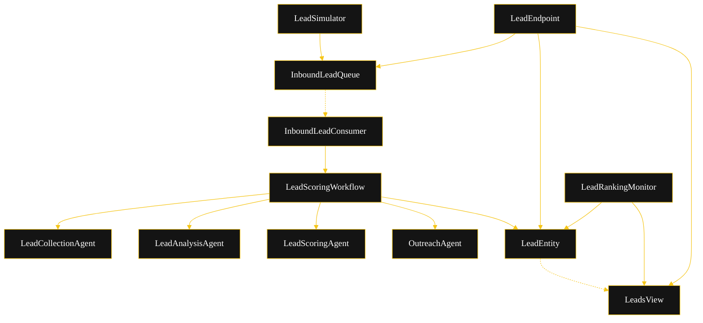
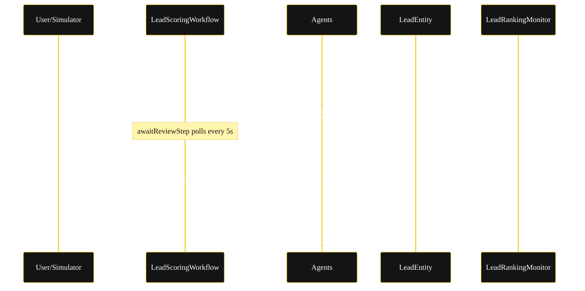
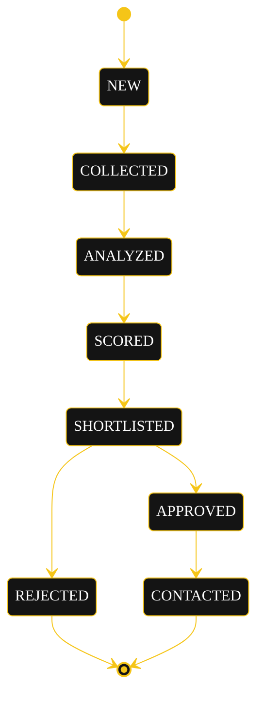
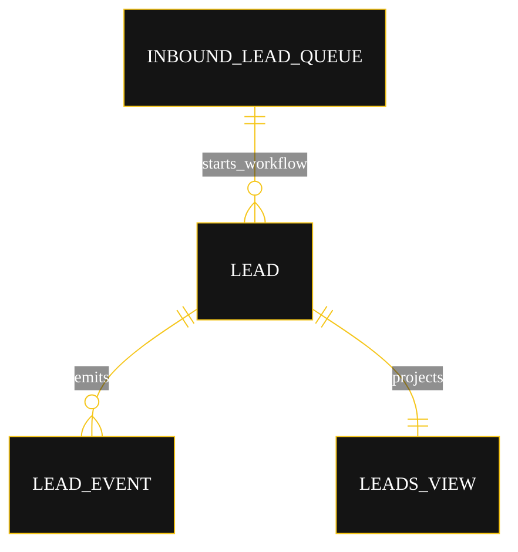

# Architecture — Lead Score HITL

The diagrams below are the source the generated system renders on the Architecture tab. All four use the Akka theme variables; the state diagram additionally needs the CSS label overrides from Lesson 24 (state names render black-on-black and edge labels clip without them).

## Component graph

Every inbound lead flows from `LeadSimulator` or `LeadEndpoint` into `InboundLeadQueue`. `InboundLeadConsumer` reacts to each `InboundLeadQueued` event and starts one `LeadScoringWorkflow`. The workflow drives the four agents in sequence and writes their results to `LeadEntity`. `LeadsView` projects entity events for the UI and the ranking monitor.

## Interaction sequence

The primary journey: a lead is collected (after PII sanitization), analyzed, and scored; the workflow pauses; the ranking monitor shortlists the top leads; a human approves; outreach is drafted under a guardrail.

## State machine

`LeadEntity` lifecycle.

## Entity model

`InboundLeadQueue` starts a `LeadScoringWorkflow` per inbound lead; the workflow drives `LeadEntity`, whose events project into `LeadsView`.

