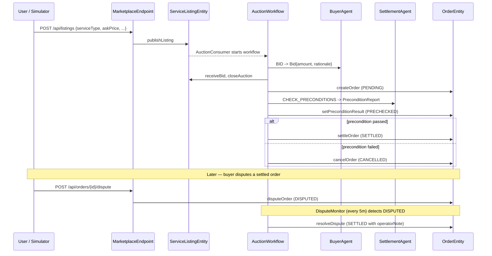
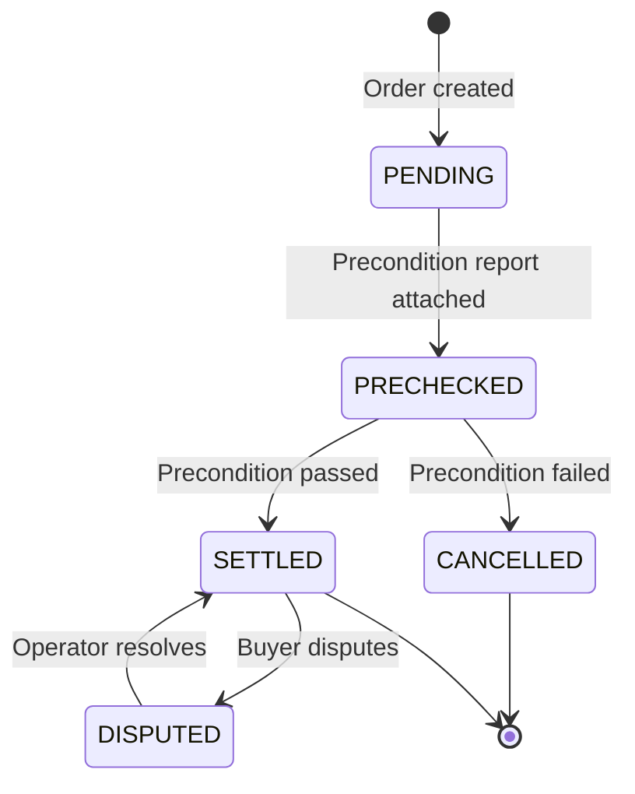
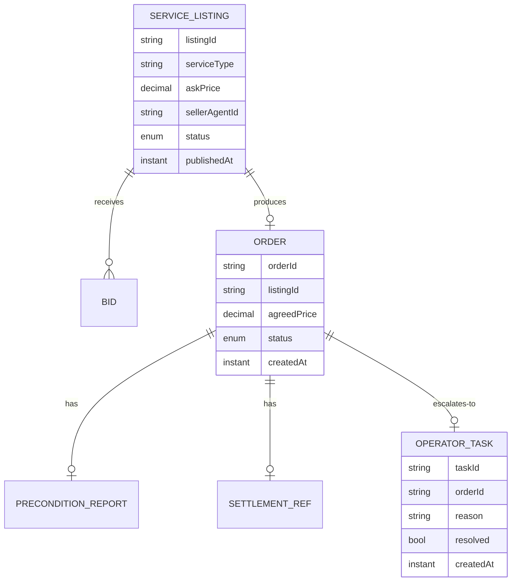

# PLAN — Agent-to-Agent Commerce Settlement

Architectural sketch for `/akka:specify`. Mirrors `SPEC.md` Section 4 component names exactly. Mermaid sources here are rendered on the Architecture tab of the embedded UI; carry the Lesson 24 CSS overrides into the generated `index.html`.

## Component graph

```mermaid
%%{init: {'theme':'base','themeVariables':{'primaryColor':'#141414','primaryBorderColor':'#F5C518','primaryTextColor':'#ffffff','lineColor':'#7EC8E3','nodeTextColor':'#ffffff','fontFamily':'Instrument Sans'}}}%%
flowchart TB
  ME[MarketplaceEndpoint<br/>HttpEndpoint]:::ep
  AE[AppEndpoint<br/>HttpEndpoint]:::ep
  SLE[ServiceListingEntity<br/>EventSourcedEntity]:::ese
  OE[OrderEntity<br/>EventSourcedEntity]:::ese
  OTE[OperatorTaskEntity<br/>EventSourcedEntity]:::ese
  AC[AuctionConsumer<br/>Consumer]:::con
  WF[AuctionWorkflow<br/>Workflow]:::wf
  BA[BuyerAgent<br/>AutonomousAgent]:::ag
  SA[SettlementAgent<br/>AutonomousAgent]:::ag
  MV[MarketplaceView<br/>View]:::vw
  SIM[ListingSimulator<br/>TimedAction]:::ta
  DM[DisputeMonitor<br/>TimedAction]:::ta

  ME -->|POST /listings| SLE
  ME -->|POST /listings/{id}/bids| SLE
  SIM -.->|every 60s| SLE
  SLE -.->|ListingPublished| AC
  AC -->|start workflow| WF
  WF -->|BID| BA
  WF -->|CHECK_PRECONDITIONS| SA
  WF -->|commands| SLE
  WF -->|commands| OE
  SLE -.->|events| MV
  OE -.->|events| MV
  OTE -.->|events| MV
  DM -.->|every 5m| MV
  DM -->|createTask| OTE
  ME -->|getAllListings / getAllOrders / SSE| MV
  AE --> STATIC[static-resources]:::static

  classDef ep fill:#141414,stroke:#7EC8E3,color:#fff;
  classDef ese fill:#141414,stroke:#F5C518,color:#fff;
  classDef vw fill:#141414,stroke:#3fb950,color:#fff;
  classDef wf fill:#141414,stroke:#ff5f57,color:#fff;
  classDef ag fill:#141414,stroke:#B388FF,color:#fff;
  classDef con fill:#141414,stroke:#7EC8E3,color:#fff;
  classDef ta fill:#141414,stroke:#F5C518,color:#fff;
  classDef static fill:#0A0A0A,stroke:#333,color:#aaa;
```

Solid arrows: synchronous commands. Dashed arrows: event subscriptions. Dotted arrows: scheduled ticks.

## Interaction sequence



## State machine



## Entity model



## Component table

| Component | Akka primitive | File path |
|---|---|---|
| `BuyerAgent` | AutonomousAgent | `application/BuyerAgent.java` |
| `SettlementAgent` | AutonomousAgent | `application/SettlementAgent.java` |
| `CommerceTasks` | Task constants | `application/CommerceTasks.java` |
| `AuctionWorkflow` | Workflow | `application/AuctionWorkflow.java` |
| `ServiceListingEntity` | EventSourcedEntity | `domain/ServiceListingEntity.java` |
| `OrderEntity` | EventSourcedEntity | `domain/OrderEntity.java` |
| `OperatorTaskEntity` | EventSourcedEntity | `domain/OperatorTaskEntity.java` |
| `MarketplaceView` | View | `application/MarketplaceView.java` |
| `AuctionConsumer` | Consumer | `application/AuctionConsumer.java` |
| `ListingSimulator` | TimedAction | `application/ListingSimulator.java` |
| `DisputeMonitor` | TimedAction | `application/DisputeMonitor.java` |
| `MarketplaceEndpoint` | HttpEndpoint | `api/MarketplaceEndpoint.java` |
| `AppEndpoint` | HttpEndpoint | `api/AppEndpoint.java` |

## Concurrency notes

- **Step timeouts (Lesson 4):** `bidStep` and `preconditionStep` get 60s; `closeAuctionStep` gets 10s. The 5s default fails every LLM call. `WorkflowSettings` is nested inside `Workflow` — no import.
- **Idempotency:** the workflow id is the `listingId`. Re-delivery of the same `ListingPublished` event resolves to the same workflow instance — no duplicate auction.
- **Guardrail gating:** `preconditionStep` result drives a branching transition — `settleStep` if passed, `cancelStep` if not. No retry on precondition failure.
- **Dispute path:** `disputeOrder` command moves the order to `DISPUTED`; `DisputeMonitor` creates one `OperatorTask` per DISPUTED order (idempotent: skips if a task already exists). The operator calls `POST /api/orders/{id}/resolve`; the endpoint calls `resolveDispute` on `OrderEntity` and `resolveTask` on `OperatorTaskEntity`.
- **View filtering:** `getAllListings` and `getAllOrders` return all rows; status filtering is client-side (Akka cannot auto-index enum columns). `getOpenTasks` uses a WHERE clause because `resolved` is a boolean, not an enum.
