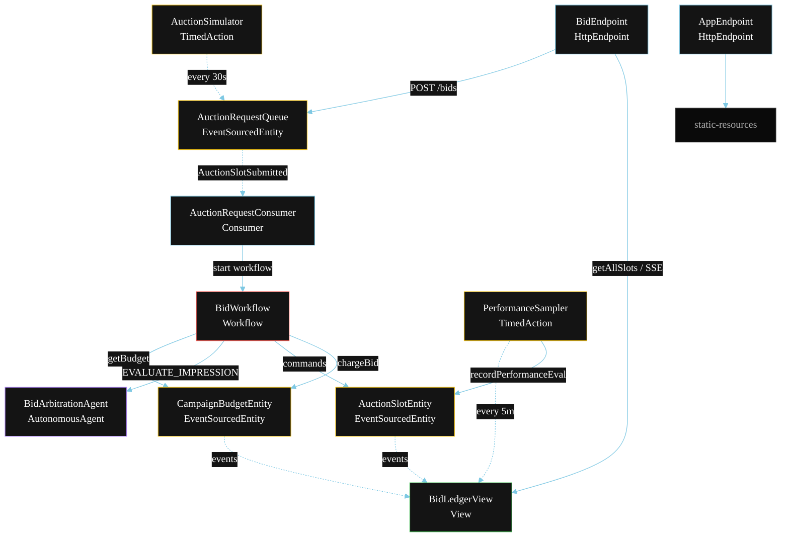
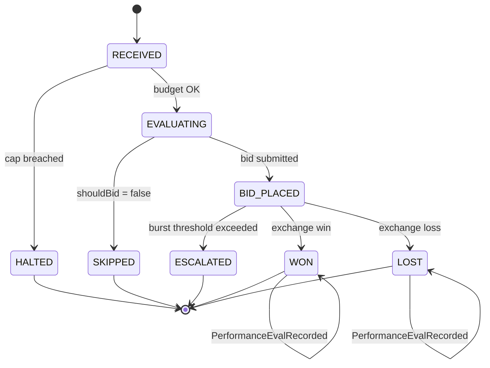
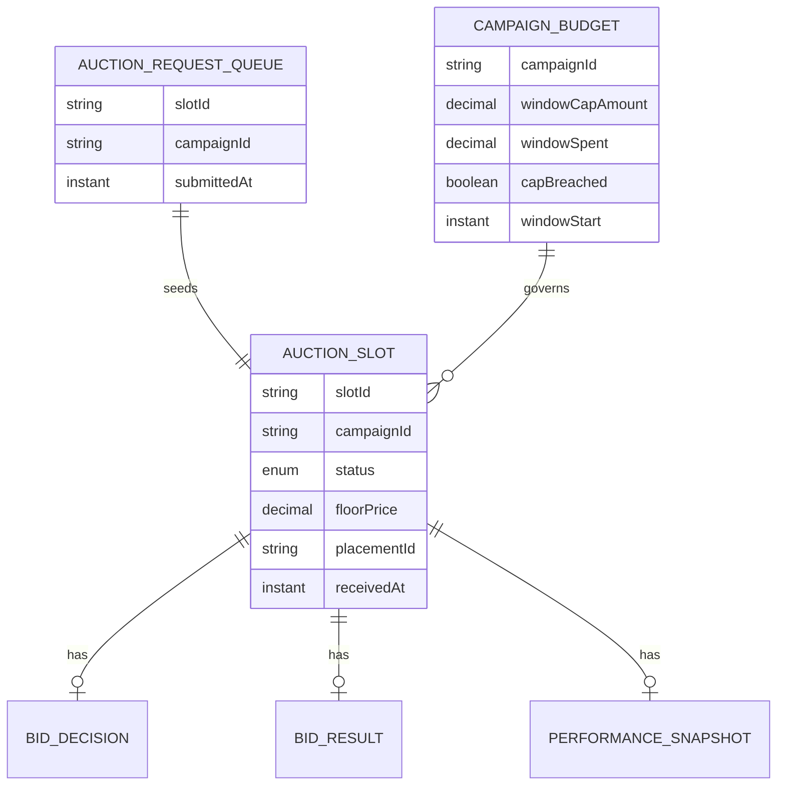

# PLAN — Real-Time Bid Arbitration Agent

Architectural sketch for `/akka:specify`. Mirrors `SPEC.md` Section 4 component names exactly. Mermaid sources here are rendered on the Architecture tab of the embedded UI; carry the Lesson 24 CSS overrides into the generated `index.html`.

## Component graph



Solid arrows: synchronous commands. Dashed arrows: event subscriptions or scheduled ticks.

## Interaction sequence

```mermaid
sequenceDiagram
  participant U as User / Simulator
  participant BE as BidEndpoint
  participant ARQ as AuctionRequestQueue
  participant WF as BidWorkflow
  participant CBE as CampaignBudgetEntity
  participant BAA as BidArbitrationAgent
  participant ASE as AuctionSlotEntity

  U->>BE: POST /api/bids {slotId, campaignId, ...}
  BE->>ARQ: submitSlot
  ARQ-->>WF: AuctionRequestConsumer starts workflow
  WF->>ASE: receiveSlot (RECEIVED)
  WF->>CBE: getBudget
  alt cap breached
    WF->>ASE: haltSlot (HALTED)
  else cap OK
    WF->>ASE: evaluateSlot (EVALUATING)
    WF->>BAA: EVALUATE_IMPRESSION -> BidDecision
    alt shouldBid = false
      WF->>ASE: skipSlot (SKIPPED)
    else shouldBid = true
      WF->>ASE: placeBid (BID_PLACED)
      Note over WF: burst check; if > threshold -> escalateStep
      alt burst detected
        WF->>ASE: escalateSlot (ESCALATED)
      else no burst
        WF->>ASE: recordResult (WON or LOST)
        WF->>CBE: chargeBid
      end
    end
  end
```

## State machine



## Entity model



## Component table

| Component | Akka primitive | File path |
|---|---|---|
| `BidArbitrationAgent` | AutonomousAgent | `application/BidArbitrationAgent.java` |
| `BidTasks` | Task constants | `application/BidTasks.java` |
| `BidWorkflow` | Workflow | `application/BidWorkflow.java` |
| `AuctionSlotEntity` | EventSourcedEntity | `domain/AuctionSlotEntity.java` |
| `CampaignBudgetEntity` | EventSourcedEntity | `domain/CampaignBudgetEntity.java` |
| `AuctionRequestQueue` | EventSourcedEntity | `domain/AuctionRequestQueue.java` |
| `BidLedgerView` | View | `application/BidLedgerView.java` |
| `AuctionRequestConsumer` | Consumer | `application/AuctionRequestConsumer.java` |
| `AuctionSimulator` | TimedAction | `application/AuctionSimulator.java` |
| `PerformanceSampler` | TimedAction | `application/PerformanceSampler.java` |
| `BidEndpoint` | HttpEndpoint | `api/BidEndpoint.java` |
| `AppEndpoint` | HttpEndpoint | `api/AppEndpoint.java` |

## Concurrency notes

- **Step timeout (Lesson 4):** `evaluateStep` (the agent call) gets 20 s; the 5 s default fails LLM calls. `WorkflowSettings` is nested inside `Workflow` — no import.
- **Idempotency:** the workflow id is the `slotId`. Re-delivery of the same `AuctionSlotSubmitted` event resolves to the same workflow instance — no duplicate slot.
- **Halt path:** `budgetCheckStep` reads `CampaignBudgetEntity.getBudget` synchronously before calling the agent. If `capBreached` is true, the workflow transitions to `haltStep` without ever invoking `BidArbitrationAgent`.
- **Burst detection:** an in-memory counter keyed by `campaignId + minute-bucket` increments on each successful `placeStep`. If the count exceeds `burstThreshold`, the workflow transitions to `escalateStep`. The counter resets per window reset.
- **Performance eval:** `PerformanceSampler` reads `BidLedgerView.getAllSlots` (no enum WHERE clause — Lesson 2) and filters client-side for slots resolved in the current window.
