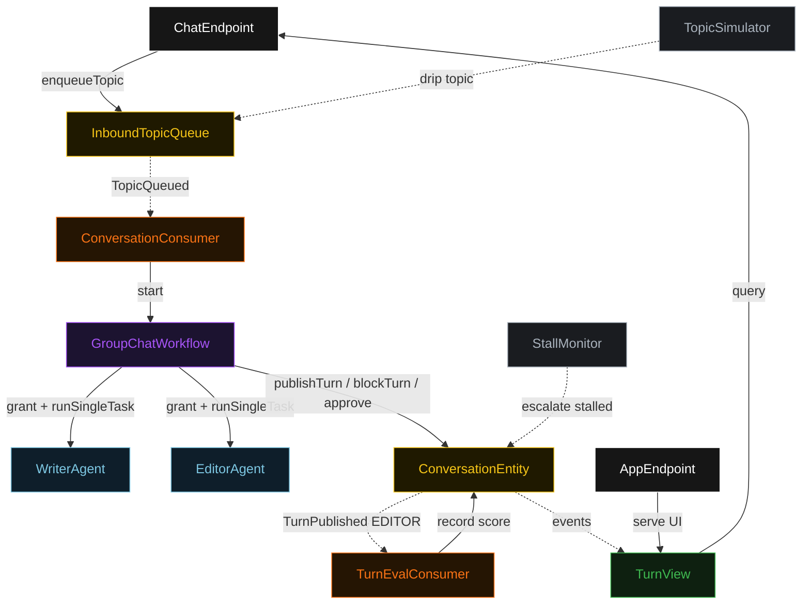
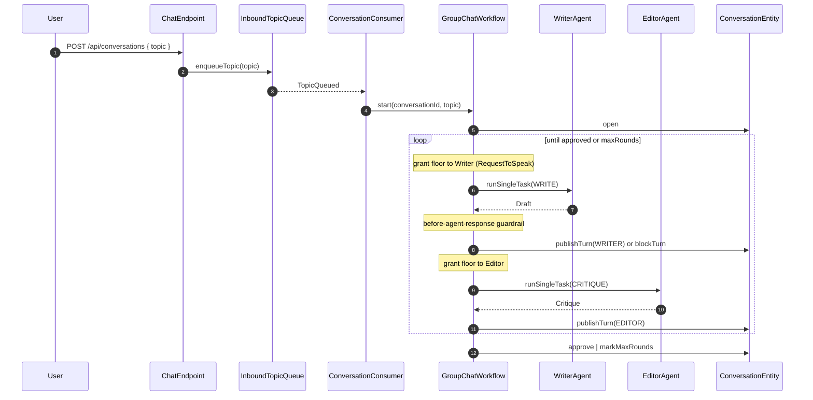
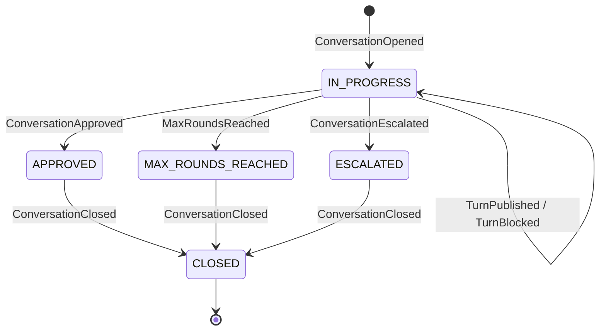
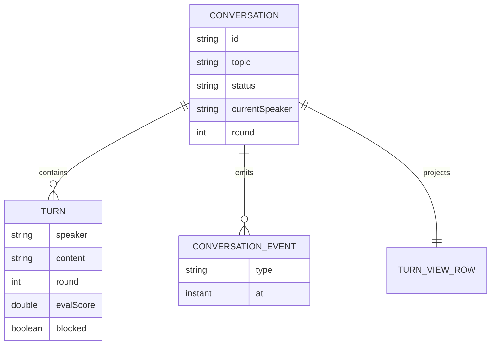

# PLAN — writer-editor-group-chat

Architectural sketch. All four mermaid diagrams plus the component table. Diagrams render on the Architecture tab; they inherit the Lesson 24 state-label CSS overrides and theme variables.

---

## Component graph

## Interaction sequence

## State machine

## Entity model

## Component table

| Component | Akka primitive | Path (generated) |
|---|---|---|
| WriterAgent | AutonomousAgent | `application/WriterAgent.java` |
| EditorAgent | AutonomousAgent | `application/EditorAgent.java` |
| GroupChatTasks | task constants | `application/GroupChatTasks.java` |
| GroupChatWorkflow | Workflow | `application/GroupChatWorkflow.java` |
| ConversationEntity | EventSourcedEntity | `domain/ConversationEntity.java` |
| InboundTopicQueue | EventSourcedEntity | `domain/InboundTopicQueue.java` |
| TurnView | View | `application/TurnView.java` |
| ConversationConsumer | Consumer | `application/ConversationConsumer.java` |
| TurnEvalConsumer | Consumer | `application/TurnEvalConsumer.java` |
| TopicSimulator | TimedAction | `application/TopicSimulator.java` |
| StallMonitor | TimedAction | `application/StallMonitor.java` |
| ChatEndpoint | HttpEndpoint | `api/ChatEndpoint.java` |
| AppEndpoint | HttpEndpoint | `api/AppEndpoint.java` |

## Concurrency notes

- **Step timeouts.** `writerTurnStep` and `editorTurnStep` call agents; each overrides `stepTimeout` to 60 s (Lesson 4). Default 5 s would time out every LLM call. `defaultStepRecovery(maxRetries(2).failoverTo(error))`.
- **Idempotency.** Each workflow instance is keyed by the conversation UUID minted by `ConversationConsumer`; re-delivery of `TopicQueued` does not start a second workflow for the same queued offset.
- **Round-robin bound.** The manager loops Writer→Editor up to `maxRounds` (default 4). A blocked turn re-requests the same speaker with bounded retries before failing the step over to `error`.
- **No saga.** All actions are in-process and event-sourced; there is no external side effect to compensate. Escalation is a forward transition driven by `StallMonitor`, not a rollback.
