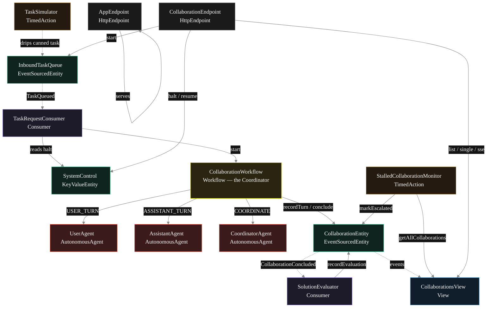
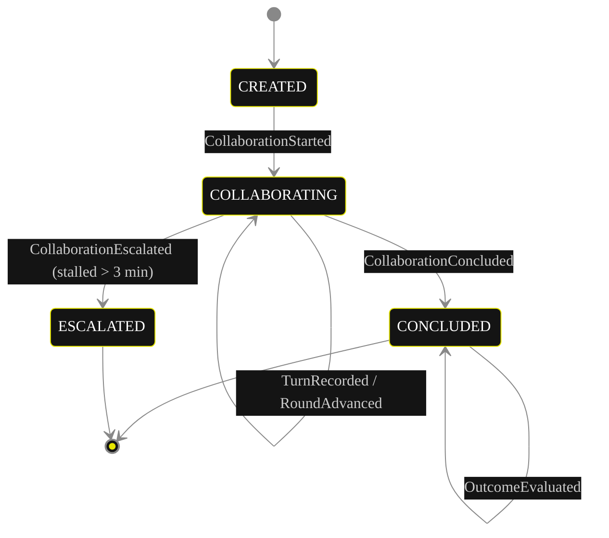
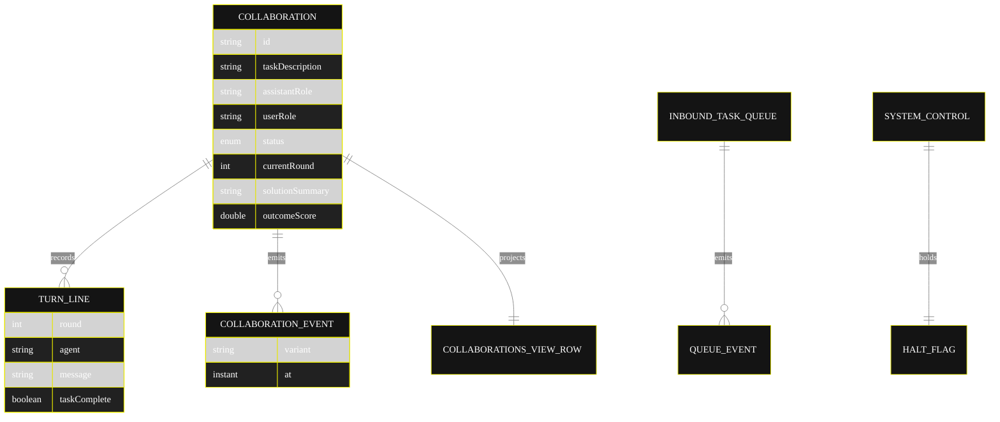

# Implementation Plan — `camel-roleplay`

The architecture this blueprint resolves to once [`SPEC.md`](./SPEC.md) is run through `/akka:specify` → `/akka:plan`. The four mermaid diagrams below render on the Architecture tab of the generated UI; they use the Akka theme variables plus the Lesson 24 CSS overrides so state-box labels and edge labels stay legible.

---

## 1. Component graph



Solid arrows are synchronous commands; dashed arrows are event subscriptions; dotted arrows are scheduled ticks.

## 2. Interaction sequence — one collaboration

```mermaid
%%{init: {'theme':'base','themeVariables':{
  'primaryColor':'#141414','primaryBorderColor':'#E6E600','primaryTextColor':'#ffffff',
  'lineColor':'#888','actorTextColor':'#ffffff','noteTextColor':'#ffffff',
  'fontFamily':'Instrument Sans, sans-serif'
}}}%%
sequenceDiagram
  participant U as User / Simulator
  participant Q as InboundTaskQueue
  participant C as TaskRequestConsumer
  participant W as CollaborationWorkflow
  participant UA as UserAgent
  participant AA as AssistantAgent
  participant CA as CoordinatorAgent
  participant E as CollaborationEntity
  participant S as SolutionEvaluator

  U->>Q: enqueueTask(taskDescription, assistantRole, userRole)
  Q-->>C: TaskQueued
  C->>W: start(collaboration)
  W->>E: start -> CollaborationStarted
  loop up to 12 rounds
    W->>UA: runSingleTask(USER_TURN)
    UA-->>W: DialogueTurn (message, intent, taskComplete)
    W->>E: recordTurn(USER)
    W->>AA: runSingleTask(ASSISTANT_TURN)
    AA-->>W: DialogueTurn (message, intent, taskComplete)
    W->>E: recordTurn(ASSISTANT)
    W->>CA: runSingleTask(COORDINATE)
    CA-->>W: CoordinatorDecision (verdict)
    Note over W,CA: SOLVED or IMPASSE ends the loop;<br/>CONTINUE advances the round
  end
  W->>E: conclude -> CollaborationConcluded
  E-->>S: CollaborationConcluded
  S->>E: recordEvaluation(score, notes)
```

## 3. State machine — `CollaborationEntity`



`CONCLUDED` carries an `outcome` of `SOLVED` or `IMPASSE`; the enum stays four-valued so no view query indexes it.

## 4. Entity model



## 5. Component table

| Component | Kind | File | Purpose |
|---|---|---|---|
| `AssistantAgent` | AutonomousAgent | `application/AssistantAgent.java` | Task-solving dialogue turn per round; returns `DialogueTurn`. |
| `UserAgent` | AutonomousAgent | `application/UserAgent.java` | Instruction-giving dialogue turn per round; returns `DialogueTurn`. |
| `CoordinatorAgent` | AutonomousAgent | `application/CoordinatorAgent.java` | Adjudicates each round; returns `CoordinatorDecision`. |
| `CollaborationTasks` | task definitions | `application/CollaborationTasks.java` | `ASSISTANT_TURN`, `USER_TURN`, `COORDINATE`. |
| `CollaborationWorkflow` | Workflow | `application/CollaborationWorkflow.java` | Turn-taking loop and convergence routing. |
| `CollaborationEntity` | EventSourcedEntity | `application/CollaborationEntity.java` | Per-collaboration durable state. |
| `InboundTaskQueue` | EventSourcedEntity | `application/InboundTaskQueue.java` | Records each task request. |
| `SystemControl` | KeyValueEntity | `application/SystemControl.java` | Operator halt flag. |
| `CollaborationsView` | View | `application/CollaborationsView.java` | Row type `Collaboration`; `getAllCollaborations` + stream. |
| `TaskRequestConsumer` | Consumer | `application/TaskRequestConsumer.java` | Starts a workflow per queued task. |
| `SolutionEvaluator` | Consumer | `application/SolutionEvaluator.java` | Scores each concluded collaboration. |
| `TaskSimulator` | TimedAction | `application/TaskSimulator.java` | Drips a canned task every 30 s. |
| `StalledCollaborationMonitor` | TimedAction | `application/StalledCollaborationMonitor.java` | Escalates collaborations running > 3 min. |
| `CollaborationEndpoint` | HttpEndpoint | `api/CollaborationEndpoint.java` | `/api/*` HTTP + SSE + metadata. |
| `AppEndpoint` | HttpEndpoint | `api/AppEndpoint.java` | Serves `/` and `/app/*`. |
| `Bootstrap` | service-setup | `Bootstrap.java` | Schedules the two TimedActions. |

Domain records live in `domain/`: `Collaboration`, `CollaborationStatus`, `CollaborationEvent`, `TurnLine`. Agent result records (`DialogueTurn`, `CoordinatorDecision`) live in `application/`.

Akka component count: **2 http-endpoint · 2 timed-action · 1 view · 1 workflow · 1 service-setup · 3 autonomous-agent · 2 consumer · 2 event-sourced-entity · 1 key-value-entity**.

## 6. Concurrency notes

- **Step timeouts.** `userTurnStep`, `assistantTurnStep`, `coordinateStep`, and `concludeStep` each call an agent, so every one overrides the 5 s default to 60 s (Lesson 4). `WorkflowSettings` is the nested `Workflow.WorkflowSettings` — no import (Lesson 5).
- **Step recovery.** `defaultStepRecovery(maxRetries(2).failoverTo(CollaborationWorkflow::error))`; the `error` step writes a `CollaborationConcluded` with `outcome = IMPASSE` so a stuck collaboration always reaches a terminal state.
- **Round cap.** The round counter lives on `CollaborationEntity` (incremented by `advanceRound`/`RoundAdvanced`), not only in workflow state, so a workflow restart resumes from the persisted round and cannot exceed twelve rounds.
- **Idempotency.** The workflow id is the collaboration id; `TaskRequestConsumer` derives a deterministic workflow id from the queue event sequence so a redelivered queue event does not start a duplicate collaboration.
- **Convergence is driven by the Coordinator.** The Coordinator evaluates whether the assistant's latest turn constitutes a complete answer and whether the user agent signals acceptance; it does not apply numeric arithmetic. The output guardrail validates that a `SOLVED` verdict always carries a non-empty `solutionSummary`.
- **Halt is a read, not a lock.** `TaskRequestConsumer` reads `SystemControl.isHalted` before starting work; in-flight collaborations are never interrupted by a halt — only new starts are gated.
- **No saga rollback needed.** Nothing in the runs-out-of-the-box form has an external irreversible side effect; a failed `concludeStep` simply fails over to the `error` step, which concludes the collaboration as `IMPASSE`.
