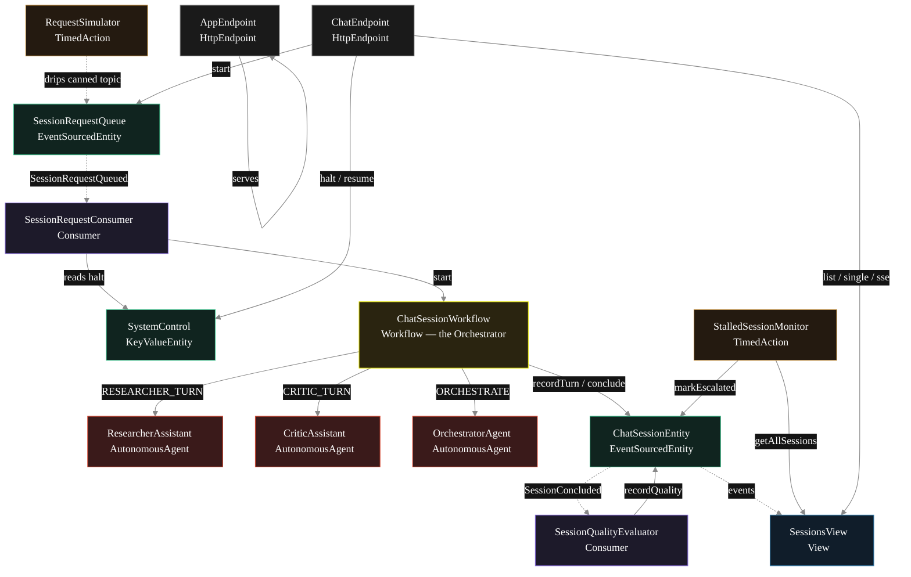
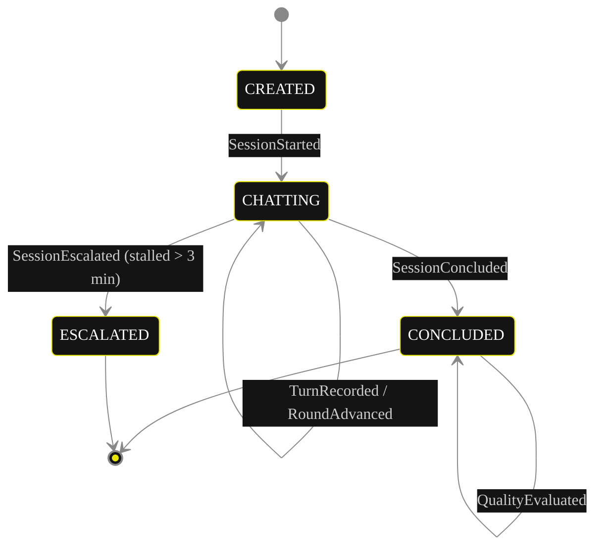
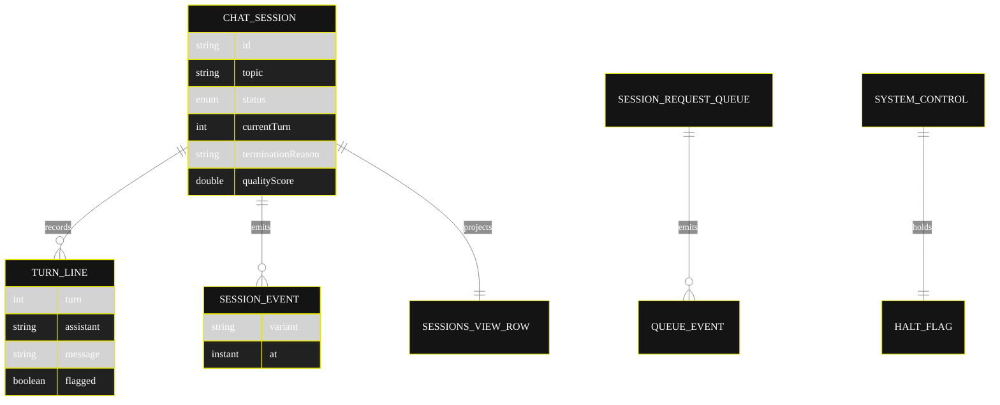

# Implementation Plan — `moderated-group-chat`

The architecture this blueprint resolves to once [`SPEC.md`](./SPEC.md) is run through `/akka:specify` → `/akka:plan`. The four mermaid diagrams below render on the Architecture tab of the generated UI; they use the Akka theme variables plus the Lesson 24 CSS overrides so state-box labels and edge labels stay legible.

---

## 1. Component graph



Solid arrows are synchronous commands; dashed arrows are event subscriptions; dotted arrows are scheduled ticks.

## 2. Interaction sequence — one chat session

```mermaid
%%{init: {'theme':'base','themeVariables':{
  'primaryColor':'#141414','primaryBorderColor':'#E6E600','primaryTextColor':'#ffffff',
  'lineColor':'#888','actorTextColor':'#ffffff','noteTextColor':'#ffffff',
  'fontFamily':'Instrument Sans, sans-serif'
}}}%%
sequenceDiagram
  participant U as User / Simulator
  participant Q as SessionRequestQueue
  participant C as SessionRequestConsumer
  participant W as ChatSessionWorkflow
  participant R as ResearcherAssistant
  participant K as CriticAssistant
  participant O as OrchestratorAgent
  participant E as ChatSessionEntity
  participant V as SessionQualityEvaluator

  U->>Q: enqueueRequest(topic)
  Q-->>C: SessionRequestQueued
  C->>W: start(session)
  W->>E: start -> SessionStarted
  loop up to 20 turns
    W->>R: runSingleTask(RESEARCHER_TURN)
    R-->>W: ChatTurn (message, flagged)
    W->>E: recordTurn(RESEARCHER)
    W->>K: runSingleTask(CRITIC_TURN)
    K-->>W: ChatTurn (message, flagged)
    W->>E: recordTurn(CRITIC)
    W->>O: runSingleTask(ORCHESTRATE)
    O-->>W: OrchestratorDecision (verdict)
    Note over W,O: CONCLUDE or ESCALATE ends the loop;<br/>CONTINUE advances the turn
  end
  W->>E: conclude -> SessionConcluded
  E-->>V: SessionConcluded
  V->>E: recordQuality(score, notes)
```

## 3. State machine — `ChatSessionEntity`



`CONCLUDED` carries a `terminationReason` of `CONSENSUS`, `MAX_TURNS_REACHED`, or `ESCALATED`; the enum stays four-valued so no view query indexes it.

## 4. Entity model



## 5. Component table

| Component | Kind | File | Purpose |
|---|---|---|---|
| `ResearcherAssistant` | AutonomousAgent | `application/ResearcherAssistant.java` | Researcher's contribution per turn; returns `ChatTurn`. |
| `CriticAssistant` | AutonomousAgent | `application/CriticAssistant.java` | Critic's evaluation per turn; returns `ChatTurn`. |
| `OrchestratorAgent` | AutonomousAgent | `application/OrchestratorAgent.java` | Adjudicates each round; returns `OrchestratorDecision`. |
| `ChatTasks` | task definitions | `application/ChatTasks.java` | `RESEARCHER_TURN`, `CRITIC_TURN`, `ORCHESTRATE`. |
| `ChatSessionWorkflow` | Workflow | `application/ChatSessionWorkflow.java` | Turn-taking loop and conclusion routing. |
| `ChatSessionEntity` | EventSourcedEntity | `application/ChatSessionEntity.java` | Per-session durable state. |
| `SessionRequestQueue` | EventSourcedEntity | `application/SessionRequestQueue.java` | Records each session request. |
| `SystemControl` | KeyValueEntity | `application/SystemControl.java` | Operator halt flag. |
| `SessionsView` | View | `application/SessionsView.java` | Row type `ChatSession`; `getAllSessions` + stream. |
| `SessionRequestConsumer` | Consumer | `application/SessionRequestConsumer.java` | Starts a workflow per queued request. |
| `SessionQualityEvaluator` | Consumer | `application/SessionQualityEvaluator.java` | Scores each concluded session. |
| `RequestSimulator` | TimedAction | `application/RequestSimulator.java` | Drips a canned topic every 30 s. |
| `StalledSessionMonitor` | TimedAction | `application/StalledSessionMonitor.java` | Escalates sessions running > 3 min. |
| `ChatEndpoint` | HttpEndpoint | `api/ChatEndpoint.java` | `/api/*` HTTP + SSE + metadata. |
| `AppEndpoint` | HttpEndpoint | `api/AppEndpoint.java` | Serves `/` and `/app/*`. |
| `Bootstrap` | service-setup | `Bootstrap.java` | Schedules the two TimedActions. |

Domain records live in `domain/`: `ChatSession`, `ChatSessionStatus`, `SessionEvent`, `TurnLine`. Agent result records (`ChatTurn`, `OrchestratorDecision`) live in `application/`.

Akka component count: **2 http-endpoint · 2 timed-action · 1 view · 1 workflow · 1 service-setup · 3 autonomous-agent · 2 consumer · 2 event-sourced-entity · 1 key-value-entity**.

## 6. Concurrency notes

- **Step timeouts.** `researcherTurnStep`, `criticTurnStep`, `orchestrateStep`, and `concludeStep` each call an agent, so every one overrides the 5 s default to 60 s (Lesson 4). `WorkflowSettings` is the nested `Workflow.WorkflowSettings` — no import (Lesson 5).
- **Step recovery.** `defaultStepRecovery(maxRetries(2).failoverTo(ChatSessionWorkflow::error))`; the `error` step writes a `SessionConcluded` with `terminationReason = ESCALATED` so a stuck session always reaches a terminal state.
- **Turn cap.** The turn counter lives on `ChatSessionEntity` (incremented by `advanceRound`/`RoundAdvanced`), not only in workflow state, so a workflow restart resumes from the persisted turn and cannot exceed twenty turns.
- **Idempotency.** The workflow id is the session id; `SessionRequestConsumer` derives a deterministic workflow id from the queue event sequence so a redelivered queue event does not start a duplicate session.
- **Guardrail is pre-commit.** The before-agent-response guardrail fires before a turn is passed back to the workflow; a flagged turn that fails the check causes the workflow step to fail over to the error step rather than being added to the transcript.
- **Halt is a read, not a lock.** `SessionRequestConsumer` reads `SystemControl.isHalted` before starting work; in-flight sessions are never interrupted — only new starts are gated.
- **No saga rollback needed.** Nothing in the runs-out-of-the-box form has an external irreversible side effect; a failed `concludeStep` simply fails over to the `error` step.
