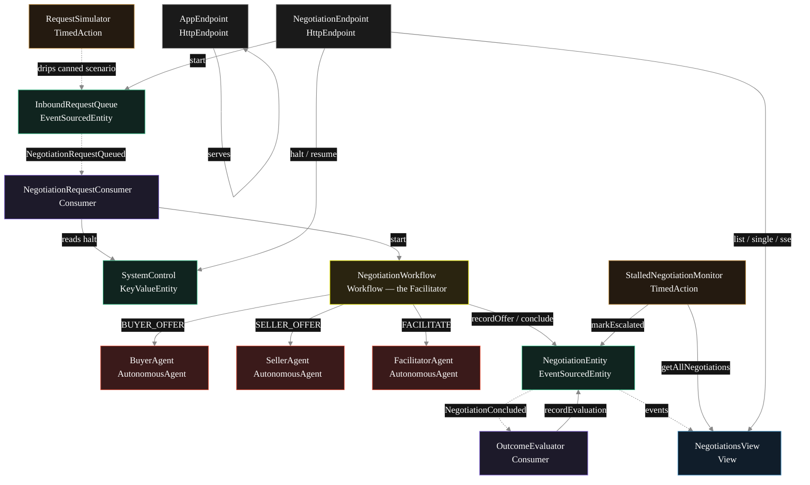
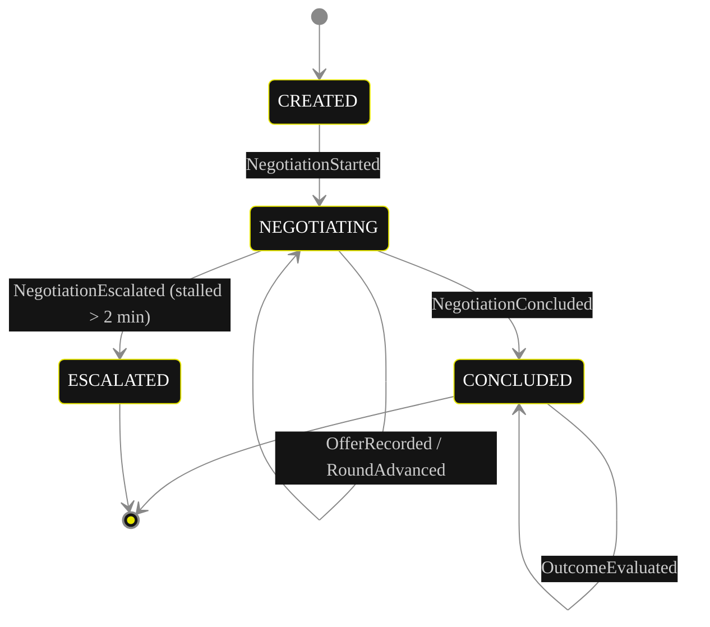
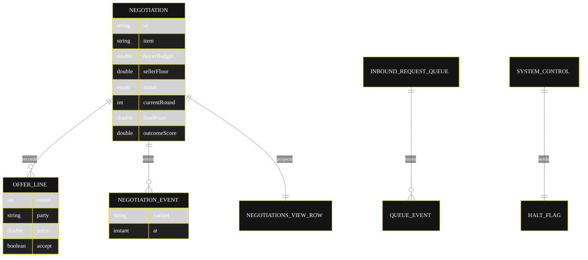

# Implementation Plan — `negotiation`

The architecture this blueprint resolves to once [`SPEC.md`](./SPEC.md) is run through `/akka:specify` → `/akka:plan`. The four mermaid diagrams below render on the Architecture tab of the generated UI; they use the Akka theme variables plus the Lesson 24 CSS overrides so state-box labels and edge labels stay legible.

---

## 1. Component graph



Solid arrows are synchronous commands; dashed arrows are event subscriptions; dotted arrows are scheduled ticks.

## 2. Interaction sequence — one negotiation

```mermaid
%%{init: {'theme':'base','themeVariables':{
  'primaryColor':'#141414','primaryBorderColor':'#E6E600','primaryTextColor':'#ffffff',
  'lineColor':'#888','actorTextColor':'#ffffff','noteTextColor':'#ffffff',
  'fontFamily':'Instrument Sans, sans-serif'
}}}%%
sequenceDiagram
  participant U as User / Simulator
  participant Q as InboundRequestQueue
  participant C as RequestConsumer
  participant W as NegotiationWorkflow
  participant B as BuyerAgent
  participant S as SellerAgent
  participant F as FacilitatorAgent
  participant E as NegotiationEntity
  participant V as OutcomeEvaluator

  U->>Q: enqueueRequest(item, budget, floor)
  Q-->>C: NegotiationRequestQueued
  C->>W: start(negotiation)
  W->>E: start -> NegotiationStarted
  loop up to 10 rounds
    W->>B: runSingleTask(BUYER_OFFER)
    B-->>W: Offer (price, terms, accept)
    W->>E: recordOffer(BUYER)
    W->>S: runSingleTask(SELLER_OFFER)
    S-->>W: Offer (price, terms, accept)
    W->>E: recordOffer(SELLER)
    W->>F: runSingleTask(FACILITATE)
    F-->>W: FacilitatorDecision (verdict)
    Note over W,F: CONVERGED or NO_DEAL ends the loop;<br/>CONTINUE advances the round
  end
  W->>E: conclude -> NegotiationConcluded
  E-->>V: NegotiationConcluded
  V->>E: recordEvaluation(score, notes)
```

## 3. State machine — `NegotiationEntity`



`CONCLUDED` carries an `outcome` of `CONVERGED` or `NO_DEAL`; the enum stays four-valued so no view query indexes it.

## 4. Entity model



## 5. Component table

| Component | Kind | File | Purpose |
|---|---|---|---|
| `BuyerAgent` | AutonomousAgent | `application/BuyerAgent.java` | Buyer's offer per turn; returns `Offer`. |
| `SellerAgent` | AutonomousAgent | `application/SellerAgent.java` | Seller's counteroffer per turn; returns `Offer`. |
| `FacilitatorAgent` | AutonomousAgent | `application/FacilitatorAgent.java` | Adjudicates each round; returns `FacilitatorDecision`. |
| `NegotiationTasks` | task definitions | `application/NegotiationTasks.java` | `BUYER_OFFER`, `SELLER_OFFER`, `FACILITATE`. |
| `NegotiationWorkflow` | Workflow | `application/NegotiationWorkflow.java` | Turn-taking loop and convergence routing. |
| `NegotiationEntity` | EventSourcedEntity | `application/NegotiationEntity.java` | Per-negotiation durable state. |
| `InboundRequestQueue` | EventSourcedEntity | `application/InboundRequestQueue.java` | Records each negotiation request. |
| `SystemControl` | KeyValueEntity | `application/SystemControl.java` | Operator halt flag. |
| `NegotiationsView` | View | `application/NegotiationsView.java` | Row type `Negotiation`; `getAllNegotiations` + stream. |
| `NegotiationRequestConsumer` | Consumer | `application/NegotiationRequestConsumer.java` | Starts a workflow per queued request. |
| `OutcomeEvaluator` | Consumer | `application/OutcomeEvaluator.java` | Scores each concluded negotiation. |
| `RequestSimulator` | TimedAction | `application/RequestSimulator.java` | Drips a canned scenario every 30 s. |
| `StalledNegotiationMonitor` | TimedAction | `application/StalledNegotiationMonitor.java` | Escalates negotiations running > 2 min. |
| `NegotiationEndpoint` | HttpEndpoint | `api/NegotiationEndpoint.java` | `/api/*` HTTP + SSE + metadata. |
| `AppEndpoint` | HttpEndpoint | `api/AppEndpoint.java` | Serves `/` and `/app/*`. |
| `Bootstrap` | service-setup | `Bootstrap.java` | Schedules the two TimedActions. |

Domain records live in `domain/`: `Negotiation`, `NegotiationStatus`, `NegotiationEvent`, `OfferLine`. Agent result records (`Offer`, `FacilitatorDecision`) live in `application/`.

Akka component count: **2 http-endpoint · 2 timed-action · 1 view · 1 workflow · 1 service-setup · 3 autonomous-agent · 2 consumer · 2 event-sourced-entity · 1 key-value-entity**.

## 6. Concurrency notes

- **Step timeouts.** `buyerTurnStep`, `sellerTurnStep`, `facilitateStep`, and `concludeStep` each call an agent, so every one overrides the 5 s default to 60 s (Lesson 4). `WorkflowSettings` is the nested `Workflow.WorkflowSettings` — no import (Lesson 5).
- **Step recovery.** `defaultStepRecovery(maxRetries(2).failoverTo(NegotiationWorkflow::error))`; the `error` step writes a `NegotiationConcluded` with `outcome = NO_DEAL` so a stuck negotiation always reaches a terminal state.
- **Round cap.** The round counter lives on `NegotiationEntity` (incremented by `advanceRound`/`RoundAdvanced`), not only in workflow state, so a workflow restart resumes from the persisted round and cannot exceed ten rounds.
- **Idempotency.** The workflow id is the negotiation id; `NegotiationRequestConsumer` derives a deterministic workflow id from the queue event sequence so a redelivered queue event does not start a duplicate negotiation.
- **Convergence is deterministic.** The Facilitator's tolerance check (`|buyerPrice − sellerPrice| / sellerFloor ≤ tolerance`, default 0.02) and the budget-to-floor guardrail band are evaluated the same way on every retry; the LLM supplies reasoning text, not the arithmetic boundary.
- **Halt is a read, not a lock.** `NegotiationRequestConsumer` reads `SystemControl.isHalted` before starting work; in-flight negotiations are never interrupted by a halt — only new starts are gated.
- **No saga rollback needed.** Nothing in the runs-out-of-the-box form has an external irreversible side effect; the publish-analog (returning final terms) is in-process, so a failed `concludeStep` simply fails over to the `error` step.
