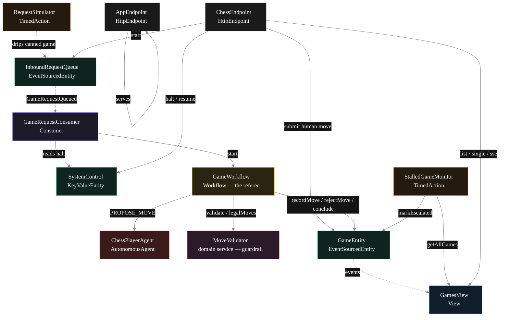
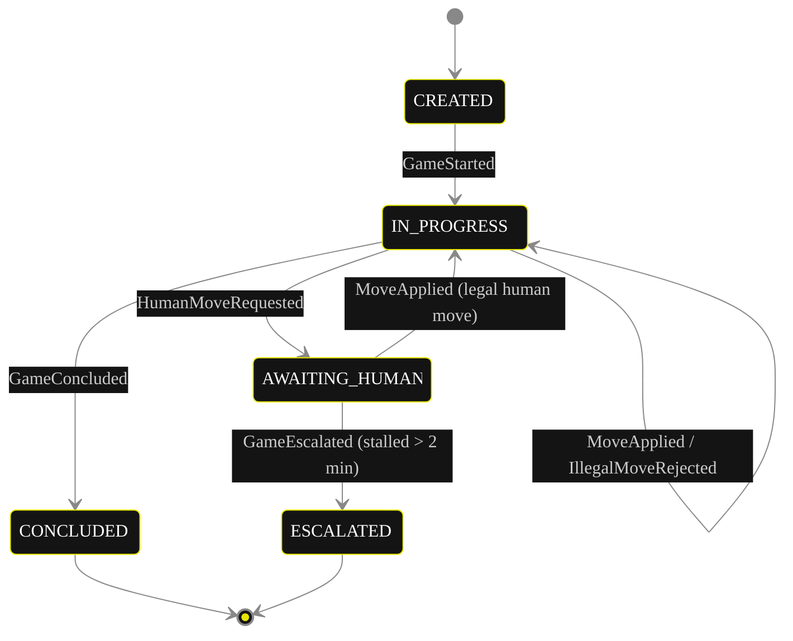
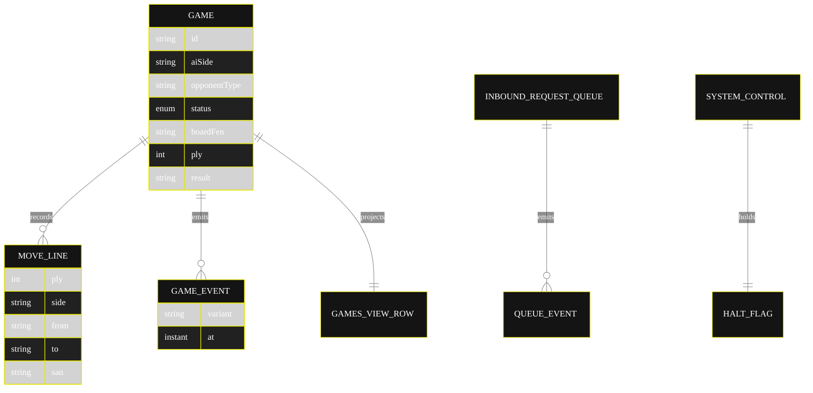

# Implementation Plan — `turn-taking-game-agents`

The architecture this blueprint resolves to once [`SPEC.md`](./SPEC.md) is run through `/akka:specify` → `/akka:plan`. The four mermaid diagrams below render on the Architecture tab of the generated UI; they use the Akka theme variables plus the Lesson 24 CSS overrides so state-box labels and edge labels stay legible.

---

## 1. Component graph



Solid arrows are synchronous commands; dashed arrows are event subscriptions; dotted arrows are scheduled ticks.

## 2. Interaction sequence — one game (AI versus random)

```mermaid
%%{init: {'theme':'base','themeVariables':{
  'primaryColor':'#141414','primaryBorderColor':'#E6E600','primaryTextColor':'#ffffff',
  'lineColor':'#888','actorTextColor':'#ffffff','noteTextColor':'#ffffff',
  'fontFamily':'Instrument Sans, sans-serif'
}}}%%
sequenceDiagram
  participant U as User / Simulator
  participant Q as InboundRequestQueue
  participant C as RequestConsumer
  participant W as GameWorkflow
  participant A as ChessPlayerAgent
  participant M as MoveValidator
  participant E as GameEntity

  U->>Q: enqueueRequest(aiSide, opponentType)
  Q-->>C: GameRequestQueued
  C->>W: start(game)
  W->>E: start -> GameStarted (initial FEN)
  loop until terminal position
    alt AI side to move
      W->>A: runSingleTask(PROPOSE_MOVE, fen, legalMoves)
      A-->>W: ProposedMove (from, to, rationale)
    else random or human side
      W->>M: legalMoves(fen) / pending human move
    end
    W->>M: validate(fen, from, to) -- before-tool-call guardrail
    Note over W,M: illegal -> rejectMove, re-propose;<br/>legal -> apply
    W->>E: recordMove (resulting FEN, terminal flag)
    Note over W,E: CHECKMATE/STALEMATE/DRAW ends the loop;<br/>NONE flips the side and continues
  end
  W->>E: conclude -> GameConcluded (result, reason)
```

## 3. State machine — `GameEntity`



`CONCLUDED` carries a `result` of `WHITE_WINS`, `BLACK_WINS`, or `DRAW`; the enum stays five-valued so no view query indexes it (Lesson 2).

## 4. Entity model



## 5. Component table

| Component | Kind | File | Purpose |
|---|---|---|---|
| `ChessPlayerAgent` | AutonomousAgent | `application/ChessPlayerAgent.java` | Proposes the AI side's move; returns `ProposedMove`. |
| `ChessTasks` | task definitions | `application/ChessTasks.java` | `PROPOSE_MOVE`. |
| `MoveValidator` | domain service | `domain/MoveValidator.java` | Chess rules: validate, enumerate legal moves, detect terminal positions. |
| `GameWorkflow` | Workflow | `application/GameWorkflow.java` | Turn-taking loop, guardrail call, terminal routing. |
| `GameEntity` | EventSourcedEntity | `application/GameEntity.java` | Per-game durable state. |
| `InboundRequestQueue` | EventSourcedEntity | `application/InboundRequestQueue.java` | Records each new-game request. |
| `SystemControl` | KeyValueEntity | `application/SystemControl.java` | Operator halt flag. |
| `GamesView` | View | `application/GamesView.java` | Row type `Game`; `getAllGames` + stream. |
| `GameRequestConsumer` | Consumer | `application/GameRequestConsumer.java` | Starts a workflow per queued request. |
| `RequestSimulator` | TimedAction | `application/RequestSimulator.java` | Drips a canned game every 30 s. |
| `StalledGameMonitor` | TimedAction | `application/StalledGameMonitor.java` | Escalates games awaiting a human move > 2 min. |
| `ChessEndpoint` | HttpEndpoint | `api/ChessEndpoint.java` | `/api/*` HTTP + SSE + metadata. |
| `AppEndpoint` | HttpEndpoint | `api/AppEndpoint.java` | Serves `/` and `/app/*`. |
| `Bootstrap` | service-setup | `Bootstrap.java` | Schedules the two TimedActions. |

Domain records live in `domain/`: `Game`, `GameStatus`, `GameEvent`, `MoveLine`, `MoveValidator`, `Validation`. The agent result record (`ProposedMove`) lives in `application/`.

Akka component count: **2 http-endpoint · 2 timed-action · 1 view · 1 workflow · 1 service-setup · 1 autonomous-agent · 1 consumer · 2 event-sourced-entity · 1 key-value-entity**.

## 6. Concurrency notes

- **Step timeouts.** `turnStep` (when it calls the agent) and `validateAndApplyStep` override the 5 s default to 60 s (Lesson 4). `WorkflowSettings` is the nested `Workflow.WorkflowSettings` — no import (Lesson 5).
- **Step recovery.** `defaultStepRecovery(maxRetries(2).failoverTo(GameWorkflow::error))`; the `error` step writes a `GameConcluded` with `result = DRAW` so a stuck game always reaches a terminal state.
- **Human-await poll.** The human turn does not block a step; `turnStep` requests a human move, self-schedules a 3-second resume timer, and on resume reads the entity for a pending move — the same await-poll pattern the exemplar uses for approval.
- **Board state lives on the entity.** The current FEN, the ply counter, and every move are on `GameEntity`, not only in workflow memory, so a crash mid-game resumes from the persisted position.
- **The guardrail is deterministic.** `MoveValidator.validate` is pure: the same FEN and the same proposed move yield the same legality and the same resulting position on every retry; the LLM supplies a candidate move and rationale, never the legality verdict.
- **Idempotency.** The workflow id is the game id; `GameRequestConsumer` derives a deterministic workflow id from the queue event sequence so a redelivered queue event does not start a duplicate game.
- **Halt is a read, not a lock.** `GameRequestConsumer` reads `SystemControl.isHalted` before starting work; in-flight games are never interrupted — only new starts are gated.
- **No saga rollback needed.** Nothing in the runs-out-of-the-box form has an external irreversible side effect; a failed `concludeStep` fails over to the `error` step.
