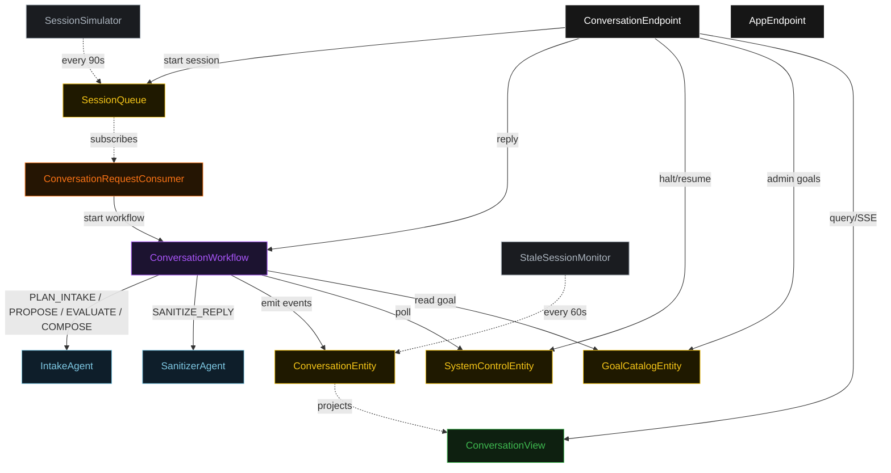
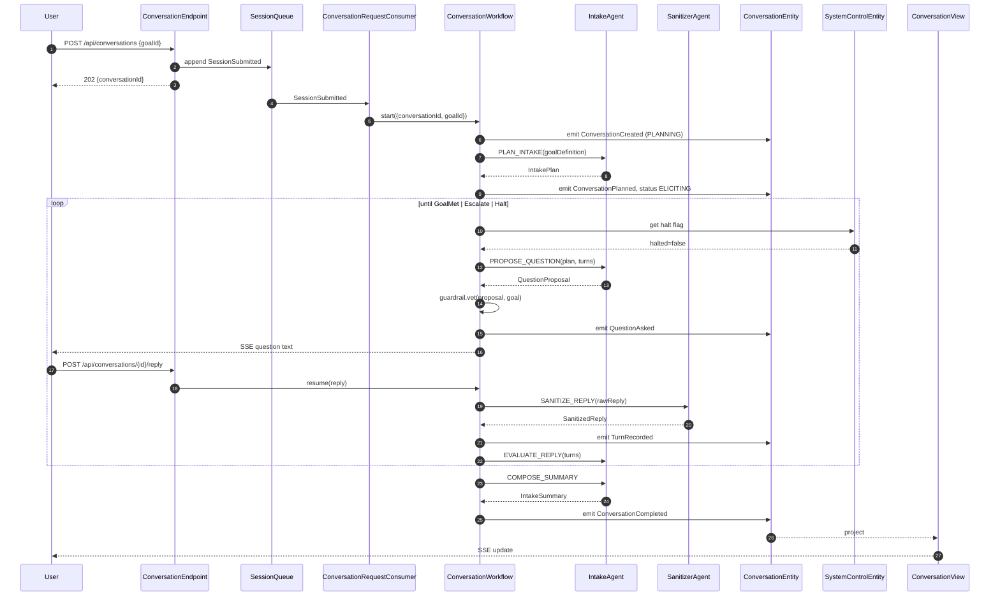
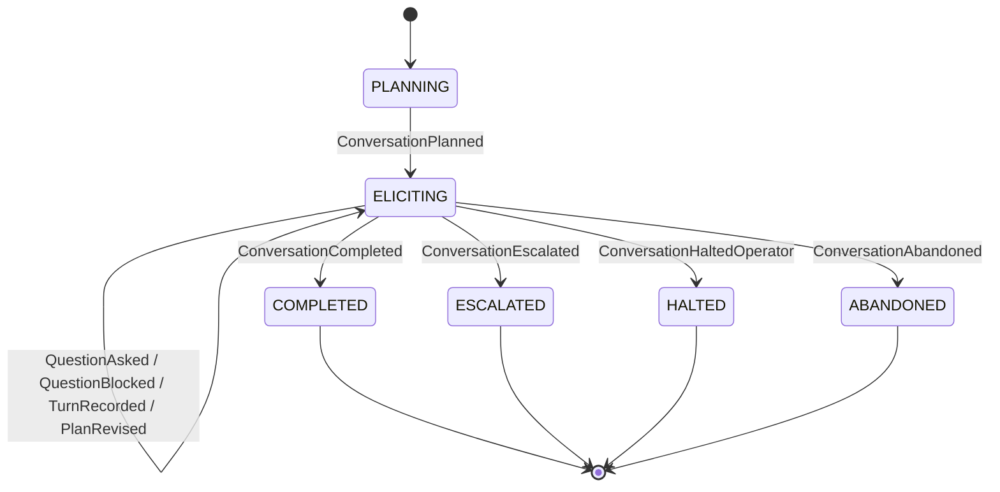
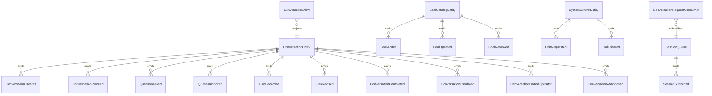

# PLAN — guided-intake-agent

Architectural sketch consumed by `/akka:plan` (or skipped if `/akka:specify` covers it). Diagrams render on the generated system's Architecture tab.

---

## Component graph

## Interaction sequence — J1 (happy path)

## State machine — `ConversationEntity`

## Entity model

## Component table — Java file targets

| Component | Path (generated) |
|---|---|
| `IntakeAgent` | `application/IntakeAgent.java` |
| `SanitizerAgent` | `application/SanitizerAgent.java` |
| `ConversationWorkflow` | `application/ConversationWorkflow.java` |
| `ConversationEntity` | `application/ConversationEntity.java` (state in `domain/Conversation.java`, events in `domain/ConversationEvent.java`) |
| `GoalCatalogEntity` | `application/GoalCatalogEntity.java` |
| `SystemControlEntity` | `application/SystemControlEntity.java` |
| `SessionQueue` | `application/SessionQueue.java` |
| `ConversationView` | `application/ConversationView.java` |
| `ConversationRequestConsumer` | `application/ConversationRequestConsumer.java` |
| `SessionSimulator` | `application/SessionSimulator.java` |
| `StaleSessionMonitor` | `application/StaleSessionMonitor.java` |
| `TopicGuardrail` | `application/TopicGuardrail.java` |
| `PiiScrubber` | `application/PiiScrubber.java` |
| `IntakeTasks` | `application/IntakeTasks.java` |
| `SanitizerTasks` | `application/SanitizerTasks.java` |
| `ConversationEndpoint` | `api/ConversationEndpoint.java` |
| `AppEndpoint` | `api/AppEndpoint.java` |
| Bootstrap | `Bootstrap.java` |

## Concurrency notes

- **Workflow step timeouts:** `planStep` 60 s, `proposeStep` 45 s, `awaitReplyStep` 300 s (user has up to 5 min), `sanitizeStep` 30 s, `evaluateStep` 45 s, `summaryStep` 60 s. Default recovery: `maxRetries(2).failoverTo(ConversationWorkflow::error)`.
- **Replan budget:** the agent may emit `Replan` at most twice in a row without a `Continue` in between; a third consecutive `Replan` is treated as `Escalate`.
- **Turn budget:** each goal specifies `maxTurns`; when the turn log reaches that count the workflow transitions to `escalateStep` even if the goal is not yet met.
- **Halt poll:** every `checkHaltStep` reads `SystemControlEntity.get` synchronously — no caching. An operator halt arriving during `awaitReplyStep` lets the in-flight reply land; the loop exits at the next `checkHaltStep`.
- **Idempotency:** `ConversationEndpoint.start` uses `(goalId, submittedBy)` over a 10 s window to dedupe concurrent submissions.
- **Stale detection:** `StaleSessionMonitor` ticks every 60 s; conversations `ELICITING` for > 10 minutes are marked `ABANDONED`. The workflow's `evaluateStep` checks the entity status and exits when it reads `ABANDONED`.
- **PII scrubber determinism:** `PiiScrubber.scrub` is pure; given the same input it always produces the same output. Raw replies are never stored in any event.
