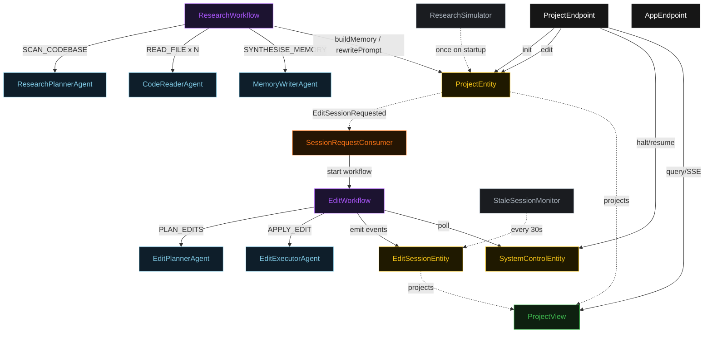
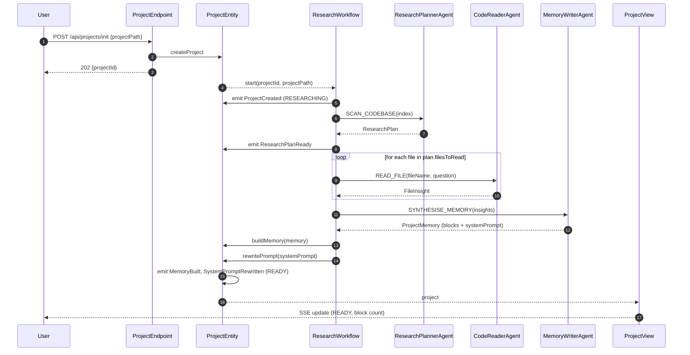
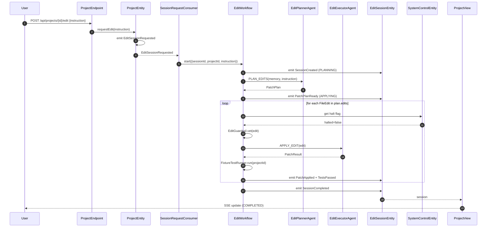
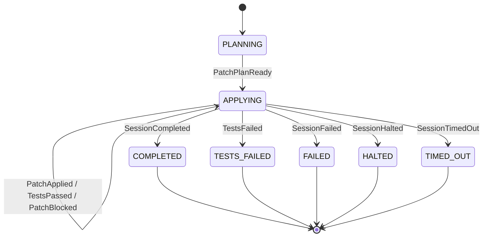

# PLAN — akka-memory-first-coding-agent

Architectural sketch consumed by `/akka:plan` (or skipped if `/akka:specify` covers it). Diagrams render on the generated system's Architecture tab.

---

## Component graph

## Interaction sequence — J1 (init happy path)

## Interaction sequence — J2 (edit path with guardrail)

## State machine — `EditSessionEntity`

## Entity model

```mermaid
erDiagram
  ProjectEntity ||--o{ ProjectCreated : emits
  ProjectEntity ||--o{ ResearchPlanReady : emits
  ProjectEntity ||--o{ MemoryBuilt : emits
  ProjectEntity ||--o{ SystemPromptRewritten : emits
  ProjectEntity ||--o{ ProjectFailed : emits
  ProjectEntity ||--o{ EditSessionRequested : emits
  EditSessionEntity ||--o{ SessionCreated : emits
  EditSessionEntity ||--o{ PatchPlanReady : emits
  EditSessionEntity ||--o{ PatchBlocked : emits
  EditSessionEntity ||--o{ PatchApplied : emits
  EditSessionEntity ||--o{ TestsPassed : emits
  EditSessionEntity ||--o{ TestsFailed : emits
  EditSessionEntity ||--o{ SessionCompleted : emits
  EditSessionEntity ||--o{ SessionFailed : emits
  EditSessionEntity ||--o{ SessionHalted : emits
  EditSessionEntity ||--o{ SessionTimedOut : emits
  ProjectView }o--|| ProjectEntity : projects
  ProjectView }o--|| EditSessionEntity : projects
  SystemControlEntity ||--o{ HaltRequested : emits
  SystemControlEntity ||--o{ HaltCleared : emits
  SessionRequestConsumer }o--|| ProjectEntity : subscribes
```

## Component table — Java file targets

| Component | Path (generated) |
|---|---|
| `ResearchPlannerAgent` | `application/ResearchPlannerAgent.java` |
| `CodeReaderAgent` | `application/CodeReaderAgent.java` |
| `MemoryWriterAgent` | `application/MemoryWriterAgent.java` |
| `EditPlannerAgent` | `application/EditPlannerAgent.java` |
| `EditExecutorAgent` | `application/EditExecutorAgent.java` |
| `ResearchWorkflow` | `application/ResearchWorkflow.java` |
| `EditWorkflow` | `application/EditWorkflow.java` |
| `ProjectEntity` | `application/ProjectEntity.java` (state in `domain/Project.java`, events in `domain/ProjectEvent.java`) |
| `EditSessionEntity` | `application/EditSessionEntity.java` (state in `domain/EditSession.java`, events in `domain/SessionEvent.java`) |
| `SystemControlEntity` | `application/SystemControlEntity.java` |
| `ProjectView` | `application/ProjectView.java` |
| `SessionRequestConsumer` | `application/SessionRequestConsumer.java` |
| `ResearchSimulator` | `application/ResearchSimulator.java` |
| `StaleSessionMonitor` | `application/StaleSessionMonitor.java` |
| `EditGuardrail` | `application/EditGuardrail.java` |
| `FixtureTestRunner` | `application/FixtureTestRunner.java` |
| `ResearchTasks` | `application/ResearchTasks.java` |
| `EditTasks` | `application/EditTasks.java` |
| `ProjectEndpoint` | `api/ProjectEndpoint.java` |
| `AppEndpoint` | `api/AppEndpoint.java` |
| Bootstrap | `Bootstrap.java` |

## Concurrency notes

- **Workflow step timeouts:** `scanStep` 45 s, `readFileStep` 60 s (per iteration), `synthesiseStep` 90 s, `planStep` 60 s, `applyStep` 90 s, `testGateStep` 120 s, `decideStep` 30 s. Default recovery: `maxRetries(2).failoverTo(workflow::error)`.
- **Guardrail-replan budget:** at most two consecutive blocked patches before the session fails with `"guardrail blocked all revisions"`.
- **Test-gate is terminal:** a single test failure ends the session in `TESTS_FAILED`. The patch is never applied to the project's canonical memory.
- **Halt poll:** `checkHaltStep` reads `SystemControlEntity.get` synchronously — no caching. A halt arriving during `applyStep` lets the apply finish; the loop exits at the next `checkHaltStep`.
- **Idempotency:** `POST /api/projects/init` deduplicates on `(projectPath, requestedBy)` over a 30 s window.
- **Stuck detection:** `StaleSessionMonitor` ticks every 30 s; sessions in `APPLYING` for more than 5 minutes receive `SessionTimedOut`. The workflow's `decideStep` reads the session status and exits on `TIMED_OUT`.
- **Self-rewrite loading:** `MemoryWriterAgent`'s effective prompt is resolved in `synthesiseStep` — the workflow calls `ProjectEntity.getProject` first to obtain the current `memory.systemPrompt` (if non-empty) and passes it to the agent invocation as the overriding system prompt. This ensures the first run uses the static prompt file and all subsequent runs use the persisted rewrite.
