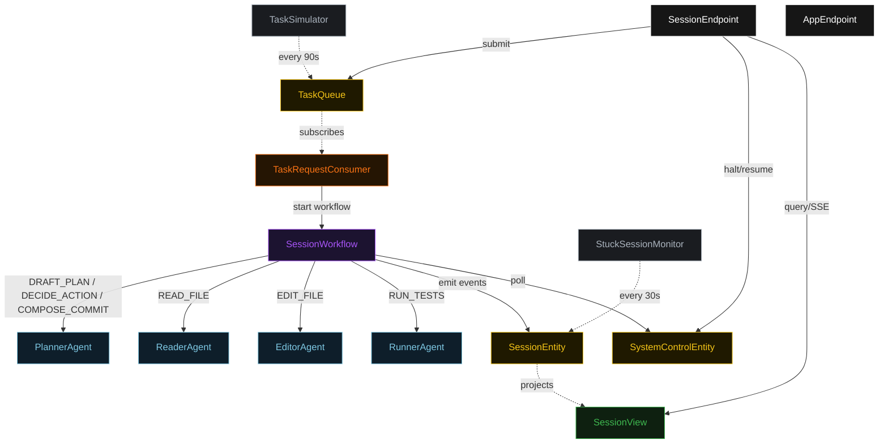
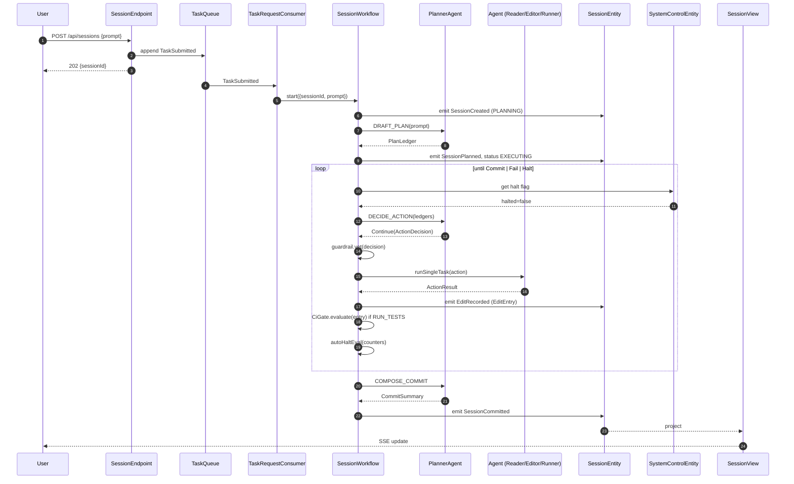
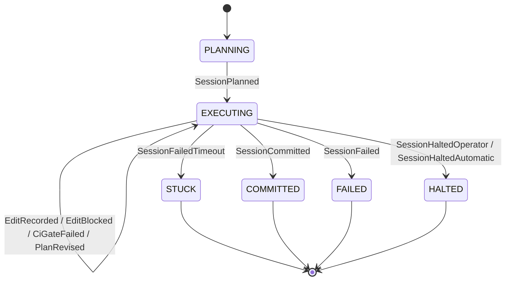
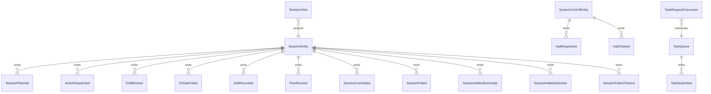

# PLAN — code-assistant-loop

Architectural sketch consumed by `/akka:plan` (or skipped if `/akka:specify` covers it). Diagrams render on the generated system's Architecture tab.

---

## Component graph

## Interaction sequence — J1 (happy path)

## State machine — `SessionEntity`

## Entity model

## Component table — Java file targets

| Component | Path (generated) |
|---|---|
| `PlannerAgent` | `application/PlannerAgent.java` |
| `ReaderAgent` | `application/ReaderAgent.java` |
| `EditorAgent` | `application/EditorAgent.java` |
| `RunnerAgent` | `application/RunnerAgent.java` |
| `SessionWorkflow` | `application/SessionWorkflow.java` |
| `SessionEntity` | `application/SessionEntity.java` (state in `domain/Session.java`, events in `domain/SessionEvent.java`) |
| `SystemControlEntity` | `application/SystemControlEntity.java` |
| `TaskQueue` | `application/TaskQueue.java` |
| `SessionView` | `application/SessionView.java` |
| `TaskRequestConsumer` | `application/TaskRequestConsumer.java` |
| `TaskSimulator` | `application/TaskSimulator.java` |
| `StuckSessionMonitor` | `application/StuckSessionMonitor.java` |
| `EditGuardrail` | `application/EditGuardrail.java` |
| `CiGate` | `application/CiGate.java` |
| `PlannerTasks` | `application/PlannerTasks.java` |
| `AgentTasks` | `application/AgentTasks.java` |
| `SessionEndpoint` | `api/SessionEndpoint.java` |
| `AppEndpoint` | `api/AppEndpoint.java` |
| Bootstrap | `Bootstrap.java` |

## Concurrency notes

- **Workflow step timeouts:** `planStep` 60 s, `proposeStep` 45 s, `dispatchStep` 120 s (covers any agent call), `decideStep` 45 s, `commitStep` 60 s. Default recovery: `maxRetries(2).failoverTo(SessionWorkflow::error)`.
- **Replan budget:** the planner may emit `Replan` at most twice in a row without a successful edit in between; a third consecutive `Replan` is treated as `Fail`.
- **CI failure budget:** three consecutive `CiGateFailed` entries without an intervening `OK` edit causes the workflow to transition to `failStep`.
- **Halt poll:** every `checkHaltStep` reads `SystemControlEntity.get` synchronously — no caching. A halt arriving during a `dispatchStep` lets the in-flight action finish; the loop exits at the next `checkHaltStep`.
- **Idempotency:** `SessionEndpoint.submit` deduplicates `POST /api/sessions` on `(prompt, requestedBy)` over a 10 s window.
- **Stuck detection:** `StuckSessionMonitor` ticks every 30 s; tasks `EXECUTING` for > 5 minutes are marked `STUCK`.
- **CiGate determinism:** `CiGate.evaluate` is pure; it never calls the LLM. The same test-output string always yields the same `CiVerdict`, keeping `EditEntry` events deterministic and replayable.
